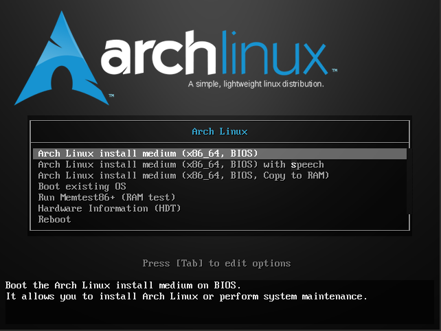
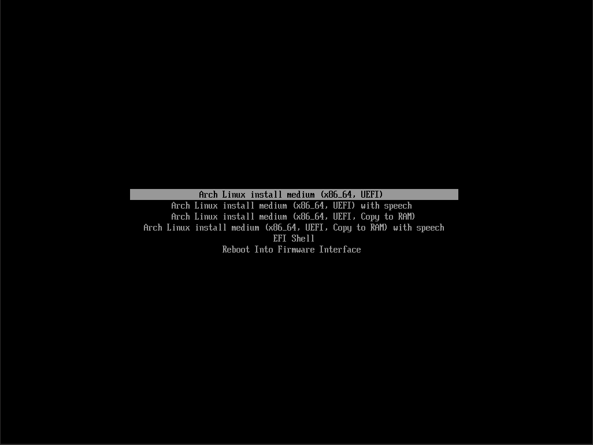
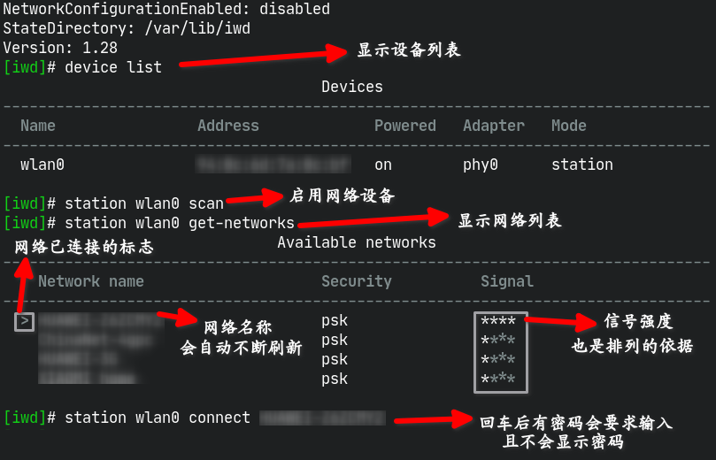
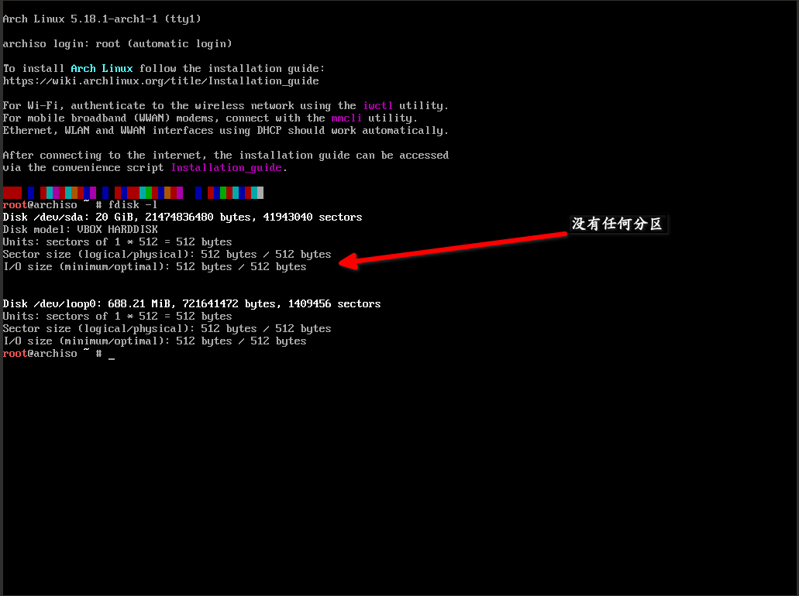
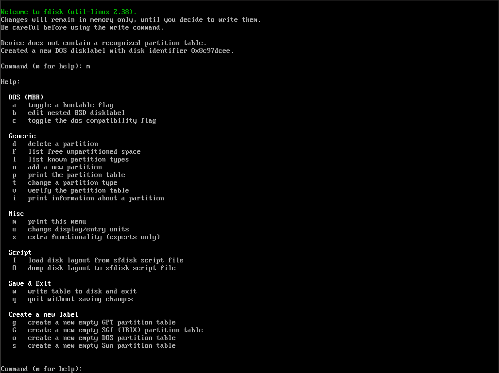
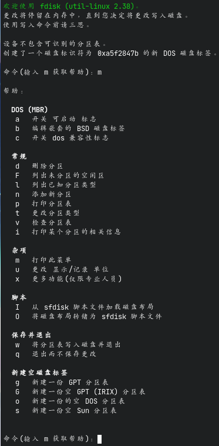
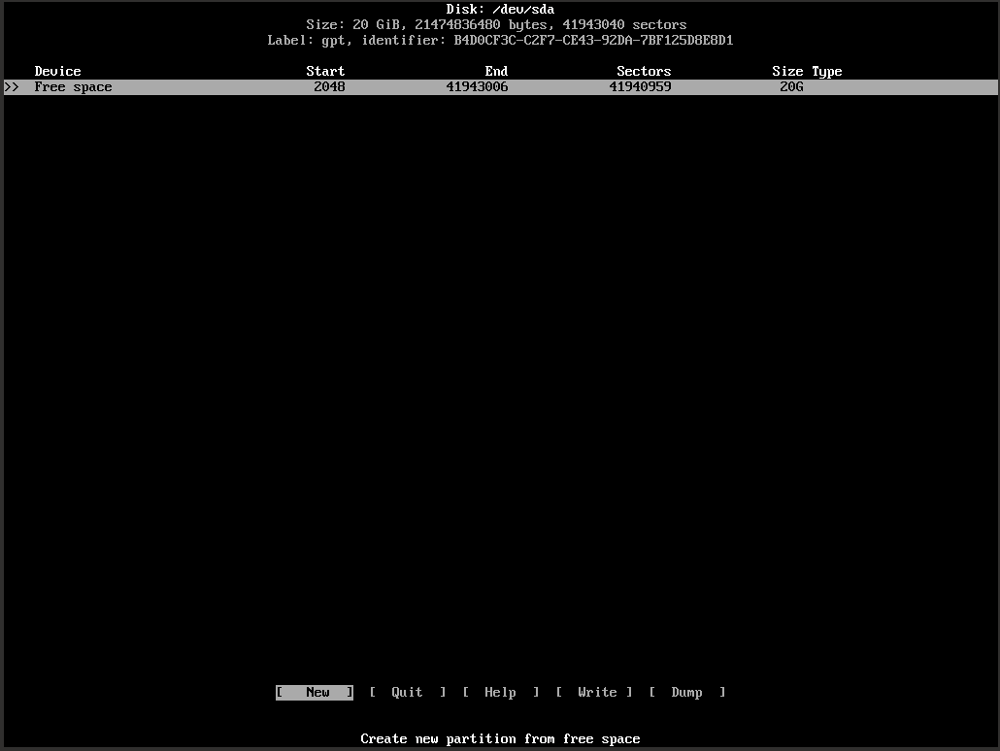

#+title: ArchLinux的安装
#+date: 2022-07-02 22:56

#+setupfile: ../../setup.setup

* ArchLinux的安装
** 写在前边
本blog用于记录我安装ArchLinux的方法，更专业的教程请查阅[[https://wiki.archlinux.org/title/Installation_guide_(%E7%AE%80%E4%BD%93%E4%B8%AD%E6%96%87)][官方Wiki]]

** 安装前的准备 -- 从U盘安装
1. 从[[https://archlinux.org/download/][官网]]上下载ArchLinux的安装镜像
  （以格式一般为 =archlinux-YYYY.MM.DD-x86\_64.iso= ）（下滑找到 *China* 分栏有
   国内镜像服务器源，速度会快很多，推荐[[https://mirrors.tuna.tsinghua.edu.cn/archlinux/iso/latest/][清华云tuna.tsinghua.edu.cn]]与[[https://mirrors.aliyun.com/archlinux/iso/latest/][阿里云
   aliyun.com]]）

2. windows下则使用任意一款U盘拷录软件（自行百度）拷录镜像文件到U盘（注意，被拷录
   的U盘的所有数据都会丢失，请备份好资料后再执行操作）。而Linux下则可以（使用
   root权限）使用命令
   #+begin_src shell
   # dd if=你的镜像文件名称 of=/dev/sdX bs=512    #sdX为要拷录的U盘设备，实际中应为sda或sdb
   #+end_src
   拷录镜像文件到U盘上（Linux的磁盘管理机制请自行百度）（ *除非你能够同时查看教
   程则直接重启，否则建议先记下下面的安装过程较好* ）

3. 重启电脑，更改启动顺序或（一般情况下）按下F12选择启动项，进入Arch的安装镜像系
   统。倘若屏幕上出现 /FALT/ 报错请自行搜索解决

** 安装过程
*** 确认引导类型
#+begin_src bash
# ls /sys/firmware/efi/efivars
#+end_src

倘若屏幕提示 =No such file or directory= 则你的电脑是BIOS引导，反则是EFI引导

#+begin_quote
个人办法：其实如果在开机时留意一下弹出过的菜单界面就能知道你的是什么引导方式。

BIOS引导的长这样：

#+CAPTION: BIOS

而EFI的长这样：

#+CAPTION: EFI

#+end_quote

*** 联网
有线网络的联网教程请自行百度，这里主要讲无线网络的连接。

无线网络联网，你可以使用 =wifi-menu= 工具联网，而我个人更倾向于使用 =iwd= 工具进行联网。在终端输入

#+begin_src bash
# iwctl
#+end_src

打开iwd的设置界面,一下为一些常用命令列表：

| 命令                             | 作用                                                                        |
|----------------------------------+-----------------------------------------------------------------------------|
| device list                      | 列出可用的网络设备                                                          |
| station 设备名称 scan            | 启用指定的设备                                                              |
| station 设备名称 get-networks    | 获取网络列表                                                                |
| station 设备名称 connet 网络名称 | 连接指定的网络，有密码的会要求输入密码，连接成功后网络列表前会出现 **>** 号 |
| exit                             | 退出                                                                        |
| quit                             | 退出                                                                        |
| Tab制表键                        | 补全或者显示出可用的命令                                                    |
| 方向上下键                       | 查找上一条/下一条历史命令                                                   |

操作演示图片：
#+CAPTION: 操作演示

最后使用

#+begin_src shell
# ping www.baidu.com
#+end_src

判断能否正常上网（使用Ctrl-C退出）

*** 软件包
**** 手动设置软件源
#+begin_quote
提示：这里需要你会使用编辑器Vim。如果不会，可以使用简单一些的nano。教程均自行百
度。
#+end_quote

执行命令调用vim以编辑文件 =/etc/pacman.d/mirrorlist=

#+begin_src shell
# vim /etc/pacman.d/mirrorlist
#+end_src

#+begin_quote
提示：输入路径时可以使用Tab补全
#+end_quote

按下 =/= 并输入 *China* 并回车，跳转到中国服务器的镜像源列表。在列表上方一列输入
=dgg= 删除列表上面的内容，在列表下方一列输入 =dG= 移除列表以下内容，建议将清华、
阿里云的源以 =dd= 删除一行，再 =p= 粘贴的操作放在文件最前面几列，最后输入 =:w=
回车保存 =:q= 回车退出。（可以合起来为 =:wq= 再回车直接保存与退出）。操作过程演
示：

#+begin_export html
<video width="640" height="480" controls>
  <source src="./2022-07-02_02/2022-07-02_02-08.webm" type="video/webm">
</video>
#+end_export

最终的成果示例：

#+begin_src conf
  ## China
  Server = https://mirrors.tuna.tsinghua.edu.cn/archlinux/$repo/os/$arch
  Server = https://mirrors.aliyun.com/archlinux/$repo/os/$arch
  Server = http://mirrors.tuna.tsinghua.edu.cn/archlinux/$repo/os/$arch
  Server = http://mirrors.aliyun.com/archlinux/$repo/os/$arch
  Server = http://mirrors.163.com/archlinux/$repo/os/$arch
#+end_src

#+begin_quote
注：示例配置中把其他的备用源都删除了
#+end_quote

**** 自动设置软件源
直接运行以下命令依照速度进行自动排序，不用手动排序

#+begin_src bash
# reflector -c China -a 10 --sort rate --save /etc/pacman.d/mirrorlist
#+end_src

**** 多文件同时下载
编辑 */etc/pacman.conf* 找到 =#ParallelDownloads = 5= 项，把前面的 *#* 号移除可
以实现同时下载多个文件，后面的5是最大的同时下载数量
**** 多文件同时下载
在 */etc/pacman.conf* 文件末尾加入

#+begin_src conf
[archlinuxcn]
Server = https://mirrors.tuna.tsinghua.edu.cn/archlinuxcn/$arch
#+end_src

可以启用 *archlinuxcn* 源，里面有一些国内的常用软件的Linux版本

*** 更新系统时间
执行

#+begin_src bash
timedatectl set-ntp true
#+end_src

#+begin_quote
正常情况下是没有输出的
#+end_quote

*** 为系统分区
#+begin_quote
注意！这个步骤要格外小心，命令回车前要确认命令无误，且要知道自己在做什么，重要的
硬盘数据应提前备份好，避免带来数据的丢失
#+end_quote

执行命令

#+begin_src bash
fdisk -l
#+end_src

查看目前的分区情况

空白的情况下：

#+CAPTION: 虚拟机——空白

**** 硬盘分区
***** 使用fdisk
使用命令开始为硬盘分区
#+begin_src bash
# fdisk /dev/sdX   #sdX为目标硬盘，实际中应为sda或sdb...
#+end_src

关于fdisk的命令教程:

- m 查看命令作用
- g 使用GTP分区表
- o 使用MBR分区表
- p 打印分区表（若p命令后中Disklable type:后为dos则为MBR分区表，gpt则为gpt分区表）
- n 新建分区
  - MBR分区表
    - 1.确认分区类型
      - p 主分区（最多四个，编号1~4）
      - e 扩展分区（占用主分区数量，最多一个，有了则不显示，编号同主分区）
      - l 逻辑分区（不限量，前提是得有一个扩展分区，无则不显示，最大大小为扩展分区大小，即包容在扩展分区内，编号5~?）
  - GPT分区表
    - 1.无需确认分区类型，无分区类型之分
  - 共同步骤
    - 2.确认分区编号
    - 3.分区起始扇区（一般不管）
    - 4.分区结束扇区（+单位 表示多大， -单位 表示剩余多大空间）
- d 移除分区，输入编号即可
- t 更改指定分区的分区类型（作用）
- w 保存退出
- q 不保存直接退出

[[https://wiki.archlinux.org/title/Fdisk_(%E7%AE%80%E4%BD%93%E4%B8%AD%E6%96%87)][也可以参考官方wiki]]

fdisk在安装镜像的帮助截图：

#+CAPTION: fdisk

fdisk在我现有系统的中文帮助截图：

#+CAPTION: fdisk-CN

***** 使用cfdisk
cfdisk有着伪图形界面，对萌新更友好。

刚进入cfdisk时如果硬盘没有分区表会询问你。上下方向键移动，回车选择。BIOS选择dos，EFI选择gpt就好。具体的操作就不细讲了。

#+CAPTION: cfdisk

***** 文件系统
使用

#+begin_src bash
# mkfs.filesystemtype /dev/sdXn    #filesystemtype为对应的文件系统类型（ext3,ext4,vfat...），sdXn为硬盘上的第n个分区，n为分区编号
#+end_src

格式化分区，对应的看下面分区建议表格
***** 挂载分区
使用mount,格式：

#+begin_src bash
# mount /dev/sdXn /dir
#+end_src

关于挂载分区的具体内容请查看[[https://wiki.archlinux.org/title/File_systems_(%E7%AE%80%E4%BD%93%E4%B8%AD%E6%96%87)#%E6%8C%82%E8%BD%BD%E6%96%87%E4%BB%B6%E7%B3%BB%E7%BB%9F][ArchWiki官方教程]]

#+begin_quote
sdXn为硬盘分区，/dir 为挂载目标目录，详见下表，
#+end_quote

但是在挂载硬盘时时不能直接按照下表挂载，/根目录一般挂载在USB系统的 =/mnt= 目录下，
其他的磁盘挂载点跟着变化就行了，但一定要先挂载根目录再依文件夹的关系一个个挂载，
没有的文件夹使用 =mkdir -p= 创建就好（例如：/boot/efi -> /mnt/boot/efi)

**** 分区建议
- BIOS
| 分区   | 大小                      | 类型              | 文件系统 | 挂载点 | 作用                                               |
|--------+---------------------------+-------------------+----------+--------+----------------------------------------------------|
| BOOT   | 200~500M                  | Linux / BIOS BOOT | ext4     | /boot  | 作为启动分区                                       |
| Root   | >=20G(建议，不是太低也行) | Linux             | ext4     | /      | 作为根目录                                         |
| *home  |                           | Linux             | ext4     | /home  | 作为用户家目录，利于数据保护、重装系统，可分可不分 |
| *SWAP  |                           | Linux Swap        |          |        | 可选，用作交换分区，可当替补的内存理解             |

- EFI引导
| 分区   | 大小                      | 类型              | 文件系统 | 挂载点    | 作用                                               |
|--------+---------------------------+-------------------+----------+-----------+----------------------------------------------------|
| EFI    | 100~500M                  | EFI System        | vfat     | /boot/efi | 作为启动引导分区                                   |
| Roott  | >=20G(建议，不是太低也行) | Linux             | ext4     | /         | 作为根目录                                         |
| *BOOT  | 200~500M                  | Linux / BIOS BOOT | ext4     | /boot     | 可选                                               |
| *home  |                           | Linux             | ext4     | /home     | 作为用户家目录，利于数据保护、重装系统，可分可不分 |
| *SWAP  |                           | Linux Swap        |          |           | 可选，用作交换分区，可当替补的内存理解             |

*** 安装系统
在硬盘全部挂载后，我们就可以开始安装系统了

安装基本系统：

#+begin_src bash
# pacstrap -i /mnt/ base base-devel linux linux-firmware
#+end_src

#+begin_quote
命令中的 */mnt/* 要替换成你所挂载根目录分区的目录名，忘记了可以使用 =df -h= 或者
=lsblk= 查看
#+end_quote

#+begin_quote
你还可以在安装完基本系统后安装额外的软件方便使用，使用

#+begin_src bash
# passtrap -i /mnt/ 软件包名
#+end_src

安装软件包。建议装上 *dhcpcd*（DNS服务） *iwd*（联网） *vim* （文件编辑） *fish*
（一种shell，默认就有强大的自动补全配置）
#+end_quote

#+begin_quote
倘若在前面的软件包设置里启用了archlinuxcn源，其实你可以额外安装内核软件包
*linux-lily* 在tty界面它原装支持显示中文
#+end_quote

配置分区表：

#+begin_src bash
genfstab -U /mnt/ >> /mnt/etc/fstab
#+end_src

#+begin_quote
这里的 */mnt/* 同理。-U 为使用UUID标识的意思
#+end_quote

进入新安装的系统：
#+begin_src bash
arch-chroot /mnt/ /bin/bash
#+end_src

#+begin_quote
若前面你安装了 *fish* 就可以使用以下命令进入新的系统

#+begin_src bash
# arch-chroot /mnt/ /bin/fish
#+end_src
#+end_quote

**** 本地化
设置中文:

#+begin_src bash
vim /etc/locale.gen
#+end_src

输入 =/= 搜索zh_CN.UTF-8与en_US.UTF-8,分别去除前面的 =#= 号，并将其放到文件头部。
如下：

#+begin_src conf
zh_CN.UTF-8 UTF-8
zh_CN.GBK GBK
en_US.UTF-8 UTF-8
# ......
#+end_src

并执行

#+begin_src bash
# locale-gen
#+end_src

以及

#+begin_src bash
# echo "LANG=zh_CN.UTF-8" >> /etc/locale.conf
# export LANG=zh_CN.UTF-8
#+end_src

设置时区为上海，这里有两种办法：

1. 手动设置
   #+begin_src bash
     # ln -sf /usr/share/zoneinfo/Asia/Shanghai /etc/localtime
   #+end_src
2. 工具设置
   #+begin_src bash
     # timedatectl set-timezone Asia/Shanghai
   #+end_src

设置硬件时钟：

#+begin_src bash
  # hwclock --systohc --utc
#+end_src

**** 安装GRUB引导
安装grub软件包：

#+begin_src bash
  # pacman -S grub efibootmgr os-prober
#+end_src

#+begin_quote
*os-prober* 可以用于自动识别电脑上的其他硬盘装的其他系统
#+end_quote

安装grub引导：

***** BIOS引导模式下
将grub引导安装在硬盘sdX的第n个分区

#+begin_src bash
grub-install /dev/sdXn
#+end_src

#+begin_quote
/dev/sdXn为硬盘上的第n个分区，也是你的BOOT分区（挂载到 */boot/* ）
#+end_quote

***** EFI引导模式下
#+begin_src bash
grub-install
#+end_src
***** 生成菜单、配置文件
（生成/更新）配置:

#+begin_src bash
  # grub-mkconfig -o /boot/grub/grub.cfg
#+end_src

#+begin_quote
如果使用多系统，可以编辑 =/etc/default/grub= ，找到 =GRUB_DISABLE_OS_PROBER=
并将后面的 ="true"= 改为 ="false"= 并重新执行更新配命令
#+end_quote
**** 用户设置
为root用户设置密码（否则无法登录）：

#+begin_src bash
paswwd root
#+end_src

#+begin_quote
*root* 可以省略，前提是你在用root用户操作
#+end_quote

创建用户：

#+begin_src bash
  # useradd -m USERNAME -s /bin/SHELL
#+end_src

#+begin_quote
*USERNAME* 为你的用户名,SHELL为你想用的shell名称，默认为bash，可以省略
#+end_quote

添加组/启用sudo：

#+begin_src bash
  # usermod USERNAME -aG sudo
#+end_src

#+begin_quote
将用户添加进 *sudo* 组
#+end_quote

为新用户创建密码（否则无法登录）：

#+begin_src bash
  # passwd USERNAME
#+end_src
**** 最后的配置
启用dhcpcd服务（未安装的使用 =pacman -S dhcpcd= 安装）：

#+begin_src bash
  # systemctl enable dhcpcd
#+end_src

#+begin_quote
同理，可以启用iwd服务，启用后普通用户也可以使用iwctl了（未开启时必须使用root）
#+end_quote

sudo启用sudo组内用户的支持：

#+begin_src bash
  # vim /etc/sudoers
#+end_src

找到 =#%sudo ALL=(ALL:ALL) ALL= ，移除 =#= 号取消注释（按下 =i= 进入插入模式再按
下 =Esc= 退回普通模式。或者直接在行首按下 =dw= ）， =:w!= 强制保存后退出

退出重启：

#+begin_src bash
  exit
  reboot
#+end_src
*** 扩展——配置系统
**** 使用图形界面
#+begin_quote
以下操作均在root权限下执行，请自行 =su root= 或者在命令前加上 =sudo=
#+end_quote

安装最基本的X服务
 
#+begin_src bash
pacman -S xorg
#+end_src

#+begin_quote
输入法（使用fcitx）
#+end_quote

#+begin_src bash
pacman -S fcitx fcitx-configtool
echo "GTK_IM_MODULE DEFAULT=fcitx" >> /etc/environment
echo "QT_IM_MODULE  DEFAULT=fcitx" >> /etc/environment
echo "XMODIFIERS    DEFAULT=@im=fcitx" >> /etc/environment
echo "QT_QPA_PLATFORMTHEME=qt5ct" >> /etc/environment
#+end_src

#+begin_quote
注：通过 =~/.pam_environment= 文件设置环境变量的方法已失效，请使用其他方法设置环
境变量，例如通过 =/etc/environment= 文件定义
#+end_quote

- gnome
  #+begin_src bash
    pacman -S alacarte gnome networkmanager
    systemctl enable gdm
  #+end_src

  #+begin_quote
  gdm为gnome的图形界面登录系统
  #+end_quote
- xfce
  #+begin_src bash
    pacman -S xfce
    systemctl enable xfce
  #+end_src
- kde
  #+begin_src bash
    pacman -S plassma konsole dolphin sddm
    pacman -S kdeconnet ark
    systemctl enable sddm
  #+end_src
- i3-wm
  #+begin_src bash
    pacman -S i3 i3blocks i3lock i3status
  #+end_src

  #+begin_quote
  2023-01-17更新：i3-gaps已经被并入了i3软件包了
  #+end_quote

  #+begin_quote
   i3-wm只是一个窗口管理器而已，并非桌面系统，需要安装其他软件。我个人习惯安装kde的软件并在i3wm下使用。即
  
   #+begin_src bash
   pacman -S i3 i3blocks i3lock i3status sddm kdeconnet konsole dolphin\
             ark qt5ct picom polybar feh rofi
   #+end_src
  #+end_quote

  #+begin_quote
  qt5ct用于设置在i3-wm下kde程序的主题,配置（同上*pam_environment*已失效）：
  
  #+begin_src bash
    echo "QT_QPA_PLATFORMTHEME DEFAULT=qt5ct" >> /etc/environment
  #+end_src
  
  picom用于美化窗口界面。polybar用于替代i3status。feh用于使用壁纸。rofi用于启动应用
  #+end_quote
**** 中文字体
#+begin_src bash
pacamn -S wqy-zenhei
#+end_src

#+begin_quote
其他我安装的字体：
#+begin_src bash
  pacamn -S ttf-liberation ttf-fira-code ttf-fira-mono ttf-nerd-fonts-symbols-mono
#+end_src
#+end_quote
**** 使用AUR
使用AUR助手yay:

#+begin_src bash
  git clone https://aur.archlinux.org/yay-bin.git
  cd yay-bin
  makepkg -si
#+end_src

#+begin_quote
如果启用了archlinuxcn源可以直接执行  
#+begin_src bash
  pacman -S yay
#+end_src
安装yay
#+end_quote

我使用AUR安装的软件:

#+begin_src bash
  yay -S google-chrome picom-jonaburg-git bat siji-git ttf-unifont autotiling\
         netease-cloud-music utools
#+end_src

#+begin_quote
*netease-cloud-music* 与 *utools* 实际上已经被包含在archlinuxcn库里了
#+end_quote

| 软件包名               | 软件作用                                         |
|------------------------+--------------------------------------------------|
| google-chrome          | 浏览器                                           |
| picom-jonaburg-git     | picom合成器的分支，支持动画，与原版picom有冲突   |
| bat                    | 文本查看器                                       |
| siji-git/ttf-unifont   | 字体                                             |
| autotiling             | 自通垂直/横向排列窗口                            |
| netease-cloud-music    | 网易云音乐                                       |
| utools                 | 强大的工具箱                                     |
