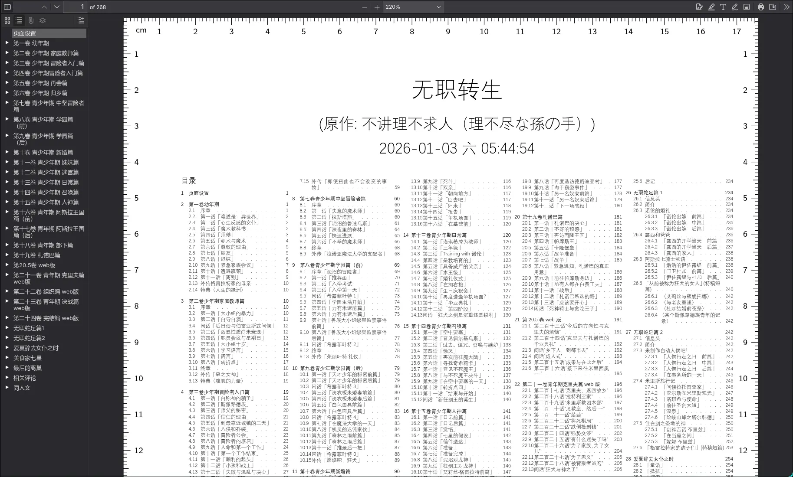
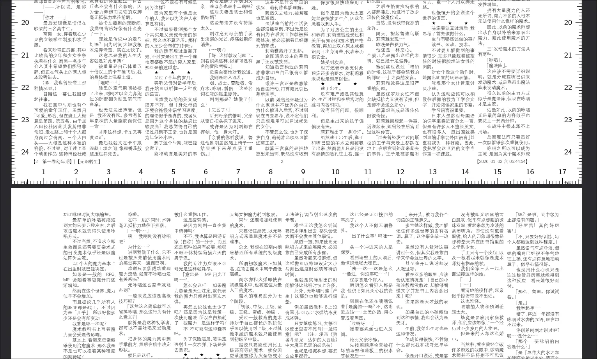

#+TITLE: 基于latex生成缩印用pdf
#+DESCRIPTION: 如何将这个小说文件夹的内容整出一个缩印用的pdf
#+DATE: <2026-01-03 六 05:54>
#+SETUPFILE: ../../../setup.setup

#+begin_quote
一篇水玩意，别看了
#+end_quote

* 食用方法
1. 确保拥有 *等线Light* 字体（Windows自带）
2. 克隆整个仓库（包括lib子仓库）
3. 在同级目录下运行[[./merge_to_tex.py]]这个程序，例如说：
   #+begin_src shell
     ./merge_to_tex.py -i 无职.json
   #+end_src
   上面还用到了个[[./无职.json]]，是写那个脚本使用的配置文件。如果要印自己的东西照着
   程序输出的标志json修改即可。

* 组成
- 程序
  - =orgreader2.py= ：自制基于python的org文件导出器，勉强能用
  - =merge_to_tex.py= ：脚本本体，负责配置读取，文档结果合并等
- latex模板\\
  自制，带有强效缩印效果，嫌字小就在默认配置里改大点。

* 效果
#+caption: 上述命令输出的效果

#+caption: 关键交界处及页脚展示

