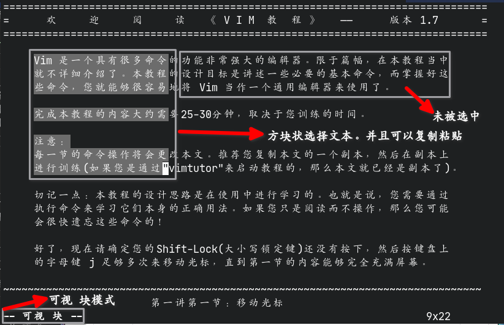

#+title: Vim/Neovim使用笔记
#+date: 2022-07-08 22:57

#+setupfile: ../../../setup.setup

* 非常见但好用快捷键
格式： =按键= (模式niv)说明
- =K= (nv)获取帮助信息（如c打开manpage,python打开pydoc,加装lsp后能获得lsp提取信息）
- =<C-r>"= (i)类似y粘贴缓冲区内容，详细内容见下（转自vim help）
  #+begin_quote
  CTRL-R {寄存器}

  插入编号寄存器或命名寄存器的内容。在键入 CTRL-R 和第二个字符之间，会显示一个 ="= 符号，提示你输入寄存器的名称。

  当与命名寄存器或剪贴板寄存器（A-Z、a-z、0-9、+）一起使用时，文本会被原样插入，类似于使用 "p" 粘贴。对于其他寄存器，文本会像你亲自键入一样被插入，但不会使用映射和缩写。不过，通过 'wildchar' 触发的命令行补全不会被激活。同时，会原样插入用于结束命令行的字符（<Esc>、<CR>、<NL>、<C-C>）。但是，<BS> 或 CTRL-W 仍然可能结束命令行，剩余的字符将在另一种模式中被解释，这可能不是你想要的效果。

  特殊寄存器：
  - ="= 无名寄存器，包含最后一次删除或复制的内容
  - =%= 当前文件名
  - =#= 交替文件名
  - =*= 剪贴板内容（X11：主选区）
  - =+= 剪贴板内容
  - =/= 上一次搜索模式
  - =:= 上一次命令行
  - =-= 上一次小删除（不足一行）
  - =.= 上一次插入的文本
  - === 表达式寄存器：系统会提示你输入一个表达式（参见 =expression= ）\\
        （在表达式提示符下不起作用；为避免副作用，某些操作如更改缓冲区或当前窗口是不允许的）\\
        如果结果是一个 =List= ，则列表项将被作为行使用。列表项内部也可以包含换行符。\\
        如果结果是一个 Float，则会自动转换为 String。\\
        请注意，如果你只想移动光标而不想插入任何内容，必须确保表达式求值为空字符串。例如：
        #+begin_src
        <C-R><C-R>=setcmdpos(2)[-1]<CR>
        #+end_src
        你可以使用 =CTRL-R =@reg= 来像键入一样插入寄存器的内容。\\
        关于寄存器的更多信息请参阅 =registers= 。\\
        实现细节：当使用 |expression| 寄存器并调用 setcmdpos() 时，该位置会在插入结果字符串之前设定。可以使用 CTRL-R CTRL-R 来在之后设定位置。
  #+end_quote
- =gO= (n)与文件类型相关(部分有部分没有)，能打开一个概要窗口用于跳转之类的

* netrw文件管理操作
| 按键  | 功能                                  |
|-------+---------------------------------------|
| -     | 返回上一级目录                        |
| Enter | 进入下一级目录或打开文件              |
| %     | 新建文件                              |
| d     | 新建目录                              |
| D     | 删除文件/目录（需确认）               |
| R     | 重命名                                |
| x     | 执行或打开（如脚本）                  |
| mf    | 标记文件（再用 mF 取消）              |
| mm    | 移动/复制标记的文件（会询问目标路径） |
| p     | 预览文件（只读，按 q 关闭）           |

* 分割线
以下内容为旧内容，我也不想管了，就放这吧

** 基本操作
#+begin_quote
Vim官方已经有了一份中文的教程了，只需要在终端执行
#+begin_src bash
vimtutor
#+end_src
即可查看
#+end_quote
*** 模式介绍
Vim分为多个模式，正常情况下Vim处于 *正常模式* 。在其他模式下按下 *ESC* 键可以返
回正常模式。在正常模式下，可以通过各种按键进入其他模式或者执行什么文件的编辑功能。
列表：

| 名称        | 作用                                               | 进入方法                                                                                                    |
|-------------+----------------------------------------------------+-------------------------------------------------------------------------------------------------------------|
| 正常模式    | vim的默认模式，其他模式的入口                      | 按下ESC返回                                                                                                 |
| 命令模式    | 可以执行命令、保存文件、退出程序等操作             | 在正常模式输入`:`进入，可以输入命令回车执行                                                                 |
| 插入模式    | 用于插入文本到文件中                               | 按下`i` `I` `a` `A` `s` `S` `c` `o` `O`等                                                                   |
| 替换模式    | 用于输入新的字符并将源字符替换                     | 按下`R`进入                                                                                                 |
| 可视模式    | 选择文本                                           | 按下`v`进入                                                                                                 |
| 可视 块模式 | 选择文本，但是可以以方块状的模式剪贴               | 按下`Ctrl-v`进入                                                                                            |
| 可视 行模式 | 选择文本，但是直接选择整行（未发现有什么用）       | 按下`Shift-v`进入                                                                                           |
| 选择模式    | 选择文本，按下字符替换掉选择的字符，并进入插入模式 | 按下`v`进入（任意）可视模式后再按下`Ctrl-g`进入选择模式，也有块、行模式的区分，基于进入的是什么可视模式进入 |

*** 正常模式

移动（官方教程原文）：

#+begin_src text
             ^
             k              提示： h 的键位于左边，每次按下就会向左移动。
       < h       l >               l 的键位于右边，每次按下就会向右移动。
             j                     j 键看起来很象一支尖端方向朝下的箭头。
             v
#+end_src

#+begin_quote
此操作只能够在正常模式下使用
#+end_quote

操作表：
| 按键                  | 功能                                                                                            |
|-----------------------+-------------------------------------------------------------------------------------------------|
| a                     | 进入插入模式，插入光标向右移动一字符，在光标左边插入                                            |
| A                     | 进入插入模式，插入光标移动到行末，在光标左边插入                                                |
| cw                    | 移除一个字符从光标处到单词末（进入插入模式）                                                    |
| ce                    | 移除字符到行末（进入插入模式）                                                                  |
| d[n]d                 | 移除n行，不指定n则为一行                                                                        |
| [n]dd                 | 移除n行，不指定n则为一行                                                                        |
| dw                    | 移除一个单词                                                                                    |
| e                     | 移动到（下一个）词末                                                                            |
| [n]gg                 | 移动到第n行，不指定n则移动到文件首                                                              |
| [n]G                  | 移动到第n行，不指定n则移动到文件末                                                              |
| Ctrl-g                | 显示文件信息                                                                                    |
| [n]h                  | 向左移动n个字符，n默认（不指定时）为1                                                           |
| i                     | 进入插入模式，插入光标不动，在光标左边插入                                                      |
| I                     | 进入插入模式，插入光标移动到行首，在光标左边插入                                                |
| [n]j                  | 向下移动n行，n默认（不指定时）为1                                                               |
| [n]k                  | 向上移动n行，n默认（不指定时）为1                                                               |
| [n]l                  | 向右移动n个字符，n默认（不指定时）为1                                                           |
| n                     | 搜索事的下一个搜索目标                                                                          |
| N                     | 搜索事的上一个搜索目标                                                                          |
| o                     | 向下新建一行并进入插入模式                                                                      |
| O                     | 向上新建一行并进入插入模式                                                                      |
| p                     | 在光标的右侧粘贴vim缓存的内容，可以通过`c` `d` `y`等方式向缓存区写入内容（独立于系统的剪贴板）  |
| P                     | 效果同`p`但是内容在光标左边粘贴内容                                                             |
| r                     | 替换一个字符                                                                                    |
| R                     | 进入替换模式，输入的字符将会替换文件原有内容                                                    |
| Ctrl-r                | 撤销*undo*操作（即撤销撤销操作）                                                                |
| s                     | 基本等同于`c`                                                                                   |
| u                     | *undo*即撤销之前的操作                                                                          |
| v                     | 进入**可视模式**选择文本（选择好后可以键入 `:w filename` 将选择的内容保存在文件 *filename* 中） |
| Ctrl-v                | 进入**可视 块**模式选择文本，可以以方块状选择文本                                               |
| Shift-v               | 进入**可视 行**模式选择文本，不过是直接一行行地选择文本                                         |
| [Ctrl/Shift]+v+Ctrl+g | 选择文本，按下字符替换掉选择的字符，并进入插入模式                                              |
| w                     | 移动到（下一个）词首，也可以作为worlds单位供其他动作使用                                        |
| [n]x                  | 移除光标所处位置的（n个字符，默认为1个）字符，但不会进入插入模式                                |
| y                     | 复制选中的内容到缓存区                                                                          |
| yy                    | 复制光标所在行的内容                                                                            |
| /                     | 搜索文件内容，后接内容（从文件首向文件末排列搜索目标）                                          |
| ?                     | 搜索文件内容时反过来搜索（从文件末向文件首排列搜索目标）                                        |
| %                     | 移动光标到符合匹配的一对字符（括号类、引号类）的另一个，如由开括号跳转到收括号                  |
| $                     | 跳转到行末                                                                                      |
| ^                     | 跳转到行首                                                                                      |
| 0                     | 跳转到行首                                                                                      |
| #                     | 在文件中查找光标所在位置的单词                                                                  |
| *                     | 同 *#*                                                                                          |
| F1                    | 打开一个Vim的帮助窗口（教程纯英文）                                                             |
| [n]Ctrl+a             | 在遇到数字时会自动将数字自增n（不指定时n默认为1）                                               |
| [n]Ctrl+x             | 在遇到数字时会自动将数字自减n（不指定时n默认为1）                                               |
*** 命令模式
较为常用的命令表：

#+begin_quote
在命令后添加 *!* 意思为强制执行
#+end_quote

| 命令              | 作用                                                                          |
|-------------------+-------------------------------------------------------------------------------|
| :w                | 保存                                                                          |
| :w!               | 强制保存                                                                      |
| :q                | 退出                                                                          |
| :q!               | 强制（不保存）退出                                                            |
| :wq               | 保存并退出                                                                    |
| :a                | 在文件的末尾追加回车后输入的字符，按下 *Esc* 返回                             |
| :r filename       | 读取文件 /filename/ 的内容并追加到文件中                                      |
| : s/a/b/g         | 替换光标所在行中的所有 *a* 为 *b*                                             |
| :%s/a/b/g         | 替换文件中的所有 *a* 为 *b*                                                   |
| :%s/a/b           | 替换文件中的每行的第一个 *a* 为 *b*                                           |
| :#,#s/a/b         | 替换文件中第 *#* 行到第 *#* 行的每行的第一个 *a* 为 *b*                       |
| :#,#s/a/b/g       | 替换文件中第 *#* 行到第 *#* 行的所有 *a* 为 *b*                               |
| :sp               | 横向分割出一个新窗口（并打开命令后面指定的文件）                              |
| :vsp              | 纵向分割出一个新窗口（并打开命令后面指定的文件）                              |
| :tabnew           | 新建标签页（并打开命令后面指定的文件）                                        |
| :tabNext          | 下一个标签页                                                                  |
| :set [setting]    | 设置编辑器设置的setting项，如 =set wrap= 设置打开文件自动折行                 |
| :setfiletype type | 设置文件类型为指定的 *type*                                                   |
| :!command         | 调用shell执行外部命令 /command/                                               |
| :bn               | 切换窗口到下一个buffer（Vim打开文件若只关闭窗口文件还会以Buffer形式在后台打开 |
*** 插入模式
只不过是简单地输入文本并插入到文件中罢了
*** 替换模式
同插入模式，只不过内容会被直接替换
*** 可视模式
从原光标处起移动光标选定区域，选定的内容可以直接输入 =y= 复制，也可以直接输入
=:w= 保存内容到指定的文件中（实际上显示的真正命令应该为 =:'\<,'\>w= ）

** 配置
- vim\\
  Vim的主配置文件可以是 =~/.vimrc= 也可以是 =~/.vim/vimrc= 。
- neovim\\
  Neovim的主配置文件是 =~/.config/nvim/init.vim= 。
*** 配置目录结构
Vim/Neovim的配置文件夹结构基本一致。基本结构如下

#+begin_src text
  $ tree2 -L 4 .config/nvim
  .config/nvim
  ├── init.vim
  ├── pack
  │   └── github
  │       ├── opt
  │       └── start
  ├── plugin
  └── undo

  18 directories, 14 files
#+end_src

其中pack文件夹下新建一个任意名字的文件夹，里面新建 /opt/ 与 /start/ 两个文件夹。
=pack/dir/start= 存放vim启动就要加载的插件（仓库），而 =pack/dir/opt= 存放的是
vim启动不自动加载的插件

undo文件夹是个人建立的，用于使用vim功能 *撤销（修改）记录永久化* ，即在退出vim
后仍然保存着修改的历史记录

plugin文件夹也用于存放配置文件，名称格式为 =任意前缀.vim= ，可以将配置文件分块存
储
*** 配置语法
**** command
command的用法：
#+begin_src vimrc
  command mp MarkdownPreview
#+end_src
在本例子中，mp被映射为 =MarkdownPreview= ，所以在普通模式中输入 =:= 后再输入
=mp= 就能够实现与输入 =MarkdownPreview= 同样的效果
**** noremap
noremap的用法（狭义）：
#+begin_src vimrc
  noremap z <Cmd>bn<CR>
#+end_src
在本例子中，倘若vim处于正常模式，键入 =z= 则会以命令行模式执行 =bn= 命令

其实它还可以这么表达：

#+begin_src vimrc
  noremap z :bn<CR>
#+end_src

很明显，noremap的键位映射就是在按下那个按键后模拟用户的输入执行什么操作，即进入
命令行模式输入 =bn= 并回车，而不能够直接表达的字符则用 =<>= 表示

| 表示符号 | 实际含义      |
|----------+---------------|
| <C->     | Ctrl + 按键   |
| <M->     | Alt + 按键    |
| <Esc>    | Esc键         |
| <SPACE>  | 回车          |
| <TAB>    | Tab键         |
| <Fn>     | Fn键，n为数字 |

**** inoremap
inoremap的用法同noremap，只不过使用的模式是插入模式。也就是说插入模式下也可以有
快捷键。如果想要输入原本的字符，就只需要等待一两秒即可。也就是说我们可以使用以下
代码实现简单的括号补全：

#+begin_src vimrc
  inoremap ' ''<ESC>i
  inoremap " ""<ESC>i
  inoremap ( ()<ESC>i
  inoremap [ []<ESC>i
  inoremap { {<CR>}<ESC>O
  inoremap < <><ESC>i
  "inoremap 「 「」<ESC>i
  inoremap （ （）<ESC>i
#+end_src

*** 其他（十分有用的）功能
实现文件退出后保存浏览进度：

#+begin_src vimrc
  au BufReadPost * if line("'\"") > 1 && line("'\"") <= line("$") | exe "normal! g'\"" | endif
  " 记忆文件上次打开位置
#+end_src

实现fcitx输入法在退出插入模式时自动切换英文：

#+begin_src vimrc
  let s:fcitx_cmd = executable("fcitx5-remote") ? "fcitx5-remote" : "fcitx-remote"
  autocmd InsertLeave * let b:fcitx = system(s:fcitx_cmd) | call system(s:fcitx_cmd.' -c')
  autocmd InsertEnter * if exists('b:fcitx') && b:fcitx == 2 | call system(s:fcitx_cmd.' -o') | endif
  " 退出插入模式时自动切换到英文
#+end_src

实现撤销记录持久化：
#+begin_src vimrc
  set undofile                           " 保存Undo文件
  let &undodir = fnamemodify($MYVIMRC, ":p:h")."/undo"
#+end_src

#+begin_quote
2025.08.01更新：更新了最新的设置，使其能够根据vim的配置目录更改undo文件目录
#+end_quote

*** 没用的功能
实现 =[涂鸦]= 窗口效果（没有对应的文件）：
#+begin_src vimrc
  setlocal buftype=nofile
#+end_src
** 个人配置
克隆下面这个仓库到 /$HOME/.config/nvim// ：
#+begin_src text
  https://gitee.com/youlanjie/vimrc.git
#+end_src

