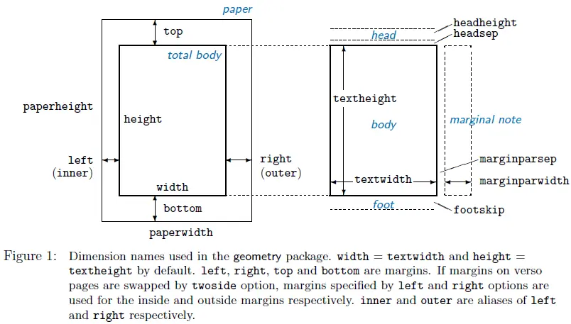

#+title: Latex学习笔记
#+date: <2024-10-01 二 02:04>
#+description: Latex使用过程中查阅一些资料做的笔记，防忘

#+setupfile: ../../../setup.setup

#+begin_quote
警告！这只是一篇笔记！一篇笔记！非入门教程！\\
系统环境：Arch Linux | Android (Termux)\\
更新时间：2025-12-27
#+end_quote

#+begin_comment
#+begin_src text
LaTeX完全指南
   
   1. 安装与环境配置
   2. LaTeX基础知识
      2.1 基本语法与命令
      2.2 文档结构与类型
      2.3 宏包管理与使用
   3. 文本格式与排版
      3.1 字体样式与大小
      3.2 段落与间距
      3.3 列表环境
      3.4 表格制作
   4. 数学公式
      4.1 基础公式语法
      4.2 常用符号速查
      4.3 多行公式与对齐
   5. 图表与浮动体
   6. 参考文献与引用
   7. 高级功能
      7.1 自定义命令
      7.2 幻灯片制作
      7.3 模板使用
   8. 常见问题与解决方案
   9. 代码示例库
   10. 参考资源
#+end_src
#+end_comment

* 基本安装
#+begin_quote
只会装texlive，别问，就是方便，虽然耗时但打不过它在arch和termux官方库里都有啊。

附注：TexLive就是一个Tex发行版（理解成xxx全家桶），类似于archlinux和linux内核的
区别。
#+end_quote
在Archlinux下执行以下命令安装即可：
#+begin_src shell
sudo pacman -S texlive-bin
#+end_src
在Termux下通过以下命令安装：
#+begin_src shell
# 安装安装脚本和依赖
pkg install texlive-bin
# 真正耗时间的是下面这条命令
termux-install-tl
# 备注：刚安装好要找一个tex文件编译一下以初始化
# 否则其他程序（例如manim）内部进行调用时就有可能出问题
#+end_src
Windows下安装的经验暂缺

* LaTeX基础知识
latex源文件(.tex文件)，纯文本，保存排版控制命令与内容本身。pdf文件由latex的编译
器编译。一般而言编译器用xelatex即可（即使用xelatex命令）。

** 基本语法
tex文件内的命令由下列格式构成
#+begin_src latex
\command[可选参数]{位置参数}
#+end_src
其中command为命令名，中括号内为可选参数（有时可直接忽略），大括号内为位置参数。
有些时候在命令外部套一个大括号这可以限制其作用范围，就像下面这样。
#+begin_src latex
{\CJKfontspec{仿宋}冇}
% latex里使用%作为行注释的开头
% 而对于上述命令，大括号限制了CJKfontspec的作用范围，使其仅使大括号内定字字体变为仿宋
#+end_src

latex的命令可以由自身定义，也可以覆盖已存在的命令
** 基本结构
Latex文件基本结构如下：
#+begin_src latex
  % 导言区
  % 用于进行一些全局的设置，这里的文字不会进入正文
  \documentclass[11pt]{article}   % 指定文章类型
  \usepackage{ctex}   % 解决中文乱码无法渲染问题
  % 这里就可以引入其他宏包、定义其他命令、设置样式等
  \begin{document}
  这里是正文区，这里的内容会进入最后的生成结果。
  \end{document}
#+end_src
对于上述内容，
- =\documentclass{xxx}= 设置了文档类型，不同文档类型会有不同的能用的命令，生成的
  文件样式也不一样。常用的documentclass有：
  - =book= : 生成的文件样式类似于出版的书籍，空白较大。提供了 =\part= =\chapter=
    =\section= 等命令
  - =article= : 生成一般文章都样式。提供了 =\section= =\subsection=
    =\subsubsection= 等命令
  - =beamer= : 生成类似幻灯片（PPT）的样式
  - =standalone= : ???
  一般而言，在指定documentclass时还可以传入参数简单地设置页面布局，如下列例子
  #+begin_src tex
    % 设置正文使用12pt字体，使用a4纸，单面打印（不会预留装订空间，对应twoside）
    \documentclass[12pt, a4paper, oneside]{article}
  #+end_src
- =\usepackage{xxx}= 则用于使用宏包，作用类似于c语言的 =#include<stdio.h>= ，或
  者是python的 =import xxx= ，宏包能很多一些有用的功能，以免自己去重复造轮子。其
  中，=xxx= 是宏包名，如基本语法，在 ={xxx}= 前加上 =[]= 可以在调用宏包时传入些
  选项。如：
  #+begin_src tex
    \usepackage[UTF8]{ctex}
  #+end_src

** 编译tex文件
可以尝试将上节的代码丢进任意一个 =.tex= 后缀的文件（例如 =a.tex= ）然后执行下列
命令
#+begin_src shell
# a.tex需要自行替换成你的文件
xelatex a.tex
#+end_src
ls一下应该能看到当前目录下多出了一堆杂七杂八的文件，以及一个pdf文件。打开之后效
果应该类似下图：

#+CAPTION: latex编译效果图
[[./latex/20251227_170048.avif]]

上面命令中的 =xelatex= 就是tex引擎（可执行程序），一般一个tex引擎会和某种特别的
/格式/ 绑定（理解成是tex语言的 /方言/ 具有独有的基础宏或命令就可以了，类比成lisp
和elisp）[fn:1]

这里选择xelatex主要是因为它的生成产物就是我们熟悉的pdf文件，而且它支持
unicode（说人话就是支持中文），所以最好直接脑子丢掉认为直接 =xelatex xxx= 编译
tex文件就好了。（除非要和不用xelatex的人对接，详见参考资料）
** 更宽泛些的例子
下面有一个包含更多latex功能的例子，解释会在注释里。
#+begin_src latex
  % 文章类型
  \documentclass[12pt, a4paper, oneside]{article}
  % 使用的宏包
  \usepackage{ctex}
  \usepackage{fgruler}   % 为页面添加标尺（用于对应实际大小）
  % 文件的作者、日期、标题等信息
  \author{Here is user!}
  \date{\today}  % 使用\today命令生成时间字符串
  \title{This is TITLE!!!}
  
  % 文档正文开始
  \begin{document}
  % 绘制标题(包括标题、作者和时间)
  \maketitle
  % 生成目录
  % 依赖于生成的.toc文件，而这个文件需要在编译过一次tex文件后才能生成
  % 所以第一次生成的pdf没有目录（还未生成.toc文件）
  % 第二次生成的pdf目录由于没有考虑到目录的加入导致的错位所以可能会和目录里的页码对不上
  % 第三次编译tex文件生成的目录才会没什么问题
  \tableofcontents
  
  这里是正文
  \section{一级标题}
  这里的\textbf{n级标题}就会被用作生成目录
  
  实际上这里的section等命令实际上会随着选择的documentclass而改变。
  例如说在article里的一级标题就是section，而在book里则变成了part。
  \subsection{二级标题}
  \LaTeX 这里放点示例文字
  \subsubsection{三级标题}
  \subsection{latex的自然段}
  latex和markdown里一样相邻的两行会被视作同一自然段
  每个自然段都会自动缩进2个汉字宽度，符合一般的排版要求
  如果需要换行则可以使用\textbackslash\textbackslash，例如说\\这段文字就被换行了。
  而如果要开启一个新的自然段可以使用\textbackslash{}par命令，\par 例如这段文字。
  
  \noindent 如果想要开启新段落而不缩进可以使用\textbackslash{}noindent命令，就例如说这个段落本身
  
  如果要开启新一页则可使用\textbackslash{}newpage
  \newpage 例如说这句话应该在新的一页里出现
  
  \subsection{\LaTeX 的行内样式}
  在正文部分实际上可以使用\textbackslash{}textit{xxx}来
  框住xxx以设置成特殊样式的字体
  
  顺带介绍下有序列表就如源代码所展示的这样：
  % 这个begin和end可以理解为开始并结束某个特定的 *环境* ，例如说有序列表，或者其他的东西
  \begin{enumerate}
  	\item \textup{textup: 就例如这段文字(Just Like This)}
  	\item \textit{textit: 就例如这段文字(Just Like This)}
  	\item \textsl{textsl: 就例如这段文字(Just Like This)}
  	\item \textsc{textsc: 就例如这段文字(Just Like This)}
  	\item \textbf{textbf: 就例如这段文字(Just Like This)}
  \end{enumerate}
  
  据说是在中文中并没有斜体这种字形，考虑到英语中的斜体作用一般是引用，
  所以在中文里就对应的换成了楷体。
  \subsection{latex一些环境}
  \subsubsection{verbatim}
  \begin{verbatim}
  	在verbatim环境的所有文字的样式都会保留原样输出。
  	具体地说，就是说假如说我就在这里换个行。
  	那他就算是另起一个段落了，而不需要空出一行或者是使用\par命令。
  	而且所有的命令都会被忽略掉。啊，好像它还不会换行。。。。。就像是现在这样子。。。。
  	即便是英文也不能。。。
  	Never Gonna Give You UP. Never Gonna Let You Down. Never gonna run around and desert you, Never gonna make you cry never gonna say goodbye. Never gonna tell a lie and hurt you.
  \end{verbatim}
  
  \subsubsection{表格}
  如果空间不足表格可能会漂移。。。
  \begin{table}[h]
  	\centering
  	\caption{描述}
  	\begin{tabular}{|c|l|r|c|}
  		第一组 & 第二组 & 第三组 & 第四组 \\
  		\hline
  		\begin{tabular}{c|c}
  			1 & 6 \\
  			2 & 8 \\
  		\end{tabular} &
  		\begin{tabular}{c|c}
  			3 & 9 \\
  			\hline
  			4 & 2 \\
  		\end{tabular} &
  		\begin{tabular}{c|c}
  			5 & 6 \\
  			8 & 3 \\
  		\end{tabular} &
  		\begin{tabular}{c|c}
  			4 & 2 \\
  			\hline
  			3 & 9 \\
  		\end{tabular}
  	\end{tabular}
  	\label{表}
  \end{table}
  
  \subsubsection{列表}
  有序列表
  \begin{enumerate}
  	\item 这是第一点; 
  	\item[/2/] 这是第二点;
  	\item[(3)] 这是第三点. 
  		% 似乎是自定义前缀就不会被加进计数器里？
  	\item 列表可嵌套
  		\begin{enumerate}
  			\item 像这样
  		\end{enumerate}
  \end{enumerate}
  无序列表
  \begin{itemize}
      \item 这是第一点; 
      \item[2] 这是第二点;
      \item 这是第三点. 
  \end{itemize}
  
  % 正文结束
  \end{document}
#+end_src

其编译结果大致如下：

#+CAPTION: latex编译效果图2
[[./latex/20251227_204308.avif]]

* latex手册
** 行内内容
*** 行内文本效果
| 命令（宏）   | 效果（引入命令）                             |
|--------------+----------------------------------------------|
| =\textup=    | article类独占                                |
| =\textit=    | 手写斜体（中文楷体）                         |
| =\textsl=    | 一般斜体（中文楷体）                         |
| =\textsc=    | 小写变成大写但字号稍小                       |
| =\textbf=    | 加粗                                         |
| =\texttt=    | 打字机字体（verbatim使用的字体）（中文仿宋） |
| =\textsf=    | 无衬线字体（中文黑体）                       |
| =\textrm=    | （没看出来根普通字体的区别）                 |
| =\underline= | 下划线                                       |
|--------------+----------------------------------------------|
| 线           | =\usepackage[normalem]{ulem}=                |
|--------------+----------------------------------------------|
| =\uline=     | 下划线(使用ulem宏包)                         |
| =\sout=      | 删除线(使用ulem宏包)                         |
|--------------+----------------------------------------------|
| cancel删除线 | =\usepackage[thicklines]{cancel}=            |
|--------------+----------------------------------------------|
| =\cancel=    | 单向删除线                                   |
| =\xcancel=   | 双向删除线                                   |
|--------------+----------------------------------------------|
| color颜色    | =\usepackage{color}=                         |
|--------------+----------------------------------------------|
| =\color=     | 前景色                                       |
| =\colorbox=  | 背景色                                       |
#+CAPTION: 行内文本效果
[[./latex/20251227_213437.avif]]
*** 字体大小
#+begin_src tex
normal size words 
{\tiny tiny words}
{\scriptsize scriptsize words}
{\footnotesize footnotesize words}
{\small small words}
{\large large words}
{\Large Large words}
{\LARGE LARGE words}
{\huge huge words}
#+end_src
*** 超链接
使用hyperref宏包插入超链接:
#+begin_src latex
  \usepackage[hidelinks]{hyperref}
  \begin{document}
  \url{http://baidu.com/}

  \href{http://baidu.com/}{Baidu}
  \end{document}
#+end_src
*** 书写化学方程式
使用mhchem宏包:
#+begin_src 
  \usepackage{mhchem}
  \begin{document}
  \ce{Zn + 2H2O = Zn(OH) + H2 ^}
  \end{document}
#+end_src
效果图:
#+CAPTION: 化学方程式效果图
[[./latex/20251227_230211.avif]]
*** 示例文本（假文）
使用lipsum宏包以插入示例文本:
#+begin_src latex
  \usepackage{lipsum}
  \begin{document}
  % 这里的"114"是开始段落的意思，"514"是结束段落的意思
  % 个人推测就是从一个文本库里按照给定的自然段编号或者范围
  % 抽出来塞进正文里
  % 所以一直\lipsum[1]给出来到文字都会是重复的
  \lipsum[114-514]
  \end{document}
#+end_src
如果想要使用中文的可以使用zhlipsum宏包，对应的命令变更成
=\zhlipsum= 即可
*** 可用命令表示的普通字符
省略号(中文的 =……= 省略号在ctex会被转换为居中的省略号)
- 无需数学环境:
  - =\ldots= ：用于表示底部对齐的省略号，通常用于列举中的省略符号。
  - =\vdots= ：用于表示垂直的省略号，适合用于矩阵或多维数组。
  - =\dots= ：用于根据实际情况自动改变省略号的位置。
- 需要数学环境:
  - =\ddots= ：用于表示斜对齐的省略号，适合用于表示对角线上的省略。 
  - =\cdots= ：用于表示居中的省略号，适合用于运算（如连加、连乘等）中的省略。
** 行外内容
*** 表格
以 =tabular= 作纵向表格环境，内部可以镶嵌，外部套一个 =table= 环境，表格数据间通
过… =&= 进行横向分割通过 =\\= 进行纵向分割
*** TODO 插入图片
*** TODO 列表
关于设定列表的边距：
#+begin_src tex
% 设置列表的间距
\setlist{noitemsep,leftmargin=1em,labelsep=0.1em,topsep=0.1em,partopsep=0.1em}
#+end_src
*** 代码块
可以使用原生的verbatim环境(emacs导出src时使用)，不过更好的是使用listings宏包。
#+begin_src latex
  \lstset{
      breaklines=true,
      breakatwhitespace=false,     % 允许在任意位置换行
      breakindent=2em,            % 换行缩进
      prebreak=\mbox{\textcolor{red}{$\hookleftarrow$}\space},
      postbreak=\mbox{\space\textcolor{red}{$\hookrightarrow$}},
      numbers=left,      % 行号位置
      numbersep=0.5em,   % 行号距左侧宽度
      xleftmargin=1em,   % 左侧整体偏移
      %numberstyle=\tiny\color{gray},
      %basicstyle=\ttfamily\small,
  }
  \begin{document}
  \begin{lstlisting}[language=Java]
  public class Example {
      // 这是一个很长的注释行，会在这里自动换行显示，因为这一行确实太长了，超出了页面边界
      public static void main(String[] args) {
          System.out.println("Hello, World!");
      }
  }
  \end{lstlisting}
  \end{document}
#+end_src
** 特殊字符转义
#+begin_src latex
  % 原字符:
  %  #  $  %  ^    &  _  {  }  ~   \
  % 对应的表示方法：
    \# \$ \% \^{} \& \_ \{ \} \~{} \textbackslash
#+end_src
** 数学公式
#+begin_export html

#+end_export
- 行内公式
  在latex里使用两个 =$= 夹住一个行内公式，例如：
  #+begin_src tex
  $x=\frac{1}{2}at^{2}$
  #+end_src
- 行间公式
  看代码：
  #+begin_src tex
    $$x=\frac{1}{2}at^{2}$$  % 据传不推荐
    \[x=\frac{1}{2}at^{2}\]  % 据传更推荐这个
    \begin{equation}
        x=\frac{1}{2}at^{2}  % 能够生成带有编号的公式
    \end{equation}
  #+end_src
效果如下：

#+CAPTION: 公式效果图
[[./latex/20251227_220922.avif]]
** 数学符号
手写数学符号识别网站：[[http://detexify.kirelabs.org/]]
| 命令               | 效果            | 预览(html)           |
|--------------------+-----------------+----------------------|
| =a^{b}=            | 上标            | \[a^b\]              |
| =a_{b}=            | 下标            | \[a_b\]              |
| =\frac{a}{b}=      | 分数（a/b）     | \[\frac{a}{b}\]      |
| =\sqrt[n]{a}=      | 根号（a^{1/n}） | \[\sqrt[n]{a}\]      |
| =\sum_{x=1}^5 y^z= | 求和            | \[\sum_{x=1}^5 y^z\] |
|--------------------+-----------------+----------------------|
| =+=                | 加法            | \[a+b\]              |
| =-=                | 减法            | \[a-b\]              |
| =\times=           | 乘法            | \[x\times y\]        |
| =\div=             | 除法            | \[x\div y\]          |
| =\cdot=            | 点乘            | \[a \cdot b\]        |
|--------------------+-----------------+----------------------|
| =\leq=             | 小于等于        | \[a\leq b\]          |
| =\geq=             | 大于等于        | \[a\geq b\]          |
| =\neq=             | 不等于          | \[a\neq b\]          |
| =\approx=          | 约等于          | \[a\approx b\]       |
|--------------------+-----------------+----------------------|
| =\leftarrow=       | 左箭头          | \[\leftarrow\]       |
| =\rightarrow=      | 右箭头          | \[\rightarrow\]      |
| =\leftrightarrow=  | 双向箭头        | \[\leftrightarrow\]  |
|--------------------+-----------------+----------------------|
| =(= =)=            | 普通括号        |                      |
| =\{= =\}=          | 大括号          |                      |
| =[= =]=            | 方括号          |                      |
|--------------------+-----------------+----------------------|
| =\infty=           | 无穷大          | \[\infty\]           |
| =\emptyset=        | 空集            | \[\emptyset\]        |
| =\partial=         | 部分导数        | \[\partial\]         |
| =\int_a^b f(x)=    | 积分            | \[\int_a^b f(x)\]    |
*** 希腊字母
| 命令                      | 字母     |
|---------------------------+----------|
| =\alpha=                  | =𝛼=      |
| =\beta=                   | =𝛽=      |
| =\delta=, =\Delta=        | =𝛿,Δ=   |
| =\pi=, =\Pi=              | =𝜋,Π=   |
| =\sigma=, =\Sigma=        | =𝜎,Σ=   |
| =\phi=, =\Phi=, =\varphi= | =𝜙,Φ,𝜑= |
| =\psi=, =\Psi=            | =𝜓,Ψ=   |
| =\omega=, =\Omega=        | =𝜔,Ω=   |
** 页面布局
*** 纸型&页边距
使用geometry宏包用于控制页面布局,例子如下:
   #+begin_src latex
     \usepackage[
     	a4paper,      % 使用A4纸
     	left=0.7cm,   % 左边距0.7cm
     	right=0.7cm,  % 右边距
     	top=0.7cm,    % 上边距
     	bottom=0.7cm, % 正文底边距0.7cm
     	footskip=3pt, % 脚注与正文间隔3pt
     	twoside,      % 使用双面打印（装订）样式(相对于oneside)
     	bindingoffset=0.9cm,  % 设置双面打印时内侧为装订预留的页边距
     ]{geometry}   % 使用geometry,以上中括号内钧为可选参数
     % 使用时需要注意排列顺序，部分宏包可能与它的设置冲突，可能会单向覆盖
   #+end_src
以上就是一个比较极端的排版例子，页边距等都被压缩到了十分极限的地方。可以配合
fgruler宏包生成尺子评估打印效果。

相关间距说明：

#+CAPTION: geometry间距说明

*** 字体设置
使用fontspec宏包进行更详细的字体设置
#+begin_src latex
  \usepackage{fontspec}
  % 在正文之外时设置英文字体
  \setmainfont{DengXian Light}
  % 固定段落间距防止翻页时因为标题自动拉伸浪费空间
  % \setlength{\parskip}{0em}
  \begin{document}
  % 假定处于某个环境内
  \fontsize{4}{0.1}  % 为下文设置4pt的字体，行间距0.1pt(也许？)
  \selectfont    % 应用上述设置
  \CJKfontspec{DengXian Light}    % 设置中文字体(基于ctex包)(这里是"等线Light")
  \end{document}
#+end_src
*** 自定义章节样式
#+begin_src tex
% 使用 titlesec 重新定义标题格式，保持目录功能
\titleformat{\section}
  {\fontsize{6}{0.1}\selectfont\bfseries}
  {【\arabic{section}.】}
  {0pt}
  {}
\titleformat{\subsection}
  {\fontsize{5}{0.1}\selectfont\bfseries}
  {【\arabic{section}.\arabic{subsection}.】}
  {0pt}
  {}
\titleformat{\subsubsection}
  {\fontsize{5}{0.1}\selectfont\bfseries}
  {【\arabic{section}.\arabic{subsection}.\arabic{subsubsection}.】}
  {0pt}
  {}
% 移除标题间距
\titlespacing*{\section}{0pt}{0pt}{0pt}
\titlespacing*{\subsection}{0pt}{0pt}{0pt}
\titlespacing*{\subsubsection}{0pt}{0pt}{0pt}
#+end_src
*** 页眉页脚设置
用fancyfoot宏包:
#+begin_src latex
  \newcommand{\setsmallf}{\fontsize{4}{0.1}\selectfont\CJKfontspec{DengXian Light}}
  \pagestyle{fancy}
  \fancyfoot[C]{\setsmallf\thepage}   % 设置页脚（正中间）样式：使用等线light的页码
  \setlength{\footnotesep}{0.5\footnotesep} % 减少脚注之间的间距
  \setlength{\skip\footins}{0.5\skip\footins} % 减少脚注与正文的间距
#+end_src
*** 分栏
使用multicol宏包实现分栏
#+begin_src latex
  \usepackage{multicol}   % 使用包
  \setlength{\columnsep}{1mm}  % 设置分栏间隔
  \begin{document}
  不会被分栏的内容
  \begin{multicols}{n} % 其中的n为分栏数
    会被分栏的内容

    内容不够填满一整页时会优先向横向填充，在下面留出空间，而不是先一分到底
  \end{multicols}
  这里的内容也不会被分栏
  \end{document}
#+end_src
使用dblfnote可以实现脚注分栏，但是是固定2栏
*** 尺子
可以使用fgruler宏包生成实际尺寸的尺子，这里有[[http://mirrors.ctan.org/macros/latex/contrib/fgruler/fgruler.pdf][官方文档(pdf)]]。
#+begin_src latex
  \usepackage[type=user]{fgruler}
  % 指定类型为用户自定义(type=user)
  \fgrulerdefuser{
  	% 进行判断：仅在前两页生成尺子
  	\ifnum\value{page}<3\relax
		% 生成尺子，类型为alledges(四边都有)
		% alledges也可作为\usepackage时type=的参数
  		\fgrulertype{\fgrulerunit}{alledges}
  	\fi
  }
#+end_src

#+begin_quote
常见纸张类型尺寸备忘：
- A4： 210mm*297mm
- A5： 148mm*210mm
- B5： 176mm*250mm
#+end_quote

** Latex语法类控制命令
*** 判断
#+begin_src tex
  \ifodd\value{page}
  	当前为奇数页
  \else
  	当前为偶数页
  \fi
#+end_src
*** 自定义命令
#+begin_src tex
  \newcommand{\name}[arg_num]{do sth here,#1 means arg 1}
  \renewcommand{\name}[arg_num]{do sth here,#1 means arg 1}
#+end_src
*** 自定义环境
#+begin_src tex
  \newenvironment{新环境名称}[参数个数][参数默认值]{开始部分定义}{结束部分定义}
  \renewenvironment{新环境名称}[参数个数][参数默认值]{开始部分定义}{结束部分定义}
#+end_src
** 其他杂七杂八的东西
*** 宏包备忘录
1) hyperref: 插入超链接 =\usepackage[hidelinks]{hyperref}=
2) footmisc: 作用不明，先放着再说
3) lipsum: 使用 =\lipsum[num]= 插入示范文本

* Reference
- [[https://oi-wiki.org/tools/latex/][Latex入门教程]]
- [[https://dylandong.top/posts/e480/][【LaTeX】新手教程：从入门到日常使用]]
- [[https://github.com/FrogGuaGuaGua/HighSchoolMathematics/blob/main/Latex%E9%80%9F%E6%9F%A5.pdf/][Latex速查手册(tex+pdf) - （Github）]]
- [[https://www.mohu.org/info/symbols/symbols.htm][latex数学符号]]
- [[https://zhuanlan.zhihu.com/p/261667944][LaTeX listings 宏包使用说明 - 知乎]]
- [[https://blog.csdn.net/robert_chen1988/article/details/52739825][latex 中的长度单位，尺寸 - CSDN博客]]
* Footnotes
[fn:1] 参考文章：[[https://liam.page/2018/11/26/introduction-to-TeX-engine-format-and-distribution/][TeX 引擎、格式、发行版之介绍]]
