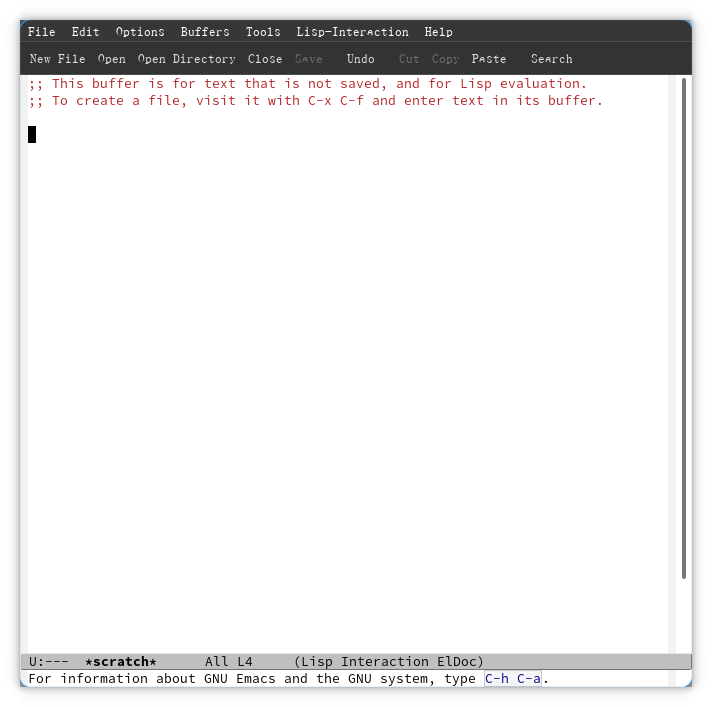
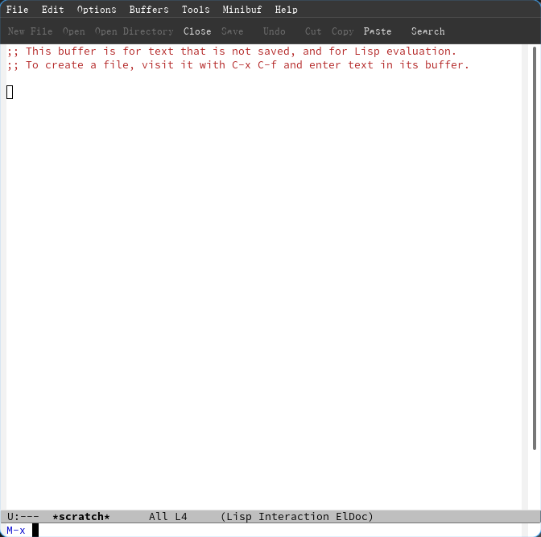
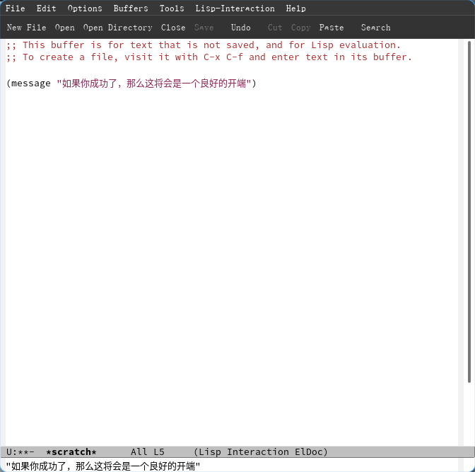
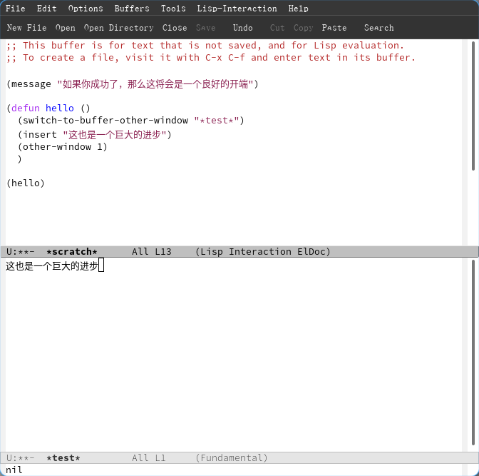

#+title: Emacs学习笔记
#+date: 2023-03-04 11:20
#+description: 我自己尝试写的Emacs入门教程，不喜勿喷，持续更新中

#+STARTUP: fold
#+OPTIONS: H:4

#+setupfile: ../../../setup.setup

* 前言
学习Emacs，一定要学会坚持

我的语文水平不太好，所以说表述可能会有错误，请原谅。\\
并且这篇文章并非专业教程，建议与其他材料对比着看。

请在上方选择栏目继续阅读。
* Emacs入门
** Emacs的安装
使用对应发行版的包管理器安装Emacs\\
以Arch Linux为例：
#+begin_src shell
pacman -S emacs
#+end_src
** 使用Emacs
*** 打开Emacs
Emacs提供了GUI图形界面和TUI终端界面两种界面。

在图形终端输入命令 =emacs= 可以打开emacs的图形界面，
或者使用 =emacs -nw= 打开非图形界面。

#+CAPTION: 图形界面

颜值不是emacs的强项，它默认的主题也确实挺丑，但是这掩盖不了它功能的强大。
*** 基本的操作
**** 一级按键操作
为了方便展示，我将基本的 /一级/ 操作写成表格列在下面：
| 按键 | 调用的函数               | 功能/效果介绍                                      |
|------+--------------------------+----------------------------------------------------|
| C-p  | previous-line            | 上一行                                             |
| C-n  | next-line                | 下一行                                             |
| C-b  | backward-char            | 上一个字符                                         |
| C-f  | forward-char             | 下一个字符                                         |
|------+--------------------------+----------------------------------------------------|
| C-l  | recenter-top-bottom      | 重置屏幕显示位置（光标居中、顶部、底部）           |
| C-v  | scroll-up-command        | 向下滚动一屏幕的位置                               |
| M-v  | scroll-down-command      | 向上滚动一屏幕的位置                               |
| C-a  | move-beginning-of-line   | 光标移动到行首                                     |
| C-e  | move-end-of-line         | 光标移动到行末                                     |
|------+--------------------------+----------------------------------------------------|
| C-g  | keyboard-quit            | 在很多情况下可以终止命令的输入或者执行             |
| C-k  | kill-line                | 删除光标右侧的内容并复制到剪贴板                   |
| C-y  | yank                     | 粘贴剪贴板的内容，粘贴历史详见官方tutorial         |
| M-@  | mark-word                | 高亮字符/单词，我也不知道具体的机制                |
| C-/  | undo                     | 撤销，在撤销前输入一个无关的命令会相反（重做）     |
| C-q  | quoted-insert            | 输入字符本身而不是进行其他操作（后面还需一个参数） |
| C-u  | universal-argument       | 重复执行某个操作多次                               |
|------+--------------------------+----------------------------------------------------|
| M-x  | execute-extended-command | 打开命令行执行命令                                 |
| M-:  | eval-expression          | 打开elisp命令行                                    |
#+begin_quote
注： =C-*= 意为 =Ctrl + key= ，而 =M-*= 意为 =Meta + key= ，其中的 =Meta= 键由于
不再在现代的键盘上使用，所以一般使用 =Alt= 键作为替代。苹果用户请另查资料。
#+end_quote
这些一级的按键操作构成了emacs最基本的操作逻辑，但是，这还远远不够
**** 多级按键操作
或许你会有疑问：为什么没有退出？\\
那是因为退出按键是一个多级的按键操作。

所谓的多级，其实是我乱取的一个称呼，实际上就是要连续按下多个快捷键。\\
打个比方，emacs中退出的快捷键是 =C-x C-c= ，即 =Ctrl+x Ctrl+c= 。这种快捷键模式
的形成主要还是得归功于键盘上的按键不够，为了能塞下尽可能多的快捷键，就产生了这么
一种“反人类”的快捷键模式，是区别于Vim多模式方法的另一种解决办法。这或许就是
Emacs学习的第一大门槛，但我要引用一些话，它们来自于Vim的官中教程vimtutor:
#+begin_quote
切记一点：本教程的设计思路是在使用中进行学习的。也就是说，您需要通过
执行命令来学习它们本身的正确用法。如果您只是阅读而不操作，那么您可能
会很快遗忘这些命令的！

...

特别提示：在浏览本教程时，不要强行记忆。记住一点：在使用中学习。

...

阅读完以上步骤，弄懂它们的意义，然后在实践中进行练习。
#+end_quote
在学习Emacs时，也应当记住上面的提示，毕竟在学习任何东西时，实践是极为有用的方法。

注意，由于编辑器系统较为复杂，所以有较多东西是没有办法一下子塞进来解释清楚的，在
学习前期的内容时更要注意以“能用”为目的，学到后面才是以“理解”为目的。在理解了
Emacs之后才能够更好地学习、扩展学识。

下面给出一个常用命令的列表：
| 按键    | 对应函数                   | 功能介绍                                         |
|---------+----------------------------+--------------------------------------------------|
| C-x     |                            | 一个前缀，其下的命令大都和窗口、文件有关         |
| C-x C-c | save-buffers-kill-terminal | 询问文件保存并杀死终端（说直白点就是退出Emacs）  |
| C-x k   | kill-buffer                | 杀死当前打开的buffer                             |
| C-x 0   | delete-window              | 关闭聚焦的窗口（或说是正在操作的窗口）           |
| C-x 1   | delete-other-windows       | 关闭非操作的窗口（即只保留正在操作的窗口）       |
| C-x 2   | split-window-below         | 在窗口的下面分割出一个新的窗口                   |
| C-x 3   | split-window-right         | 在窗口的右边分割出一个新的窗口                   |
| C-x C-e | eval-last-sexp             | 执行上一个距离光标最近的elisp语句                |
| C-c     |                            | 一个前缀，常用于特定的主模式的功能（供参考）     |
| C-h     |                            | 一个前缀，用于获取帮助信息                       |
| C-h c   | describe-key-briefly       | 获取指定按键所调用的函数名称（可作为一种"帮助"） |
| C-h k   | describe-key               | 获取指定按键所调用的函数的介绍信息               |
| C-h t   | help-with-tutorial         | 打开官方的tutorial                               |
*** 命令行操作
**** emacs函数思维
实际上emacs的所有操作都是基于某一个特定的函数的。这也就是有实际意义的按键后面都
有一个“调用的函数”的原因。

若要讲清楚什么是函数，那就要扯到elisp去了，这里简单解释一下，函数分为 /交互式函数/
和 /非交互式函数/ 两种，而交互式函数则被允许被用户从普通的命令行直接用函数名进行
调用或者设置快捷键进行调用，反过来非交互式函数则是不被允许的，但是也可以通过
elisp命令行使用elisp语法进行调用（一般是在命令外面套上一对括号，理解就好）
**** 普通的命令行
通过快捷键 =M-x= 进行调用，如图：
#+CAPTION: 调用命令行的图片

你可以在里面输入命令，并且可以使用Tab键进行补全。你可以尝试使用 =C-h c= 找到一个
你想要使用的命令并在命令行里面输入查看结果
**** elisp命令行(evil)
这个由于在前期并不常用，所以也不细说，只要记住：它可以进行elisp的命令调用
*** 小结
在阅读完上面的文本并进行大量尝试与练习之后，相信你已经可以正常的使用emacs了吧\\
但是，也仅限于会使用。如果想要真正发挥emacs的实力，你还需要学会配置emacs。请继续
往下看。
** 对Emacs的配置调教
*** 先来点降压药
如果你真的想依靠默认的快捷键配置使用emacs，那简直是不可理喻的事情。\\
我最想吐槽的或许就是emacs的快捷键——Ctrl，它作为emacs的常用快捷键的基础，它竟然在
键盘的左下或者右下角，这决定了大多数情况下你的小拇指都不会好过。所以说，为了拯救
小拇指，你或许应该考虑给Ctrl键换个位。

对于Windows10专业版的用户来说，可以选择安装微软官方出品的 =Powder Toys= 工具箱，
在里面的“键盘映射”选项中将你的 =Caps Lock= 键（即大写锁定键）映射为左右任意一
个Ctrl，那么你的小拇指将会得到极大的解放。注意，该程序对于系统有版本的要求，非专
业版用户无法使用。

对于苹果用户来说，请自查资料。本人财力有限，无法对网上的方法进行验证。

对于Linux用户来说，如果你想要在tty下更改键位，或许可以参考[[https://wiki.archlinux.org/title/Linux_console/Keyboard_configuration#Other_examples][这部分Arch Wiki]]，若想
要在X图形界面下更改键位，则只需要命令
#+begin_src shell
$ setxkbmap -option 'caps:ctrl_modifier'
#+end_src
即可让Caps Lock映射到Ctrl Left，同理更改选项则可以获得不同的效果。获取选项的命令
如下：
#+begin_src shell
$ grep -e "ctrl:\|:ctrl" /usr/share/X11/xkb/rules/evdev.lst
#+end_src
这部分的内容来自于[[https://wiki.archlinux.org/title/Xorg/Keyboard_configuration#Swapping_Caps_Lock_with_Left_Control][这部分的Arch Wiki]]，可以前去参考
*** 配置Emacs/elisp
emacs的配置文件语法是elisp（即emacs lisp），属于lisp语言的一种方言。由于其语法独
特，也可以说是emacs的第2个大门槛了

一个小提示：[[https://learnxinyminutes.com/docs/zh-cn/elisp-cn/][这里]]有一篇相对来说非常好的elisp教程，建议查看它的教程，或者互相参考。
**** 基本语法
lisp语言的本质是列表（list），其语句组成大致如下:
#+begin_src lisp
(function_name argument)
#+end_src
即一句语句由一对括号包住，组成一个列表，第一个部分为函数名称，后面的内容即为调用
函数时要传递的参数。这样就构成了一个基本的表达式，我们称之为 /s式/ 。

在执行语句时，它的逻辑是自内向外的，会将作为参数的语句执行后将其结果作为参数传递，
若想传递的值是它本身而非是执行它的结果，则应该使用一个引号 ='= 放置在元素的前面。

简单举一个例子：
#+begin_src lisp
(a (b 'c))
#+end_src
在这个例子中，解释器将会执行函数 =b= 并将 =c= 这么一个符号作为参数传递进去，并将
其执行的结果作为参数传递进函数 =a= 并执行。

要想学会elisp，只有理论怎么能行？实践那都是必须的。\\
若想要在Emacs里面执行Elisp语句可以通过以下几种方式：

1. 使用快捷键 =C-x C-e= 可以执行光标前面最近的s式
2. 通过进入 =eshell= 执行语句
3. 使用快捷键 =M-:= 打开命令行执行elisp语句

我们可以使用Emacs默认打开的buffer =*scratch*= 结合 =C-x C-e= 练习elisp语法。

尝试键入下面的内容并将光标移动到命令的下面再键入执行命令的快捷键：
#+begin_src lisp
(message "如果你成功了，那么这将会是一个良好的开端")
#+end_src
执行结果应当如下：
#+CAPTION: 执行结果

不难看出，这个语句的意思就是在消息栏里发送通知。

所以说，现在你已经学会了基本的elisp语法了，请保持这种激昂的学习情绪，继续看下去。
**** 一些例子
配置配置，肯定都是要贴合实际的，是有强功能性的。在平时的使用中应当多提问题，多想
想解决办法解决问题。

举个例子，如果我想实现一个功能，能够实现自动在当前窗口的右侧分割出一个新的窗口并
在里面打开一个新的buffer，并且在那个buffer里面插入一些指定的内容该怎么办呢？

正常情况下我们应当寻找一个函数，其功能是在一个当前的窗口右侧打开的新窗口中打开一
个新的buffer。这里废话少说，直接公布答案： =switch-to-buffer-other-window= ，这
个函数便能满足我们的需求，只要在后面加上要打开的buffer的名字即可。

接下来我们要找的是一个能够在光标处插入文本的函数，这里也一并放出： =insert= ，在
后面加上要插入的内容。

最后，我们需要一个能够返回到当前窗口的函数，即 =other-window= ，参数传递为1。

放上最终的代码：
#+begin_src lisp
(switch-to-buffer-other-window "*新的buffer*")
(insert "这是你想要输入的内容")
(other-window 1)
#+end_src
**** 函数
但是聪明的你肯定会发现，上面的语句都是单独执行的，没有办法连成一块，是没有办法成
功执行的。那么，有没有一种可能，可以将多个语句的内容合并到一起去呢？有！那就是函
数。

函数的定义语句为
#+begin_src lisp
(defun name ()
  (message "......")
  )
#+end_src
其中， =name= 表示名称，其后的括号表示参数列表，里面可以填变量名，再往后便是执行
语句了。

就以刚才的功能举例，我们可以将其扔进一个函数内部，执行完函数的定义语句后，再添加
一个执行函数的代码并执行即可。在执行定义语句时，会将函数的名称返回并显示到通知栏。

其结果应当如下：
#+CAPTION: 执行结果

值得注意的是，函数并非连接多个语句的必经之选，实际上还有 =progn= 语句可以实现相
似的功能，有些时候我们并不希望定义一个函数但是参数必须是一个函数时，我们可以使用
=lambda= 临时函数而不必定义一个函数名
**** 变量
继续刚才的内容。作为一门完整的语言，elisp也不缺变量这个东西，不过它的分类较多。
大致如下：

1. 全局变量
   1. 普通的全局变量
   2. customize的全局变量
2. 局部变量
   1. 局限于函数
   2. 局限于作用域

首先是全局变量，它的作用域应当是最广的，优先级也是最低的，它的定义方法如下：
#+begin_src lisp
(defvar name initvalue
  "docstring")
#+end_src
其中， =name= 是名字， =initvalue= 是初始值，而 =docstring= 则是介绍文档。一般用
于向用户说明函数的功能。

还有另外一种全局变量，定义如下：
#+begin_src elisp
(defcustom name standard
   "docstring"
   args)
#+end_src
这个就属于elisp里面的“方言”部分了，有了它，你就可以通过 =M-x customize-option=
设置变量的值并保存在customize的生成的内容里了。顺带一提， =args= 是它的参数，可
以传入 =:type ...= =:group ...= 进行设置，一个指定类型，二个指定它所属的组，方便
管理（组需要使用 =defgroup= 额外定义）

接着的就是局部变量了。在我的认知范围内，变量的作用域有两种：作为函数参数的局部变
量和额外定义的局部变量。这里只谈额外定义的局部变量。

定义一个变量的语法如下：
#+begin_src elisp
(let ((name 0))
  (message "这部分是执行语句"))
#+end_src
即一个列表，列表里面再套个列表，第一个是变量名，第二个是初始值

设置变量的语法如下：
#+begin_src elisp
(setq name 0)
#+end_src
也可以使用 =set= ，但是变量名前需要有 ='= 包裹。\\
该函数也可以定义全局变量或者对已有的变量重定义，而 =defvar= 则不可以。

而使用 =setq-local= 函数则可以定义一个作用域为当前buffer的变量
**** 流程控制语句
既然基本的语法学了，那么流程控制语句也不能丢。

这里我就简单提一些(知识有限，请原谅)：

- =(if (表达式) (执行语句))= \\
  判断
**** 数据的输入
- read-char\\
  读取char输入
- read-number\\
  读取数字类型输入，建议使用 =C-h f read-number= 查看详细介绍
*** 正式配置Emacs
憋了这么久，是不是特别难受？在学完了上面的所有内容之后，你应该对于elisp这门解释
型语言有了一定的了解。那么下面，我们将正式开始对Emacs的配置。
**** 文件规范
在平时，你的每一个emacs的配置文件应该被命名为 =xxx.el= ，而Emacs最开始调用的文件
是 =init.el= 文件。根据习惯，它应该存放在 =~/.emacs.d/= 目录下，即
=~/.emacs.d/init.el= 文件。

根据规范，每一个el文件都应该有一个这样的架构：
#+begin_src elisp
;;; init.el --- 这里填这个文件的描述                    -*- lexical-binding: t; -*-

;; Copyright (C) 2023  不要在意我的头像QwQ

;; Author: 不要在意我的头像QwQ <Chglish@Chglish>
;; Keywords: docs, c, lisp, files

;; This program is free software; you can redistribute it and/or modify
;; it under the terms of the GNU General Public License as published by
;; the Free Software Foundation, either version 3 of the License, or
;; (at your option) any later version.

;; This program is distributed in the hope that it will be useful,
;; but WITHOUT ANY WARRANTY; without even the implied warranty of
;; MERCHANTABILITY or FITNESS FOR A PARTICULAR PURPOSE.  See the
;; GNU General Public License for more details.

;; You should have received a copy of the GNU General Public License
;; along with this program.  If not, see <https://www.gnu.org/licenses/>.

;;; Commentary:

;; 这里理论上是填写文件的评论的地方

;;; Code:

;; 这里存放你的代码

(provide 'init)
;;; init.el ends here
#+end_src
注意，在lisp中以分号开头的行均为注释，但是不同的分号数量为开头的注释是有不同的含
义的。

3个分号开头的注释可理解为段落的标记，2个分号开头的注释可以理解为正常的行注释，而
1个分号开头的注释一般而言和2个分号开头的注释没有什么区别，但是会有很大可能和代码
一同缩进，所以通常使用2个分号开头作注释。

下面给出一些非常严格的注释规范，对于个人的配置来说可遵守可不遵守。下面是一个简化
过后的示例：
#+begin_src elisp
;;; 这边是文件名 --- 这里填这个文件的描述

;;; Commentary:

;;; Code:

;; 这里中间的部分用于存放你的配置

(provide '这里的名称是文件名去掉后缀)
;;; 这里同样也是文件名 ends here
#+end_src
这里只对 =provide= 作简单的解释。它的功能主要是将一个文件的内容“导出”，让其允
许被其他文件引用并执行，有利于配置文件模块化，方便管理。

#+begin_quote
温馨提示： =init.el= 实际上没有必要使用provide，因为它就是总调用文件
#+end_quote

下面再给出一个参考用的文件结构：
#+begin_src text
~/.emacs.d/
├── custom.el
├── init.el
└── lisp
    ├── init-auto-insert.el
    ├── init-auto-save.el
    ├── init-better-defaults.el
    ├── init-custom.el
    ├── init-keybindings.el
    ├── init-loop-alpha.el
    ├── init-open-files.el
    ├── init-org.el
    ├── init-packages.el
    ├── init-quickly-input-c.el
    └── init-ui.el
#+end_src
**** 引用
既然文件都拆分成几个了，那么就少不了引用。\\
上文中我讲了文件应当如何让自己允许被引用，那么就应当知道如何引用文件。

首先，你需要在你的init.el添加这么一句：
#+begin_src elisp
(add-to-list 'load-path "~/.emacs.d/lisp/")
#+end_src
其中 =add-to-list= 的功能是为指定的列表变量添加一个元素，在这里添加的即为文件的
加载目录。

在这之后，就可以添加引用的语句了：
#+begin_src elisp
(require 'name)
#+end_src
=name= 为你的文件里填写的 =provide= 的名字。

另外，这里提供一段设置custom文件的配置，这里不作解释。
#+begin_src elisp
(setq custom-file (expand-file-name "~/.emacs.d/custom.el"))
(load custom-file 'no-error 'no-message)
#+end_src
**** 配置
如果想要照抄配置，可以参考参考那些大佬的配置，例如[[https://github.com/purcell/emacs.d][Purcell的配置]]，或者是[[https://github.com/redguardtoo/emacs.d][陈斌的配置]]，
再或者是其他的[fn:1]。
** 更多的东西
本来我打算在这里写更多东西的，但是右侧的目录已经塞满了，那么，就到这里就结束吧。
剩下的内容应该会在下一篇博客里面写出来，希望如此吧。（理论上它会成为这篇文章的一
个新的标题在上面）
* Footnotes

[fn:1] 打个小广告：[[https://github.com/youlanjie/emacs.d/][我自己的配置]]
