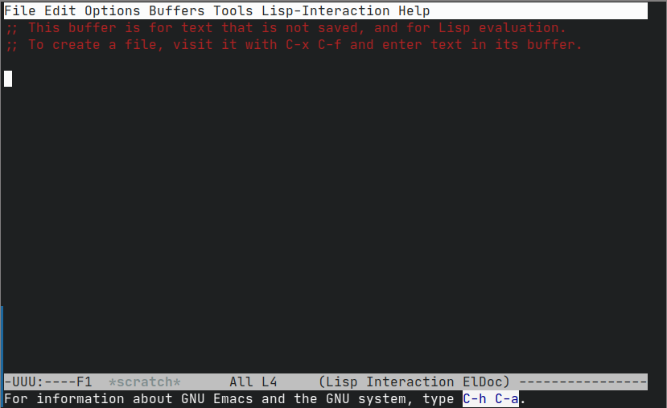
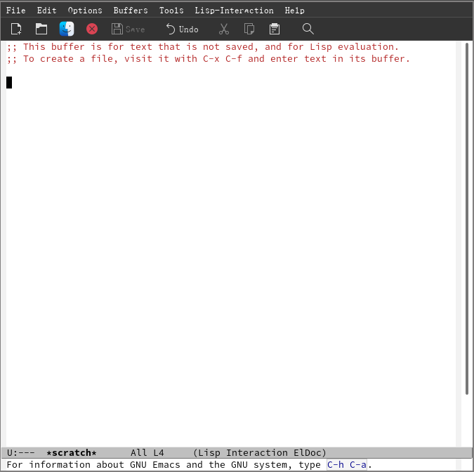

#+title: 从vim转移到emacs
#+date: 2023-01-16 12:30
#+description: 单纯的有感而发的口水文

#+setupfile: ../../../setup.setup

* 开始
** 前言
随手记下我是怎么从一个Vim用户转为一位Emacs用户的（实际上是脚踏两条船）

#+BEGIN_QUOTE
*警告，这篇文章不是教程，只是我转变的新路历程，仅对大的方向有参考作用*
#+END_QUOTE
** 原因
最开始的原因是，看到别人吹emacs的org-mode有多么厉害，功能多么强大，而vim下安装插件也只是模仿了一半而已，功能残缺。出于“试一试”的心态，我就第一次安装了Emacs
** 几次失败
既然是第一次，那么在我打开的一瞬间，我就觉得那些夸emacs好的人是不是在搞诈骗，因为它的初始的默认的界面其实异常地丑，给人一种极端复古的感觉。下面是两张Emacs终端界面和图形界面的截图（非开始界面）
#+CAPTION: 终端界面

#+CAPTION: 图形界面

这种界面给我的第一印象就是： *简陋* 。

我很难理解为什么一个被夸赞成“神的编辑器”居然看起来是如此地简陋。我甚至一度怀疑那些界面好看的Emacs都是虚假的。就这么，我放弃了Emacs，回到了Vim的舒适区内。后来我又尝试过几次，都都没有坚持下去。僵持近一年后，就到了23年1月，我开始了最后一次尝试，也是唯一成功的一次。
* 上手
** 先前阶段的学习
实际上，无配置的Emacs的开始界面并非如上图所示，而是有一个开始页面。在这个页面中，我看见了个字眼: =tutor= 。它是什么意思我并不清楚，但是我知道在安装Vim后会有一个命令： =vimtutor= ，我但是就判断：这很有可能是Emacs的教程，加上在图形界面Emacs是默认开启了鼠标操作的，于是我就用鼠标打开了" /Emacstutor/ "，正式开启了对Emacs的学习
*** 键位问题
Emacs的这份帮助文档是中文的，这极利于我学习Emacs，而摆在所有Vim党前面的最大问题实际上是Emacs看似十分不合理的键位布局。由于没有像Vim里的“编辑模式”这种东西，所以说它的大多数快捷键都是通过“ /叠Buff/ ”给叠起来的简单来说就是套娃。再通俗一点就是先按下一套快捷键，再按下另一套快捷键实现对应的功能，只有常用的快捷键不用“套娃”，如移动、复制、删除等。

但是有一个大问题，Emacs的快捷键对于Alt键和Ctrl键有着极强的依赖。对于我来说，Alt键可以很轻松地按下——只需要左手大拇指向内勾，但是Ctrl就不是省油的灯了。因为Emacs的移动就是使用C-bnpf [fn:1] 来移动的，所以说这对于小拇指的工作压力是极大的。为什么会有这种问题呢？那是因为Emacs的键位并非是按照现在的键盘设计的，所以说会有这种“逆天”的快捷键组合。

但是实际上，这个问题是有解的，解一就是让 =Caps Lock（大写锁定）= 和 =Ctrl= 两个按键调换功能，或者是直接让 =Caps Lock= 直接变成 =Ctrl= 键。但方法[fn:2]我就不在此赘述。

解二实际上现实得多，也对新手特别是Vim党特别友好——使用Evil
**** Evil
首先，我先下个定义： *Evil* 是一个Emacs的插件。不同于Vim，Emacs有一个内置的插件管理器和一个较为统一的插件仓库EPLA。它似乎又有一些其他的分支， =GNU MPLA= 是GNU Emacs的官方插件仓库，而 =MEPLA= 则是一个非官方插件仓库。不管怎样，我还是将全部的仓库放入了配置文件[fn:3]里：
#+BEGIN_SRC lisp
;; 添加仓库
(require 'package)
;(add-to-list 'package-archives '("melpa" . "https://melpa.org/packages/") t)
(setq package-archives '(
  ("melpa" . "http://mirrors.tuna.tsinghua.edu.cn/elpa/melpa/")
  ("gnu" . "http://mirrors.tuna.tsinghua.edu.cn/elpa/gnu/")
  ("org" . "http://mirrors.tuna.tsinghua.edu.cn/elpa/org/")))
(package-initialize)
#+END_SRC
为了速度，我并不是使用其官方仓库地址，而是清华镜像。同众多的Linux发行版一样，Emacs的插件仓库是有镜像的，实际上用户也可以自己构建一个本地镜像源。不过我比较懒，不想那么做。
*** 插件管理
在Emacs的配置文件中加入了上述配置后，就可以使用 =M-x= =list-packages= 或者是使用 =M-x= =package-list-packages= 来列出插件列表。其中的操作如下表：
| 按键 | 功能                 |
|------+----------------------|
| d    | 标记删除插件         |
| i    | 标记安装插件         |
| U    | 升级所有可升级的插件 |
| x    | 执行标记的操作       |
| q    | 退出插件列表         |
这样，我们就可以用它来方便地安装插件了。下面再介绍一种再配置文件中安装并配置插件的办法：使用 =use-package=
**** use-package
想要使用它，你需要先手动安装use-package插件，
并在配置文件中加入：
#+BEGIN_SRC lisp
(eval-when-compile (require 'use-package))
#+END_SRC
意思就是加载use-package插件，然后你就可以使用一个“宏”来管理插件：
#+BEGIN_SRC lisp
(use-package foo
  :ensure t                  ;; 确认插件存在（不存在则自动安装）
  :init (function)           ;; 初始化的设置，一般是启动某个函数
  :config (function)         ;; 配置方面，定义功能，设置变量
  :hook (hook . function))   ;; 定义hook，针对特定major mode的设置
#+END_SRC
它的作用通常是在安装了插件后进行相应的配置，利用这一特性，也可以通过它来让你的配置更加“ /模块化/ ”
*** 配置
这一方面我的做法是根据自己的需求（大都是想复现我在Vim配置好的功能），上网搜相应的资料抄作业。但是不知为什么，我在网上搜索到的资料比较少且大都比较杂乱，令我费解，就算是抄下来也总是出现各种莫名其妙的报错。

实际上我看过这么一篇文章[fn:4]，里面有一个观点： *站在巨人的肩膀上* ，意为新手要先把大牛的配置抄下来学习，不要尝试自己从头建立一份配置。我并不反对这一观点，并且我还尝试了他推荐的[[https://github.com/purcell/emacs.d][purcell的Emacs配置]]。确实，相对于我自己的配置来说（也许）更快，但我觉得有一些缺点是没有办法弥补的。别人的配置总有一些是我不需要的，也会缺少一些我需要的功能，而自己胡乱去加，又有可能引发奇怪的bug。所以说我也只是把这些配置当成抄作业的对象，但不是首要的。毕竟我不想一遍遍去看完它的所有文件。

* Footnotes
[fn:1]
即Ctrl-b（向左）、Ctrl-n（向下）、Ctrl-p（向上）、Ctrl-f（向左）

在Emacs中（其实这套方案大都通用）， =Key-key= 通常表示要从左到右同时按下的按键，而 =Key key= 则是先按下 =Key= 后再按下 =key= 的快捷键组合

[fn:2]
这里仅补充Linux如何设置按键映射。

在X环境下请参考[[https://wiki.archlinux.org/title/Xorg/Keyboard_configuration#Using_setxkbmap][这篇ArchWiki学习使用setxkbmap]]并参考[[https://wiki.archlinux.org/title/Xorg/Keyboard_configuration#Swapping_Caps_Lock_with_Left_Control][其中的这段文字学习查看相关选项]]。这里给出相关命令及其结果
#+BEGIN_SRC shell
# 查询相关选项
$ grep -e "ctrl:\|:ctrl" /usr/share/X11/xkb/rules/evdev.lst
  grp:ctrl_select      Left Ctrl to first layout; Right Ctrl to second layout
  grp:ctrls_toggle     Both Ctrls together
  grp:ctrl_shift_toggle Ctrl+Shift
  grp:ctrl_alt_toggle  Alt+Ctrl
  grp:ctrl_space_toggle Ctrl+Space
  ctrl:nocaps          Caps Lock as Ctrl
  ctrl:lctrl_meta      Left Ctrl as Meta
  ctrl:swapcaps        Swap Ctrl and Caps Lock
  ctrl:hyper_capscontrol Caps Lock as Ctrl, Ctrl as Hyper
  ctrl:ac_ctrl         To the left of "A"
  ctrl:aa_ctrl         At the bottom left
  ctrl:rctrl_ralt      Right Ctrl as Right Alt
  ctrl:menu_rctrl      Menu as Right Ctrl
  ctrl:swap_lalt_lctl  Swap Left Alt with Left Ctrl
  ctrl:swap_lwin_lctl  Swap Left Win with Left Ctrl
  ctrl:swap_rwin_rctl  Swap Right Win with Right Ctrl
  ctrl:swap_lalt_lctl_lwin Left Alt as Ctrl, Left Ctrl as Win, Left Win as Left Alt
  caps:ctrl_modifier   Make Caps Lock an additional Ctrl
  altwin:ctrl_win      Ctrl is mapped to Win and the usual Ctrl
  altwin:ctrl_rwin     Ctrl is mapped to Right Win and the usual Ctrl
  altwin:ctrl_alt_win  Ctrl is mapped to Alt, Alt to Win
  terminate:ctrl_alt_bksp Ctrl+Alt+Backspace
# 设置选项，这是让Caps Lock映射到Ctrl Left
$ setxkbmap -option 'caps:ctrl_modifier'
# 这是让Caps Lock和Ctrl Left互换
$ setxkbmap -option 'swapcaps'
#+END_SRC

若是在无图形界面环境下，请参考[[https://wiki.archlinux.org/title/Linux_console/Keyboard_configuration][这篇ArchWiki学习配置]]，其中[[https://wiki.archlinux.org/title/Linux_console/Keyboard_configuration#Other_examples][这段]]是交换按键的具体例子。这里再附上[[https://wiki.archlinuxcn.org/wiki/Linux_%E6%8E%A7%E5%88%B6%E5%8F%B0/%E9%94%AE%E7%9B%98%E9%85%8D%E7%BD%AE][中文版本连接]]和[[https://wiki.archlinuxcn.org/wiki/Linux_%E6%8E%A7%E5%88%B6%E5%8F%B0/%E9%94%AE%E7%9B%98%E9%85%8D%E7%BD%AE#%E5%85%B6%E4%BB%96%E4%BE%8B%E5%AD%90Other_examples][片段连接]]。希望能有帮助。

[fn:3]
我的配置文件[[https://github.com/youlanjie/emacs.d/][链接]]，虽然比较烂，但可以用作参考。

[fn:4]
这两个链接的文章是相同的，这里只是提供两个入口
[[https://github.com/redguardtoo/mastering-emacs-in-one-year-guide][在Github的文章]]
[[https://blog.csdn.net/redguardtoo/article/details/7222501][在CSDN的文章]]
