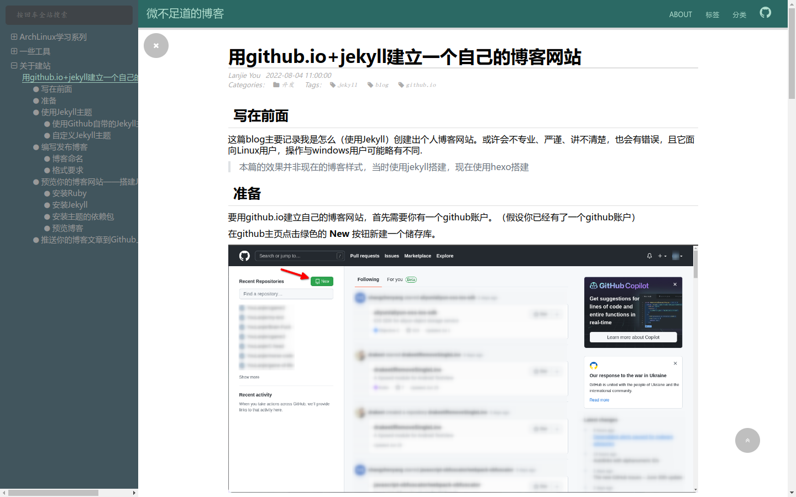

#+title: 用github.io建立自己的博客
#+date: 2023-04-29 08:55
#+description: 分别使用Hexo、Hugo、Emacs Org建立自己的博客。

#+setupfile: ../../setup.setup

* 前言
22年8月那会我写了一篇博客介绍了自己是如何使用Jekyll引擎搭建自己的博客的，但是半
年多过去了，我的博客网站早就“翻天覆地”了，基本上和过去没有什么关系了。所以，我
打算将我折腾博客的一些内容写出来。

还有，使用github.io建立博客需要拥有一个Github账户，这里为了方便简单假设您已经有
了Github账户，并且熟悉git仓库和基本的github操作。就让我们开始吧。
* Hexo使用
** 开始
Hexo使用Node.js编写，是一个博客引擎。安装方法参考[[https://hexo.io/zh-cn/index.html][官网]]：
#+begin_src shell
  $ npm install hexo-cli -g
#+end_src
安装后可以在终端执行命令
#+begin_src shell
  $ hexo init blog
#+end_src
在名为 /blog/ 的文件夹中创建默认的博客主题网站。现在则可以执行以下命令安装主题需
要的nodejs包
#+begin_src shell
  $ npm install
#+end_src
最后使用以下命令开始博客预览
#+begin_src shell
  $ hexo server
#+end_src
** 使用主题
网上有众多主题，到底应该怎么使用呢？

最基本的，当我们找到一个主题之后应当在它的Github项目页面查看README文件了解这方面
的内容，不过大都脱离不开这样的一个流程：

1) 克隆仓库到本地
2) 将克隆出来的仓库放到博客根目录下的 =theme= 目录下。
3) 编辑主题和博客的配置文件。
   这一步通常较为繁琐，一般要看主题提供了什么功能和什么注释。
** 一些优劣/我选择它的原因
1) 速度快
   它使用nodejs构建，解释速度快（相较于Jekyll）
2) 主题丰富（不知道算不算一个优势）
3) 安装部署方便
   他可以将博客一键布置到github上
4) 配置相对麻烦
   这似乎是个通病，只要换一个主题，就少不了大批量重新配置的需要，因为主题里面也
   需要更改配置。
5) 原生不支持Org文件写博客
   这点可以算是打油的，这只是我的个人需求，实际上Markdown的功能也足够丰富了
** 成果展示
#+CAPTION: 我过去使用hexo构建的博客图片

* Hugo
** 简介
Hugo是一个用Go语言编写的静态博客引擎。而相较于Hexo，它所拥有的为数不多的优势是原
生支持Org文档解析，但因为前段时间它生成博客出错，才让我抛弃它。它的主题相对会较
少，请酌情选择。
** 安装
由于我是Arch Linux环境，所以我这里只提Arch的安装办法，其他的请参考官网，理论上各
大发行版是拥有hugo软件包的。
** 使用
这里参考官网的教程，操作基本没有坑，除了选主题有点麻烦之外，这里便不过多赘述。
（实际上是我比较懒，不想写）
* Emacs Org
** 简介
这是我自己命名的一套方案，不一定好用，是我现用的方案（2023-04）

具体内容就是使用Emacs Org-mode的导出功能构建出一套博客网页。以我自己为例，网站的
Index首页索引界面和404 Not Found界面均为使用Org文档搭配html主题后生成的文件。而
首页则为纯手动管理，相对麻烦，也许什么时候我能弄上一个，脚本去管理它，而不用手动
管理链接。
** 使用
从网上下载你想要使用的主题需要的css文件和js文件到博客下的任意一个目录，然后创建
一个setup文件，像是该文章所引用的setup file：
#+begin_src org
  # -*- mode: org; -*-

  ,#+AUTHOR: 不要在意我的头像QwQ

  ,#+HTML_LINK_HOME: /
  ,#+LANGUAGE: zh

  ,#+OPTIONS: html-style:nil
  ,#+HTML_HEAD: <link rel="stylesheet" type="text/css" href="/theme/org-html-theme-dull.css"/>
  ,#+HTML_HEAD: 
  ,#+HTML_HEAD: <link rel="shortcut icon" href="/img/icon.jpg">

  ,#+LATEX_COMPILER: xelatex
  ,#+LATEX_HEADER: \usepackage[UTF8]{ctex}
#+end_src
在这里，文件第一行用于指定编辑模式，然后依次设置了用户名、主页链接、显示语言、主
题需要的选项共三行，并设置了网站的图标，最后的两行是给Latex导出为Pdf而设置的。在
编写好文件后，就可以在每篇文章里面添加这样一行内容进行引用。
#+begin_src org
  ,#+SETUPFILE: ../path/to/file.setup
#+end_src
值得注意的是，如果是要原封不动地导出到html的链接则可以使用“绝对路径”，但是如果
是要给Emacs使用的链接需要相对链接，因为在网页中可以使用 =/= 表示网站的根目录（即
只有域名的url）
** 本地预览
我会采用两种方式进行本地预览：nginx和http-server

nginx的学习与配置或许可以参考其他的文章或者我未来写一篇nginx的教程。

而http-server办法相对简单的多。首先在终端用root权限运行（请确保你安装了nodejs）
#+begin_src shell
  # npm install http-server -g
#+end_src
确认安装成功和就可以在博客根目录下使用命令 =http-server= 启动一个http服务器，默
认端口是8080，终端会有服务的地址显示的。顺带一提，它在访问没有 =index.html= 的目
录时且没有 =404.html= 文件时会自动生成返回当前目录下的所有文件与文件夹。可以当做
局域网的文件单向传输器。
** 上传到Github
你可以选择连带着org文件一齐上传，而我则选择了另外一种办法：也整一个public文件夹，
专门用于上传，而本地则维持着有点差异的文件系统，方便维护。并建立一个脚本方便快速
更新，内容如下：
#+begin_src shell
  #!/usr/bin/zsh

  #================================================================
  #   Copyright (C) 2023 YouLanjie
  #
  #   文件名称：build.sh
  #   创 建 者：youlanjie
  #   创建日期：2023年04月02日
  #   描    述：构建博客
  #
  #================================================================

  app_name="${0##*/}"

  # Show an INFO message
  # $1: message string
  _msg_info() {
      local _msg="${1}"
      [[ "${quiet}" == "y" ]] || printf '[%s] INFO: %s\n' "${app_name}" "${_msg}"
  }

  # Show a WARNING message
  # $1: message string
  _msg_warning() {
      local _msg="${1}"
      printf '[%s] WARNING: %s\n' "${app_name}" "${_msg}" >&2
  }

  # Show an ERROR message then exit with status
  # $1: message string
  # $2: exit code number (with 0 does not exit)
  _msg_error() {
      local _msg="${1}"
      local _error=${2}
      printf '[%s] ERROR: %s\n' "${app_name}" "${_msg}" >&2
      if (( _error > 0 )); then
          exit "${_error}"
      fi
  }

  usage() {
          usagetext="\
  usage: build.sh [options]
    options:
       -m 创建博客到public目录下（不建议使用）
       -b 构建博客列表与首页
       -u 导出未更新的org为html页面
       -U 强制更新所有的html页面
       -h 帮助信息"
          echo $usagetext
          exit $1
  }

  mk_public() {
          _msg_info "检测是否存在public文件夹..."
          if [[ ! -d public ]] {
                  if [[ -f public ]] {
                          _msg_error "文件\`public\`已存在且非文件夹" 1
                  }
                  _msg_warning "文件夹\`public\`不存在"
                  _msg_info "将创建public文件夹"
                  if [[ ! -d public ]] {
                          _msg_error "无法创建" 1
                  }
          } else {
                  _msg_info "结果为真，将进行构建操作"
          }
          _msg_info "清除public目录"
          find public |grep -v "\.git"|sed -n "s/public\//.\/public\//p"|sort -r|sed "s/^/rm -d '/"|sed "s/$/'/"|zsh
          _msg_info "创建目录树"
          find post -type d|sed -n "s/post\//.\/public\/post\//p"|sed "s/^/mkdir -p '/"|sed "s/$/'/"|zsh
          _msg_info "复制文件"
          find post -type f|grep -v "\.org"|sed "s/^/cp -r '/"|sed "s/ 'post\/\(.*\)$/ 'post\/\1' 'public\/post\/\1'/"|zsh
          _msg_info "复制首页"
          cp index.html public/
          _msg_info "复制404页"
          cp 404.html public/
          _msg_info "复制主题与图片"
          cp -r theme/ public/
          cp -r img/ public/
          _msg_info "Done!"
  }

  update_file() {
          emacs -Q -nw ./src/fastsetup.el "$1" --eval "(eval-buffer \"fastsetup.el\")"
  }

  update() {
          #update_file index.org
          #echo $file_list
          for name (post/**/*.org) {
                  out=$(echo $name|sed "s/\\.org$/.html/")
                  if [[ (! -f $out) || ($name -nt $out) ]] {
                          _msg_info "Export '$name' ..."
                          update_file $name
                  }
          }
  }

  build() {
          _msg_info "清空源文件"
          cat /dev/null > src/post2.org
          _msg_info "构建列表中"
          _msg_info "获取文件头并处理中"
          file_list=(post/**/*.org)
          line_max=$(echo $file_list|wc -l)
          for name ($file_list) {
                  title=$(head -n 5 $name |grep -i '#+title: ')
                  declare -l title="$title"
                  title=$(echo $title|sed 's/^#+title:[ ]*//')

                  date=$(head -n 5 $name |grep -i '#+date: ')
                  declare -l date="$date"
                  date=$(echo $date|sed 's/^#+date:[ ]*//;s/<\(.*\)>/\1/;s/\([^ ]*\) [一|二|三|四|五|六|日] /\1 /')
                  if [[ $date == "" ]] {
                          continue
                  }

                  desc=$(head -n 5 $name |grep -i '#+description: ')
                  name=$(echo $name|sed 's/^/..\//')
                  if [[ $desc != "" ]] {
                          declare -l desc="$desc"
                          desc=$(echo $desc|sed 's/^#+description:[ ]*//')
                          printf '- /%s/ [[%s][%s]]\\\\\\\\\\n  %s\n' "$date" "$name" "$title" "$desc" >> src/post2.org
                  } else {
                          printf "- /%s/ [[%s][%s]]\n" "$date" "$name" "$title" >> src/post2.org
                  }
          }
          list=$(cat src/post2.org|sort -r)
          echo $list > src/post2.org
          _msg_info "列表输出完成"
	
          _msg_info "导出首页中..."
          # emacs index.org -nw --eval "(progn (org-html-export-to-html) (kill-emacs))"
          update_file index.org
          _msg_info "Done!"
  }

  while {getopts 'mbuh?' arg} {
          case $arg {
                  m) mk_public ;;
                  b) build ;;
                  u) update ;;
                  h|?) usage 0;;
                  ,*) usage 1;;
          }
          exit 0
  }

  if [[ $@ == "" ]] {
          _msg_error "No options!"
          usage 1
  } else {
          _msg_error "Bad options!"
          usage 1
  }

#+end_src
+该脚本除了org外的将会依照原有目录树将所有源文件复制到public目录下。然后就可以使+
+用public目录进行最后的预览。最后使用public推送到github上。+

该脚本现在的用法是自动更新首页与自动更新（导出）文章的功能。脚本的链接在[[http:/build.sh][这里]]。
* Footnotes

[fn:1] =hexo s= 是 =hexo server= 的简称 
