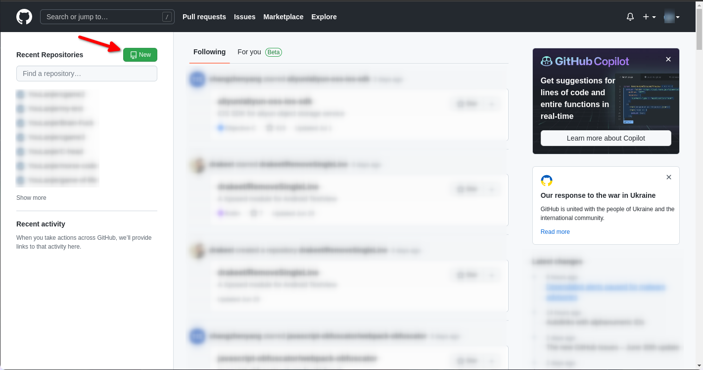
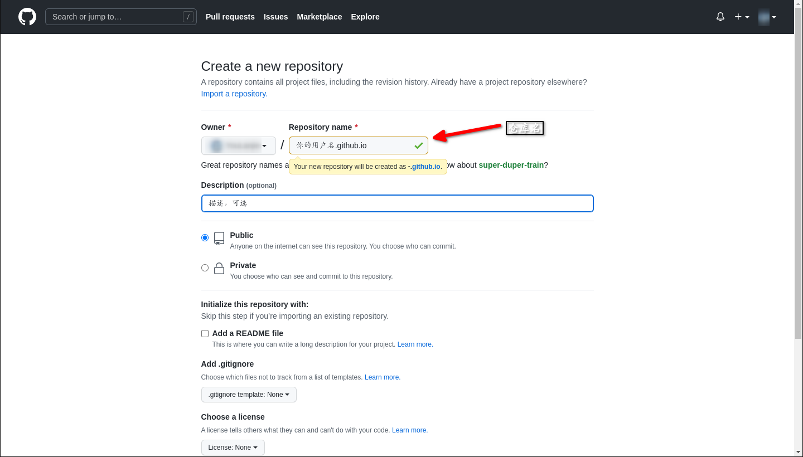
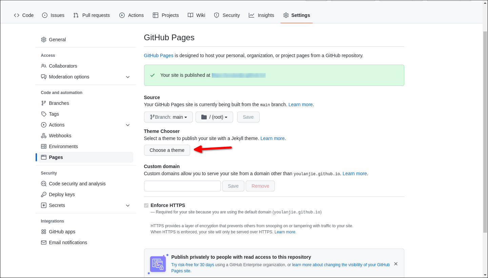
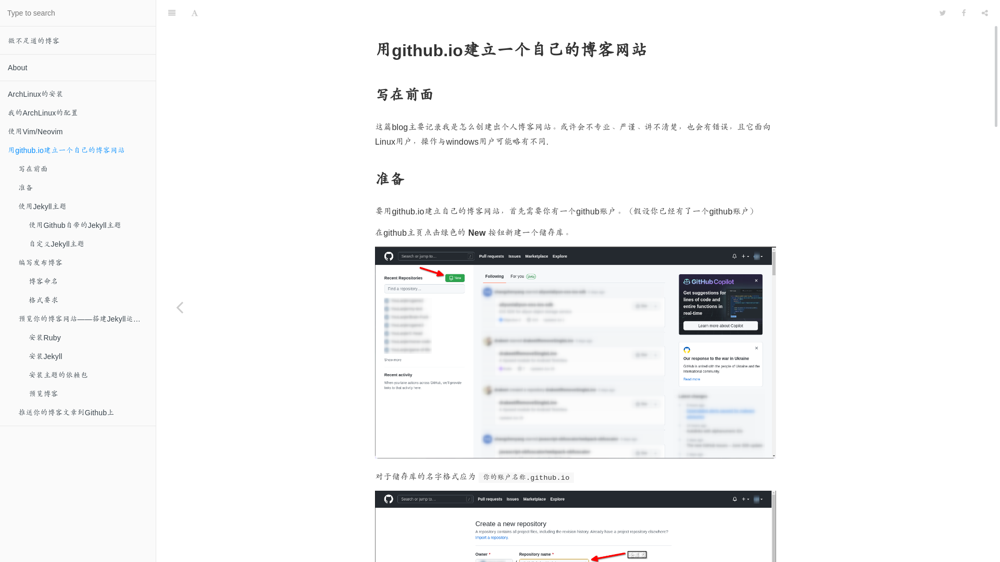

#+title: 用github.io+jekyll建立一个自己的博客网站
#+date: 2022-08-04 11:00

#+setupfile: ../../setup.setup

* 用github.io+jekyll建立一个自己的博客网站
** 写在前面
这篇blog主要记录我是怎么（使用Jekyll）创建出个人博客网站。或许会不专业、严谨、讲
不清楚，也会有错误，且它面向Linux用户，操作与windows用户可能略有不同.

#+begin_quote
本篇的效果并非现在的博客样式，当时使用jekyll搭建，现在使用emacs to http手动搭建
#+end_quote

** 准备

要用github.io建立自己的博客网站，首先需要你有一个github账户。（假设你已经有了一
个github账户）

在github主页点击绿色的 *New* 按钮新建一个储存库。

#+CAPTION: 创建仓库

对于储存库的名字格式应为 =你的账户名称.github.io=

#+CAPTION: 仓库名称

** 使用Jekyll主题
*** 使用Github自带的Jekyll主题
在仓库创建后你可以在仓库界面的 /菜单 -> Settings -> Pages/ 界面中点击按钮
*Choose a theme*

#+CAPTION: 界面位置

并选择一个Jekyll主题并提交更改形成一个初始的界面

*** 自定义Jekyll主题

先使用git克隆仓库到本地（git的用法自行百度）

#+begin_src bash
git clone https://github.com/你的用户名/你的仓库名
#+end_src

后再自定义主题。我使用的[[https://github.com/huxpro/huxpro.github.io][主题模板]]使用方法（参考[[https://keysaim.github.io/post/blog/2017-08-15-how-to-setup-your-github-io-blog/][这篇文章]]）

要先克隆你想要的主题模板仓库到本地,例如:

#+begin_src bash
git clone git@github.com:sighingnow/jekyll-gitbook.git
#+end_src

克隆后将里面的文件及文件夹（除了.git外）替换(复制到)你的仓库里，并作出一些必要的修改
（修改\_config.yml、index.html等，具体的文件规范可以看[[http://jekyllcn.com/docs/structure/][官方文档]]）
/（就像是抄作业不抄名字）/ 成为你的博客网站（这可能需要一定的html开发知识）

其他的主题可以在[[http://jekyllthemes.org/][这个网站上]]查找

** 编写发布博客
*** 博客命名
根据Jekyll官方文档的要求，博客文件应当放置在 *仓库根目录/\_posts/* 文件夹下,以
=YEAR-MONTH-DAY-title.MARKUP= 的格式对文件进行命名。推荐使用markdown编写blog。

*** 格式要求

#+begin_quote
我个人建议使用Markdown编写博客，最好搭配markdown预览功能使用。
#+end_quote

下面的内容均使用Markdown编写博客，其他的请自行查找教程

博客的头部应该有以下内容：

#+begin_src markdown
---
title: 这里填写文章的标题，填了就不用写一级标题了
author: 用户，我不太清楚它有什么用
date: 博客的编写时间（YYYY-MM-DD），填写了时间就会安装文件内部的时间来生成网页（而非文件名）
category: Jekyll       （我不知道它有什么用）
layout: post           （必不可少的内容，标识文件的类型为博客，否则本地预览时一般会出现问题：没有应用主题）
cover: 标识文章的封面图像
---
#+end_src

其中， =layout: post= 十分重要，如果文章里没有它，那么（本地预览）打开文章时不会
应用主题到上面去（至少我测试时是这样的）

而 =date: YYYY-MM-DD= 日期也不止是可以这样，你还可以写成 =date: YYYY-MM-DD
HH-MM-SS +8000= 的形式。即包括时间及时区（+8000是时区）。如果当前日期时间在文章
标注的时间前是不会构建文章的内容为html的

封面有无图像效果对比：
#+begin_center
#+CAPTION: 无封面

#+CAPTION: 有封面

#+end_center

** 预览你的博客网站——搭建Jekyll运行环境
由于博客网站推送到远程再进行构建会有一定的延迟，有时甚至不会更新，
因此在本地搭建Jekyll的运行环境是有必要的
*** 安装Ruby  
在ArchLinux安装：

#+begin_src bash
sudo pacman -S ruby
#+end_src

在Debian/Ubuntu

#+begin_src bash
sudo apt install ruby
#+end_src

*** 安装Jekyll
#+begin_src bash
gem install jekyll
#+end_src

*** 安装主题的依赖包  

因为不同的主题会使用到不同的包，会有不同的依赖，具体的可以查看项目目录下的
=Gemfile=，里面会有一些类似于下面的内容

#+begin_src gemfile
gem "jekyll"
gem 'jekyll-feed'
gem 'jekyll-readme-index'
gem 'jemoji'
gem 'webrick'
#+end_src

基本上安装文件中的引号中的包（名）就不会报错

#+begin_src bash
gem install xxx          #xxx为包名，需自行替换
#+end_src

#+begin_quote
不知道为什么，我运行jekyll预览时会报错，含有 =webrick= 等字样
查了半天才找到了[[https://blog.csdn.net/qq_43655096/article/details/120397848][解决办法]]：

#+begin_src bash
bundle add webrick
#+end_src
#+end_quote

*** 预览博客
在终端执行命令：

#+begin_src bash
jekyll serve
#+end_src

#+begin_quote
顺带一提，想要在本地创建一个默认的jekyll博客项目，就在终端执行：

#+begin_src bash
jekyll new 你的项目名称（文件夹）
#+end_src

不过这样可能会有一些慢
#+end_quote

** 推送你的博客文章到Github上
在一篇blog写完后就可以执行

#+begin_src bash
git add --all                                  #添加所有文件
git commit -m "你想要给这一次提交做的注释"     #进行提交
git push                                       #推送更新到Github上
#+end_src

将更新推送到github上，等待一会之后你的博客网页
（应为你的仓库名，如[[https://your_user_name.github.io]]）就应会刷新
