#+title: 泰拉瑞亚战士全流程笔记
#+date: <2024-11-10 Sun 09:14>
#+description: 看404岛主等up的教程学的知识点笔记

#+SETUPFILE: ../../../../setup.setup

* 肉前流程
** 创建世界
战士，只建议玩猩红世界，以获取站神必备物品。（腐化，前期地形比较难探，且没有站神小玩具）
** 开局
下挖一小坑标记出生点，左右撸树平整下场地，搭建如图示卡怪单向墙，因为僵尸头顶有平台时不会跳,史莱姆不会下平台，人可先上平台（5格）再上至墙顶翻入，左右各一部。未成城镇前围小点（两堵墙搭得近点）防怪刷里面，有3个NPC后（会形成城镇）后再扩大墙之间的距离（与NPC屋同宽可围成成基地，后期屋子内可以铺上墙防刷怪)

[[./泰拉瑞亚战士全流程笔记/前期卡怪墙.jpg]]
#+begin_quote
僵尸（战士）AI特性:其第二第三格有平台时会尝试跳起来跳到平台上（如果玩家高于平台就会上去，反之就会下来），但第四格（即其头顶的一格）有平台时就不会跳了
#+end_quote
** 基地/NPC监狱
以基本的卡怪墙为前提，在出生点上方搭三层间隔4格高（即正常放置极限高）的平台（放置怪物跳上来），在最上方的那一阶平台开始左右扩展。预留以出生点那格为中心的3格宽作过道，于两侧各搭建NPC房屋5-6间（自用布局:左边4间，右边6-8间），款式如图，内部分上层4宽4高（用实体方块围外面），下层4宽3高（用平台围），中间隔以3实体方块和1火把（联通上下层），上层内部再摆上工作台和椅子，并在火把处向上铺3~4格墙即可成屋
#+begin_quote
[[./泰拉瑞亚战士全流程笔记/NPC监狱.jpg]]

原理:具有60格总面积，有光源（火把），家具（桌椅），门（平台，放房间内部也算），背景墙（小于4*4的破洞会被作为窗户处理），足够的站立点（中间的三格实体方块），处于非邪恶环境内（向日葵可以抵消邪恶计分）\\
缺点:NPC基于检测房间墙壁生成，墙铺得少NPC来得慢
#+end_quote
建议先建几间房引奸商进来，屯钱买镰刀割干草作垫脚和建筑方块（前期)。钱可以通过刷史莱姆或者僵尸屯(50银足以勾引奸商)，怕死可以直接把钱放在地上不会丢
** 探险/探图
把家周围的地表探下，遇怪优先以躲避为主，针对不同环境的内容总结如下：
- 通用：小心摔落伤害，平地放方块或者平地小跳可勾引僵尸从头上是跳过
- 森林：绕过史莱姆
- 雪地：相对安全，易于探索（包括地下，详见下面“关于更多的地形”一节）
- 沙漠：尽多地挖仙人掌做仙人掌剑仙人掌套，秃鹫和史莱姆一样不会下平台
- 丛林：对技术没自信的建议撤
- 猩红：见了就要跑的（对技术没自信的建议撤）
#+begin_quote
探索小技巧:往返床\\
利用系统对房屋判定，自动开关门和沙子自动下落的特性，将房屋造成门打开时房间失效（判定与NPC房类似，不过不需要判断是否有椅子和邪恶环境罢了），人使用魔镜（或回忆药水）会传送回初始出生点，然后门自动关闭，房间生效，人再传送会回到设定出生点。（用于前期探索时快速往返）

便捷的模板房间如下:
[[./泰拉瑞亚战士全流程笔记/往返床.jpg]]

使用方式:人站在门前，门自动打开（需要设置中启用相关功能，默认是开着的），在非床侧门上方放置一个沙子使房间失效，用魔镜传送即可
#+end_quote

如果探索过程中遇到丛林和邪恶环境堵家门口的眉笔情况，可以尝试快速翻越过去（或者取巧用绳子上太空用伞飞过去），碰碰运气看看它刷不刷怪。一旦越过去就立刻建个往返床作为基地。若条件充足则可以尝试建立相应的城镇之类的（雪地环境塞雪地晶塔）

#+CAPTION: 眉笔运气：左边猩红堵门，右边丛林堵门
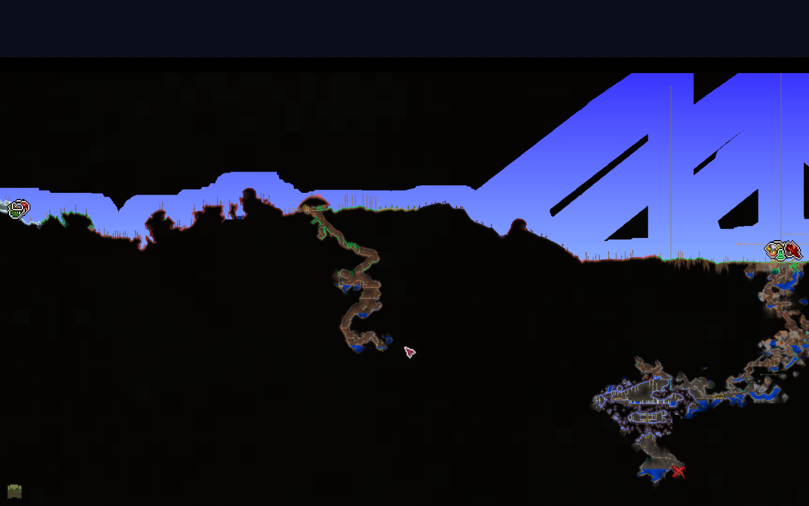

在探险过程中要留意下有没有攀爬爪和鞋钉（花后重要道具），金属带扣（新月可以找骷髅商人买），水上漂靴（泰拉靴合成材料之一）
** 挖矿
(此过程相对漫长且时刻穿插)
没有存钱罐下矿记得清钱，有则随身带一个，矿工帽对下矿也挺有帮助的。选址建议在普通地形（雪地也不错）探矿，相对安全。如果家附近有地表矿道建议顺其而下（不过要小心摔落伤害），多避战，多挡怪，前期战士弱鸡打不过。采矿的同时宝石也别放过，挖去做钩爪提升机动力（越早越好，搭配干草块，探险效果较好）（有钩爪就可以在一格宽的通道里上下移动）。遇到发光蘑菇地可以看看有多少生命水晶，把血量上限拉上去。
- 矿物:
  - 肉前自然矿[fn:1]:铜锡;铁铅;银钨;金/铂金
  - 肉前邪恶矿:魔矿/猩红矿（钧需要金一级稿或者炸弹）
  - 肉前特殊矿:陨石;黑曜石;狱岩矿（需要邪恶镐）
  - 肉后灵矿:钴矿/钯金矿;山铜矿/秘银矿;精金矿/钛金矿
  - 肉后其他矿:（神圣锭由新三王掉落）;叶绿矿（可合成蘑菇锭，幽灵锭）;夜明矿
- 稿力:决定敲击方块次数，矿级越高镐力越高，能挖的方块也越多。（不等于挖掘速度，肉前银镐最快，肉后蘑菇挖矿爪最快）

若遇到发光蘑菇地可以多搞点发光蘑菇，他们是50血药瓶合成成100血药瓶的必要材料
** 关于特殊事件
在探索到一定程度，拉到一定血量上限后就会发生的事，如160HP和10防御有克眼，200HP炸邪恶心会出哥布林事件，还有随机的血月（需要血量上限）和史莱姆雨（打多了召唤史莱姆王）
*** 过血月/哥布林袭击
向上延伸卡怪墙，和上层NPC房屋结合（如图），在事件期间堵住出口，然后在地上用手雷慢慢向左右清怪即可。\\
目标:取钱币槽

注：如果已经拿到勾爪了就可以把原本的突出部之类的挖掉了，反正自己能通过勾爪爬进去

[[./泰拉瑞亚战士全流程笔记/防御性墙.jpg]]

注2：若有条件实际上这时候就可以开装地表刷怪场了，详细相关内容可见“肉前准备工作与现状概述->三套刷怪场”中相关内容

#+CAPTION: 开荒过程中根据实际需求搭建的刷怪场，可见其中并未过克眼
[[./泰拉瑞亚战士全流程笔记/开荒地表刷怪场.jpg ]]
*** 打史莱姆王
召唤方式:杀够足够的史莱姆或者用材料去祭坛合成召唤物\\
平地拉或者用高空短平台通过下平台勾引下去用手榴弹或者其他武器削。目标:取史莱姆ang。
*** 过克眼（主线BOSS）
在家顶准备2层钩爪能够到的战斗平台，铺长点，摆上增益家具（篝火加生命回复，猫雕加防御，心灯加生命回复，向日葵加移速并降低刷怪率），换上防御最高的套装，有条件可备些廉价饰品上防御（如绳子+染料反复微光重铸），拿手榴弹，悠悠球，回旋镖，星怒等（远程）武器干就完了（武器能有就有）。

（打完还缺钱可以多打几次卖猩红矿）
** 关于更多的地形
注意：探索和主线进度是同时进行的，所以说不是推完主线再去探索下述地形之类的。
*** 雪地
雪地物产不算丰富，但是相对比较安全（环境明亮没有什么穿墙怪），可算是第二甚至是第一挖矿选择，宝箱可取其中冰雪刃、冰回旋镖、和溜冰靴，雪地也较易挖出较多宝石以获取或升级勾爪。
*** 空岛
空岛生成时有概率水池溢出落到地面，所以见到地上的疑似非正常生成水池时可以搭绳子绳子上去找空岛。如果绳子足够多且有伞则可以尝试用绳子搭根"擎天柱"上天用伞滑翔寻找，亦或者是在高空用铁轨水平方向查找（建议和床搭配）。如果有重力药水那就省事了。（绷不住的话可以尝试用如Terramap之类的地图查看器查图）
#+CAPTION: 大师档死好几次摸到星怒的我
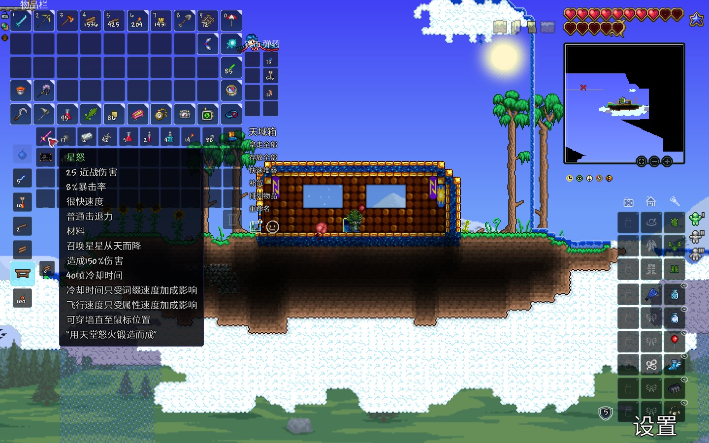

探索空岛主要目的:获取星怒，马掌和气球。
*** 沙漠
有星怒后探索地下沙漠就方便了，破仙人掌球掏生命水晶，寻找高尔夫球手。

目的:获得海螺（传送海边），凿子（挖掘速度），猫雕（加防御）
*** 丛林
主要目的:搜集丛林孢子15，藤蔓3，毒刺12以做草剑（真有了那就莽了）;\\
次要目的:取再生流杖
#+CAPTION: 丛林宝物：草剑
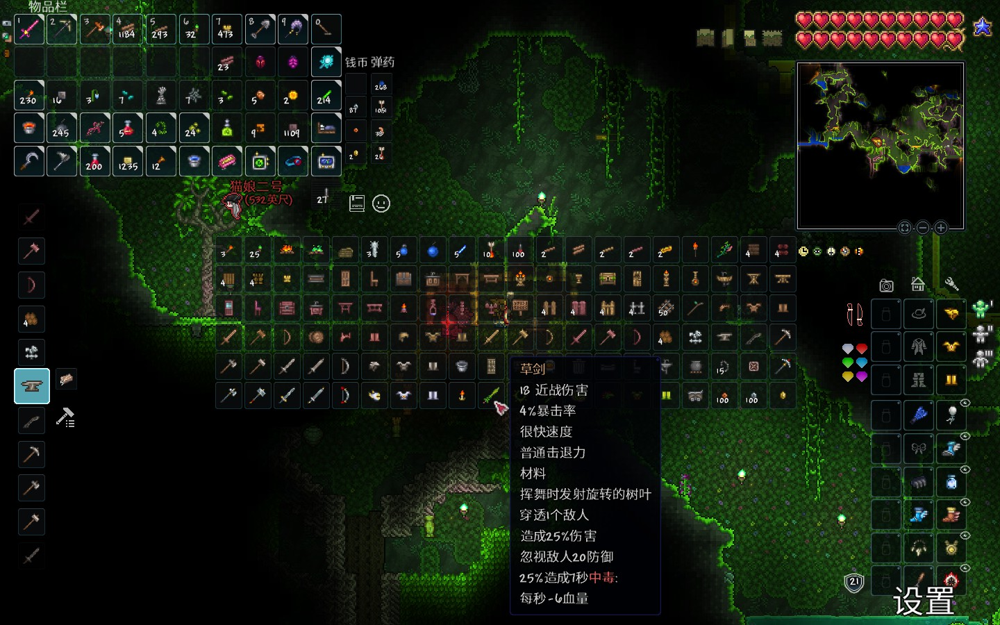
*** 微光
在丛林侧海边（可以通过海螺传送）和正常地形的交界处（大世界的位置稍微更加不确定些）向下挖或用雷管炸出下滑通道，找到微光，堵下两头防怪，然后迅速建NPC屋把NPC般进来，用10金买晶塔（微光拆解合成能省很多钱）

#+CAPTION: 微光城镇环境示意
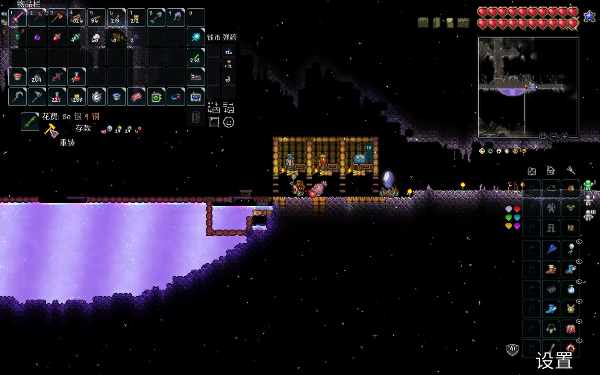

微光重铸设计：旁边挖个沟下去，摆上单向墙。
*** 猩红
猩红没有什么矿，主要是要搭点平台为打可脑和肉后敲祭坛作准备
** 过克脑
猩红中央空洞里铺上几层平台，掏袭击拿到的尖球约100个洒地上，后期草剑强健。目标：得到样本组织做猩红镐，猩红套。

注：克脑后就可以刷出酒馆老板找他要玻璃了[fn:4]。

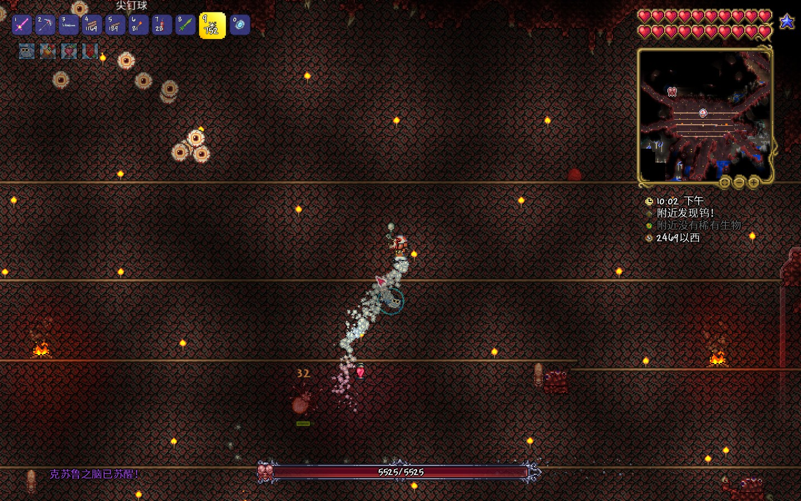
** 骷髅王
1) 套装准备：先探下地狱，用黑皮药水[fn:2]挖狱岩矿（需要65x3=195的狱石，65个黑曜石），再挖点黑曜石做狱岩套及火山大剑（要用到地狱熔炉，需要探索遗迹获得）。
2) 武器准备：火山、星怒、草剑（最主要）
3) 饰品：克盾、克脑、一堆廉价饰品（全护佑）
4) 场地准备：地牢斜坡搭个小房间放张床（用于快速复活、加速时间），在地牢门口上方搭2-3层约一屏幕长的战斗平台，准备好向日葵、猫雕、篝火等（间隔高点）

一阶段躲头用火山（换血）打手，然后同向绕圈走位用草剑打头（通过史莱姆ang的上下移速拉开距离的同时躲开螺旋追踪的骷髅头），滚筒洗衣机时平地跑即可（可全程带史莱姆ang）

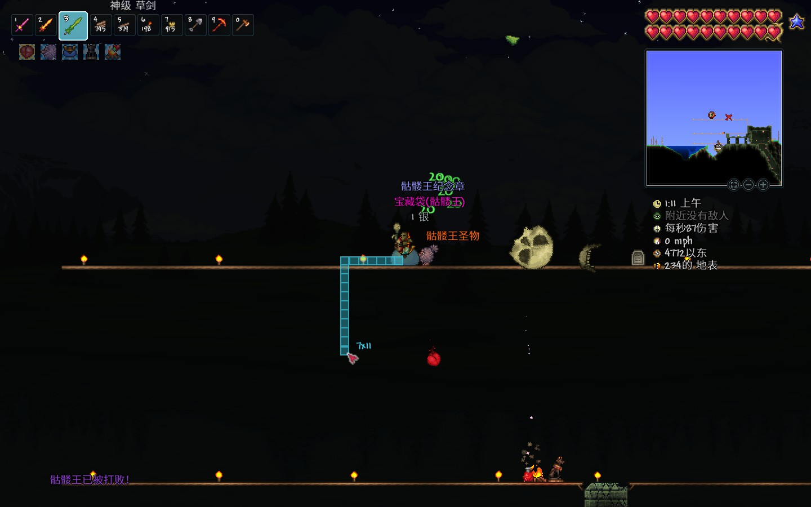
** 地牢与合成装备
- 刷怪取金题钥匙开箱取村正，回家合成把永夜剑（需要祭坛，火山，草剑，邪恶剑，村正）
- 刷怪取金题钥匙开箱取钴护盾，回家合成黑曜石护盾（需要黑曜石->黑曜石骷髅头）
- 找到机械师
- 找到猩红宝箱位置并用火把围两圈标记
- 刷够足够的骨头合成虚空袋即可。
** 其他BOSS
*** 蜂王
骷髅王后配置可以直接野战蜂王（丛林找蜂巢）（无需药水），注意下就行了

#+begin_quote
2025.01.22补充：就算是骷髅王后配置站撸蜂王还是有点悬的，最好还是跳下大绳
#+end_quote
*** 雪怪
祭坛合成召唤物或者等待自然生成\\
反正不会立刻挂，大不了搭上条命再去站撸（或者是床设置重生点海螺切到海边回血再回去），去把那个宠物（骨眼）打出来即可（巨好用）。

* 肉前准备工作与现状概述
此为战士肉后快速快乐发展之基，因此至关重要。当然，这里只是一个总结性的概述，其中的不同内容可以依据具体情况自行决定施工步骤。

** 建筑方块改变
如果缺建筑方块可以找酒馆老板买麦芽酒去微光分解成破璃
** 初步形成晶塔网络与NPC编排
- 丛林晶塔 油漆工、树妖（boss后）、巫师（蜂王后）、（史莱姆1只（给一史莱姆铜短剑即可））
- 洞穴晶塔[fn:3] 哥布林（袭击后）、机械师（骷髅王后）、酒馆老板（克脑后）、炸弹商[fn:5]
- 沙漠晶塔 高尔夫球手（地下沙漠）、染料商（骷髅王后）、（随便了这里）
- 雪原晶塔 （功能上不大重要，随便塞点什么npc撑个场子就行）
- 海洋晶塔 渔夫（海边）、派对女孩（具有一定NPC后）、理发师（蜘蛛洞）
- 森林晶塔 向导、奸商、（其他垃圾）

#+begin_quote
换取晶塔的方法：把军火商（有枪即来）和护士（有生命水晶即来）单独放在一起（旁边不要有其他npc），军火商会出售晶塔
#+end_quote
注：需要小心些防止肉后猩红感染带刷到自己的某个城镇，需要用向日葵等做好防护
** 推荐的城填样式与部分特殊基地安排
- 一般共性：NPC屋悬空于地表，可平整下地面，一般距地15格即可
- 出生点：边界使用单向墙/卡怪墙（如果已经有了地表刷怪场那可以拆掉换成竖直的墙），内建空间一侧储物（放箱子），另一侧放床、工作站等家具，出生点上下为贯通上下且有不可感染方块围挡保护的直通车（通上通下，防止肉后怪突袭）
- 丛林：丛林的NPC屋需改造为下底封上的样式（反正就是围起来），防止肉后从林刷"新三王"(丛林龟等)，高度适当抬高，但别脱离环境。如果有需要，可以在从林新增两条地狱直通车。
** 初步建成各群系的鱼池
鱼池只需300格即可没有渔力debuff
（如果找不到合成猛虎攀爬装备的材料那钓鱼就会成为唯一出路）

需求:丛林地表，沙漠地表，天空池，雪地地表，森林地表（非必须）

注：当然如果运气非常好这个存档什么装备都有没有必要钓鱼那就当我没说。（不过渔夫给的信息类饰品还是有点吸引力的）
** 其它肉后基础设施建筑设
- 家具 搞到利器站（没有肉后找奸商买）、施法桌、做草药的
- 丛林 挖条直通车下到丛林神庙。建生命果农场（世纪之花苞农场确信），加防刷怪平台（小心感染了）
  #+CAPTION: 生命果农场，也可以刷世花花苞
  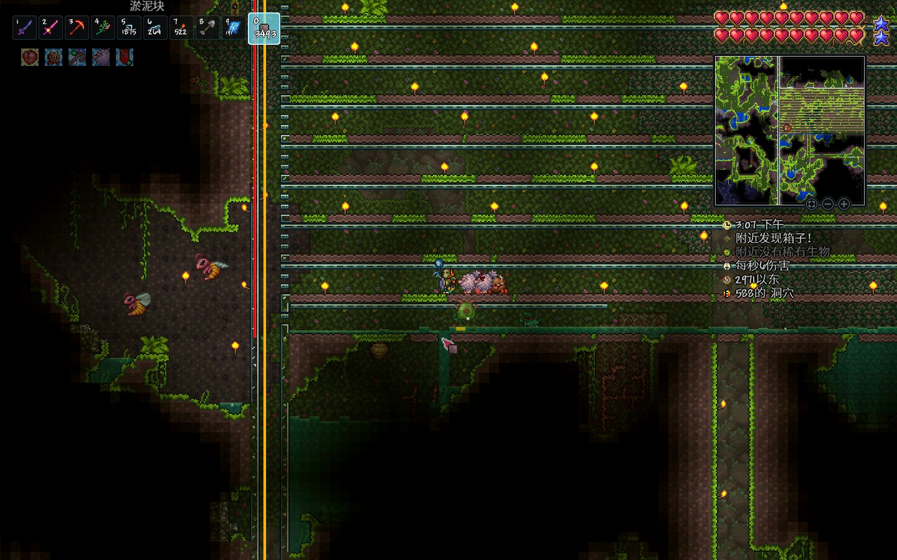
  - 生命果生成：最大可以每隔60格生成一个，所以需要经常去刷刷，财力充足可以加虚化器一键收割，只不过有点难找掉落物（或许应当铺上人工墙？）
- 草药农场 用利用树妖买的盆栽和丛林开出的再生法杖种植（建议建在海洋城镇外侧，刷怪少空间大），以下是部分草药和药水相关信息（加号表示有）:
  | 药水/草药        | 太阳花 | 月光草 | 火焰花 | 闪耀根 | 寒颤棘 | 雏菊/水叶草 | 备注                      |
  |                  |  <c>   |  <c>   |  <c>   |  <c>   |  <c>   |     <c>     |                           |
  |------------------+--------+--------+--------+--------+--------+-------------+---------------------------|
  | 铁皮药水（荐）   |   +    |        |        |        |        |             | +8防御                    |
  | 再生药水         |   +    |        |        |        |        |             | +生命回复                 |
  | 生命力药水       |        |   +    |        |        |   +    |      +      | +生命上限，还需要七彩矿鱼 |
  | 耐力药水         |        |        |        |   +    |        |             |                           |
  |------------------+--------+--------+--------+--------+--------+-------------+---------------------------|
  | 重力药水         |        |        |   +    |   +    |        |             | 还需要死亡草和羽毛        |
  | 洞穴探险药水     |        |   +    |        |   +    |        |             | 探灵矿/叶绿矿/生命果      |
  | 危险感知药水     |        |        |        |        |   +    |             |                           |
  | 黑曜石皮药水     |        |        |   +    |        |        |      +      | 还需要黑曜石              |
  |------------------+--------+--------+--------+--------+--------+-------------+---------------------------|
  | 生物群系视觉药水 |        |   +    |   +    |   +    |        |             | 净化环境用                |
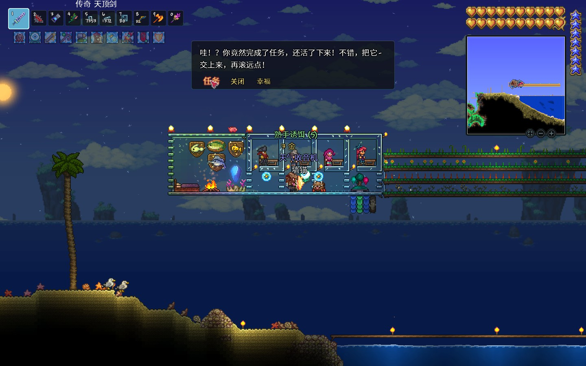
** 三套刷怪场
分别布局在家中直通车的洞穴层（不能放在地下层），家顶（地表，城镇环境用影烛消除），海边（刷哥布林或海盗等）（最后这个可选）
*** 刷怪机制
预先声明:坐标系使用的坐标原点均在玩家左上角

[[./泰拉瑞亚战士全流程笔记/刷怪范围.png]]
- 区域：建议在此基础上增加一些距离，为实际操作换取一些空间（如快速切换环境等）
  - 安全区域:W63， N36， E65， S38
  - 刷怪区域:W84， N46， E83， S45
  - 环境判定:W83， N61， E85， S64，至少需清定此范围防环境污染
  - NPC 检测:W120，N68， E121，S72，确保此范围内没有NPC，有则用影烛
  - 删怪区域:W250，N120，E220，S140
- 刷怪尝试 刷怪区择非实非人工墙，下寻一块（普通方块或者平台皆可)检测位置(三格高，左侧没有方块）（即在左上右下向阶梯不刷怪)，后出
- 类型 方块（大多）、环境（丛林冰雪龟）、墙怪（蜘蛛），环境+墙+方块（地牢）、其它（混沌精要影烛）
*** 环境构建
沙漠（需要有墙）1.5k物块，雪地1.5k;丛林250;神圣125;猩红300;地牢250（还要刷怪处有背景墙和方块，玩家在危险墙后）（墙分砖、板、瓷砖，战士只用瓷砖墙）;蘑菇地100

#+CAPTION: 开荒实践搭建的肉前载有雪地环境的刷怪场，用以刷小雪怪皮毛（场地经过改造故与下文图片不同）
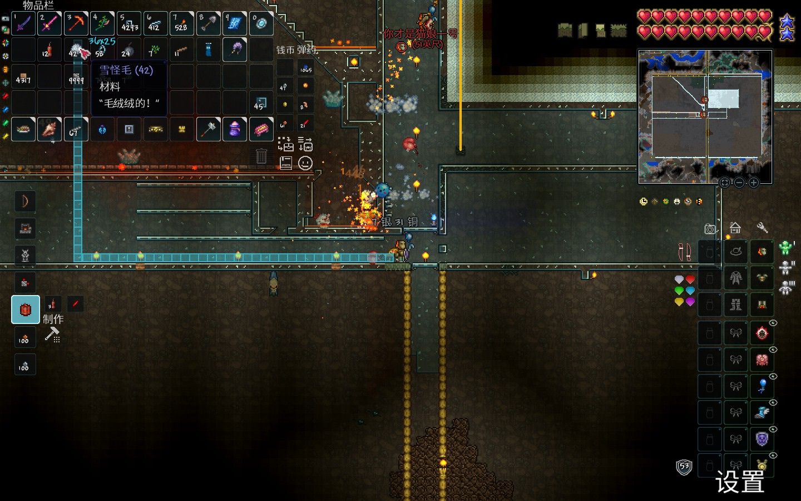
*** 特殊生物处理
法师会传送至记家6~20格范围内，空间宽3高4， *要有危险墙* ，用下面放泡泡上面倒岩浆处理

[[./泰拉瑞亚战士全流程笔记/刷怪场局部1.jpg]]
*** 刷怪场搭建
- 场地框架搭建：清空环境区域，并向多个方向多清理几格，建立如图所示的框架，建议用方块围下外框架。
- 刷怪区域处理：刷怪区用下半砖铺以激活（肉后）小宝箱怪，下方速移平台为向右倒斜坡（面向右下角）实体方块替换为防岩浆平台（如石砖平台），怪下平台会被速移。
- 放置环境：实际上只需要猩红雪地和地牢三种环境即可
- 物块准备：准备淤泥块，丛林和蘑菇草种，大理石块，猩红石块，地牢砖用于刷方块怪
  - 邪恶类型方块使用注意：肉后邪恶方块会感染6格范围内的方块，所以请务必确保方块周边6格内没有可以感染的方块防范感染
- 附加物件：
  - 放置一个箱子里面塞点东西，让仙灵（会降低刷怪率）能被快速刷掉
  - 放床和利器站等加成类家具，方便挂了也能原地复活
  - 放置水蜡烛和影烛，水蜡烛常驻，影烛常闭
[[./泰拉瑞亚战士全流程笔记/刷怪场全景.jpg]]

[[./泰拉瑞亚战士全流程笔记/刷怪场局部2.jpg]]

还有，这里还有一份改进后的设计供参考（最好还是自己去看看岛主的视频），主要改进的就是将刷怪平台抬高一些挖一个坑把怪卡里面，对于手短的战士而言是个好消息。并且增加了无伤宝箱怪装置

#+CAPTION: 此图的地牢环境处理错误，法师传送处没有放危险地牢墙故法师不会传送
[[./泰拉瑞亚战士全流程笔记/刷怪场改进.jpg]]

#+CAPTION: 扩展：无伤宝箱怪装置（宽3高4底部开孔还有倒斜坡） 
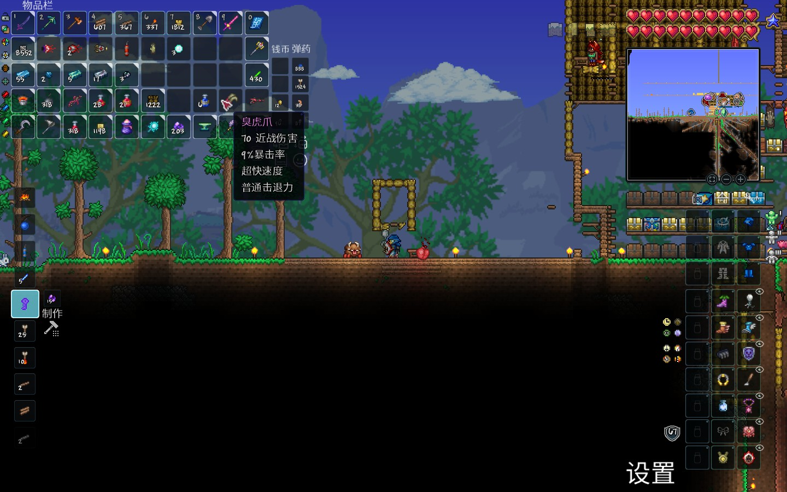

刷怪场最终确认的样式大致长这样，多了个方便出入的传送机罢了（左侧那几层玻璃平台没用可忽视）：

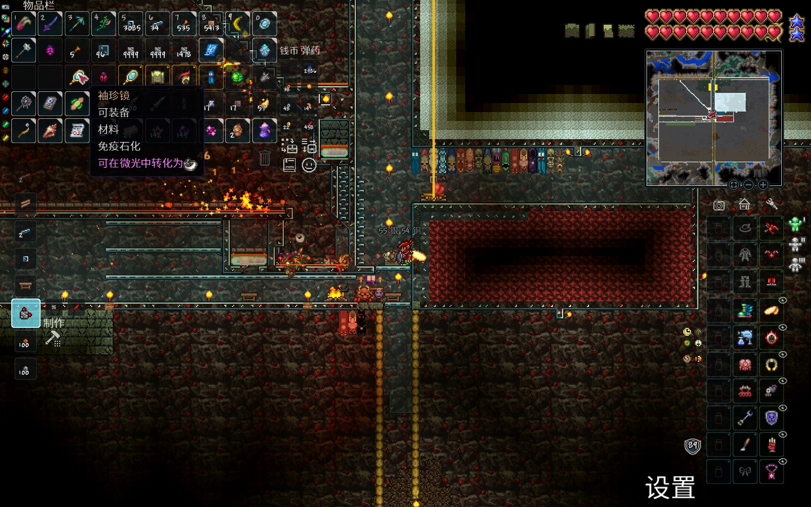
*** 地表刷怪
丢掉环境部分，场地如法炮制，需要注意的是地表有刷哥布林袭击的需求，然而哥布林法师传送并不会只传在什么危险墙后，所以需要做好防范法师传送的工作。

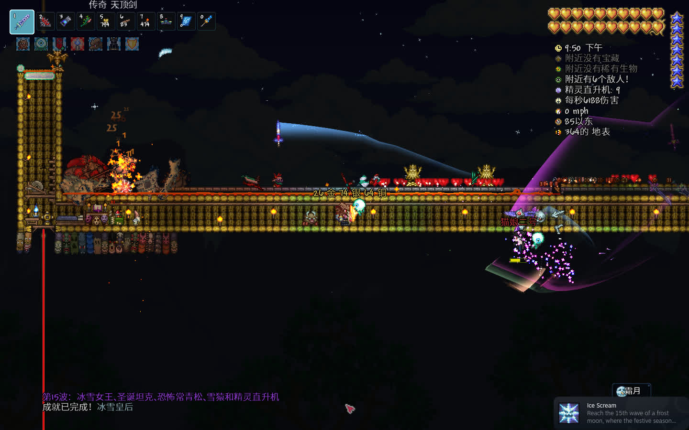

#+CAPTION: 新版地表刷怪场，不过仍旧不能防范哥布林袭击的法师。
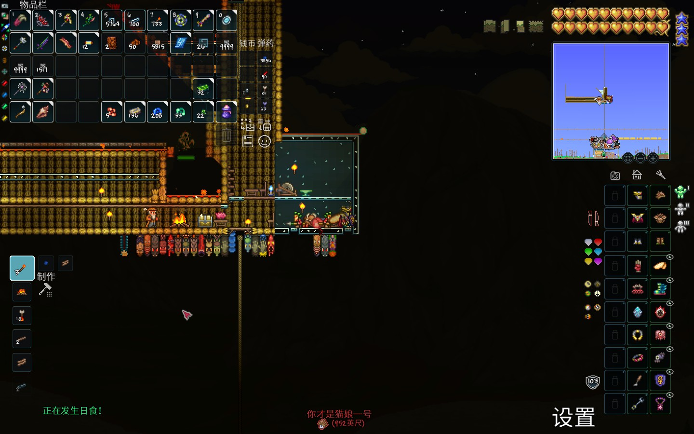
* 肉后
** 过肉山
在地狱搭建三分之一到二分之一世界宽（中世界）铁轨，把握好距离，可用永夜剑轻松过（47防）
** 过渡时期
*** 获取武器装备/npc
- 刷怪场刷猩红怪取灵夜和魂，利用装置无伤猩红宝箱怪取臭狐爪和血指虎
- 缺蛛洞搞黑隐士刷蜘蛛牙搞召唤物（武器），去搞祭坛取灵矿！尽可能多敲但留点（合成）。
- 做矿洞探险药水去挖矿（逐级向上，地狱熔炉->秘银砧->精金熔炉）做出精金套和精金/钛金熔炉
- 刷怪场找巫师，丛林城镇增加蘑菇环境（可从树妖购买蘑菇草种丢微光合成丛林草种）顺便拿个松露人
- 搞齐常驻buff家具（商人：利器站，军火商：弹药匣，巫医：施法桌（如果存在巫师））
*** 获取饰品/工具
- 刷怪场猩红环境常驻刷猩红钥匙（要不然花后拿不了吸血刃）
- 刷怪场挂雪地环境刷冰龟壳（可加猩红环境）
- 刷怪场挂丛林方块刷丛林陆龟（海龟壳x3）
- 去神圣地地表刷精灵取精灵尘（不会飞）与快走时钟。太空用克盾逆向来回绕龙（类似于8字）取飞翔之魂制翼。
- 搭建腐化环境打吞噬者拿到蠕虫围巾
  - 在树妖处搭建墓地环境可购买腐化草种，放沙子在腐化泥土上方便感染，并用腐化沙合成邪水瓶
  - 去猩红地拿邪水瓶砸血菇变成邪菇，凑够6个合成30个毒粉（有炼药桌可以省点材料合成40个）
  - 刷怪场刷怪处放腐化沙子刷腐化者掉腐肉15个（顺便刷维生素、蒙眼布）（这一步效率偏低，因为那些怪会飞，建议参照岛主的视频改造刷怪场）
  - 猩红祭坛合成召唤世吞召唤物
  - 营造一个稳定的腐化环境（否则会脱战）
- 做出十字盾（刷怪场刷怪搞材料），以下为材料
  - 黑曜石护盾
  - 十字章护身符（最子集两种材料可以互相转化）
    - 反光墨镜
      - 蒙眼布：邪恶史莱姆（邪恶石块可刷）、邪恶木乃伊（邪恶感染的沙块可刷）
      - 袖珍镜：蛇发女妖（大理石可刷）（推荐）
    - 盔甲背带
      - 维生素：腐化者、恶心浮游怪（穿墙怪）
      - 盔甲抛光剂：(蓝)装甲骷髅（普通洞穴可刷）（推荐）
    - 药用绷带
      - 粘性绷带：狼人（建议和月光护身符一起刷）……
      - 牛黄：毒泥、(苔藓)黄蜂（丛林泥块可刷）（推荐）
    - 反诅咒咒语
      - 邪眼：猩红斧、附魔剑、诅咒骷髅头（肉前地牢有）
      - 扩音器：妖精（建议和妖精尘一起刷）、邪恶木乃伊（刷腐肉时顺便刷）（推荐x2）
    - 计划书
      - 三折地图：光明木乃伊[fn:6]、巨型蝙蝠（推荐）
      - 快走时钟：妖精（建议和扩音器一起刷）（推荐）、木乃伊
- 满月去地表刷怪场刷狼人搞月光护符（建议同时召唤血月增加刷怪率）
- 从奸商那儿买铁钻丢微光换铁，用椎骨等合成铁长直召唤物。
- 海盗事件：去海边刷血月刷海盗地图（海边敌怪1%概率掉落）（有海边刷怪场更好），打海盗事件，打出三个饰品合成出赚钱利器
  - 掏出刃杖（这个要打史后掉），掏出蜘蛛套，掏出宏伟蓝图和岛主牌刷钱机， =591铂金，60金15银3铜= ，我来啦！（刷钱机建不建看情况）
- 史莱姆皇后：神圣洞穴挖明胶水晶神圣地表召唤（建议打完铁长直再来打，放在这里只是因为篇章结构限制）

** 新三王
*** 铁长直/毁灭者
- 摆上猫雕，做铁皮药，磕点灵液
- 精金套108防（吃个饱食防御更高）。
  - 十字盾、克盾（或夜光护符）、克脑、围巾、狂战士手套、血肉指虎、星星面纱\\
    注：饰品不要取巧，98防和108防差很多的。
- 躲开头部攻击后，追着挨打骗伤拿臭狐爪输出，取神圣锭做能神圣套和光辉飞盘
*** 双子魔眼
- 建议打下史后拿史后鞍打以弥补全防饰品的机动性不足问题，顺便掏个刃杖
- 配置除了换战士神圣套和换更好的召唤物外没有太大的区别（实际上我也不太熟怎么走位）
- 经过实践，大致为优先打魔焰眼，喷火时向一个方向拉，冲撞时反转方向，二阶段在喷火前利用史后ang上下移动快的特性，快速上爬或者下落躲开
- 激光眼一阶段小心点，二阶段直接勾爪勾住平台替换成方块用光辉飞盘打
*** 铁吴克/机械骷髅王
- 和吴克差不多，不过远程用光辉飞盘，近战用圣剑打
- 和吴克差不多，不要打到4:30a.m.天亮，要不然等待的不是脱战而是滚筒洗衣机+你的坟
** 世纪之花
- 挖叶绿矿（总计需要480个叶绿矿，即54+24+18个叶绿锭）
- 合成真永夜、真圣剑（24个叶绿锭）
- 做海龟套（54个叶绿锭）（须刷丛林海龟）
  - 十字盾，血肉指虎，克脑，围巾，狂战士手套，冰龟壳，星星面纱
    注：饰品不要取巧，实操时可以等到快没血时再磕血药而非是半血以上磕
- 带上臭虎爪往蜂蜜里一站，站撸世花（没有嗑药需要磕满500生命值）
  - 注：大师单人世花53550HP，双人72292HP，如果一个人想站撸双人世花是有点危险的
** 石前
- 第一时间去地牢取战士玩具“吸血鬼刀”
- 刷日食蛾怪（用吸血鬼刀）合出泰拉刃（真永夜+真圣剑+英雄断剑）（顺便刷蛾怪之翼等）
  - 刷日食还须刷月亮石和海神贝壳
- （选做）找蘑菇人买自动锤炼机做出蘑菇挖矿爪（需要叶绿锭->蘑菇锭18个）
- 洞穴刷怪场刷地牢怪（圣骑士:圣骑士盾两个）（李小龙：忍者大师材料黑裤袜和黑腰带）
  - 合成（圣骑士盾冰龟壳）冰盾、（圣骑士盾+血肉指虎）英雄盾、忍者大师装备
  - 把克盾换成忍者大师
- 用吸血鬼刃站撸猪鲨（需要有冰盾和忍者大师套装）（用"5-3-反"规律精准瞄准，否则也会炸）
  - 一阶段会左右冲撞5次后停下来释放技能
  - 二阶段会左右冲撞3次后停下来释放技能
  - 三阶段会冲撞几次然后传送到玩家另一侧继续冲刺（反正就是在传送时改变攻击方向）
  - 拿到松虾露（无限飞行坐骑）就好
- 夜间光女站撸同理（别想着白天了）
** 石巨人
本身很好打，不多言
- 刷太阳石合成天界贝壳（天界护符）
- 合成甲虫套
- 搞到闪亮石
** 教徒/四柱
- 地牢门口打教徒，除了打四柱时伤害确实高有点站撸不动
- 建议先打日曜柱取武器，打星尘柱做召唤物
- 打击策略：
  - 在边缘刷一点怪就撤出环境，刷怪计数就算是在环境外也是计算的
  - 日耀柱（战士）千万不能飞起来（千足蜈蚣会教你做人）
  - 星尘柱（召唤师）可以尝试养细胞（细胞会分裂再生）
  - 星旋柱（射手）怪物不会穿墙，就地挖坑埋起来即可
  - 星云柱（法师）恶心人的东西，不知道怎么搞（人云高空六边形小房间，根本不知道怎么建。。。）
- 打击完成之前需要建个定制的小房间用于站撸月总（如图）

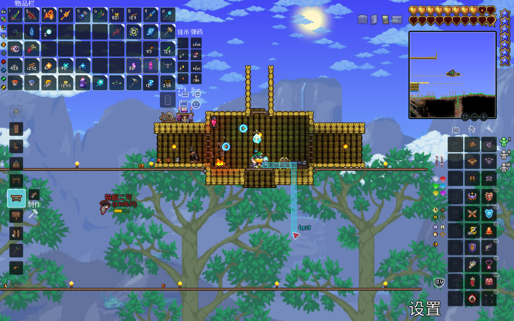

** 月总/月亮领主
- 四柱后1min内做几个200血的大血瓶。带上铁皮药水、再生药水、生命力药水、耐力药水
- 备上天界壳、闪亮石、冰盾(红盾)、围巾、面纱、克脑、忍者大师
- 跑到预制的房间内（如图），即抗伤站撸（吸血鬼刀用不了）。
- 建议夜间打，去打上面和右边，最后打左，那个破晓之光输出，半血了就停下等闪亮石回血，满血了再输出。

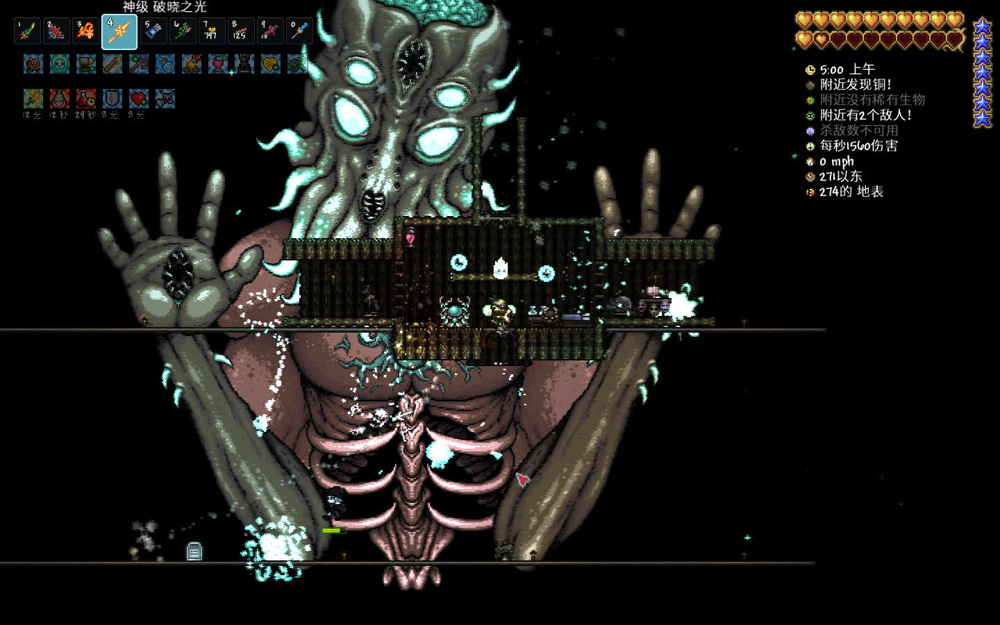
** 天顶剑
月后无敌，日耀套、天界飞盘，自备材料自己做
- 材料：铜短剑、附魔剑、星怒、养蜂人（蜂后）、泰拉刃、无头骑士剑（南瓜月）、波涌剑（火星人）、喵刀（月总）、狂星之怒（月总）

* Footnotes

[fn:1] 同等级间只能够二选一，这里用分号区分同等级的矿物，同等级矿物之间也有性能差异。这里自左向右等级逐渐升高（依照微光降级排序）
[fn:2] 药水相关信息可见“肉前准备工作与现状概述->其它肉后基础设施建筑设->草药农场”
[fn:3] 洞穴晶塔一般而言我推荐建在微光，因为最常用
[fn:4] 玻璃商人（买麦芽酒丢进微光分解成玻璃，我中后期主要建筑方块，非常好用）
[fn:5] 如此安排炸弹商的幸福度是最高的，也不知道是什么原因，反正东西卖钱找他就对了
[fn:6] 如果有片神圣沙漠就可以光明木乃伊和妖精一起刷
