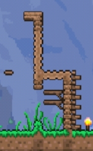
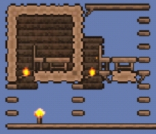
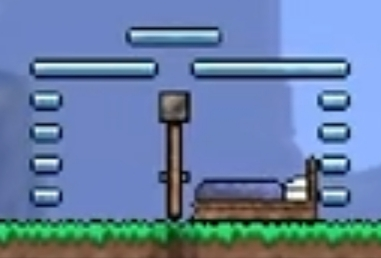
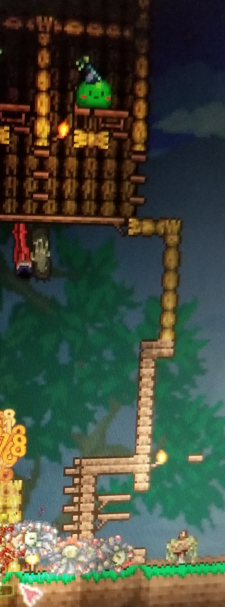
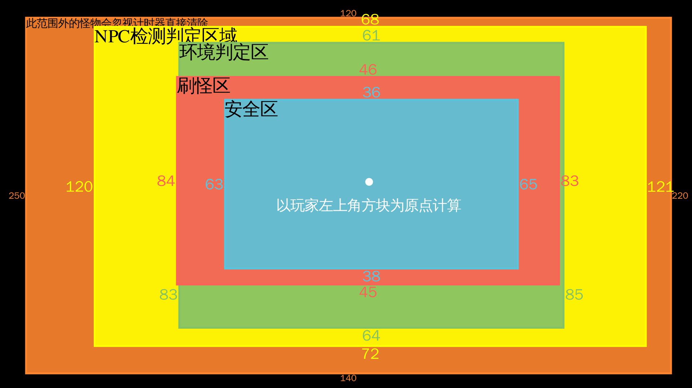
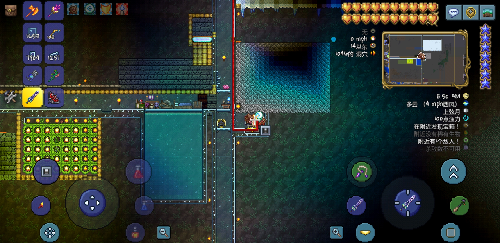
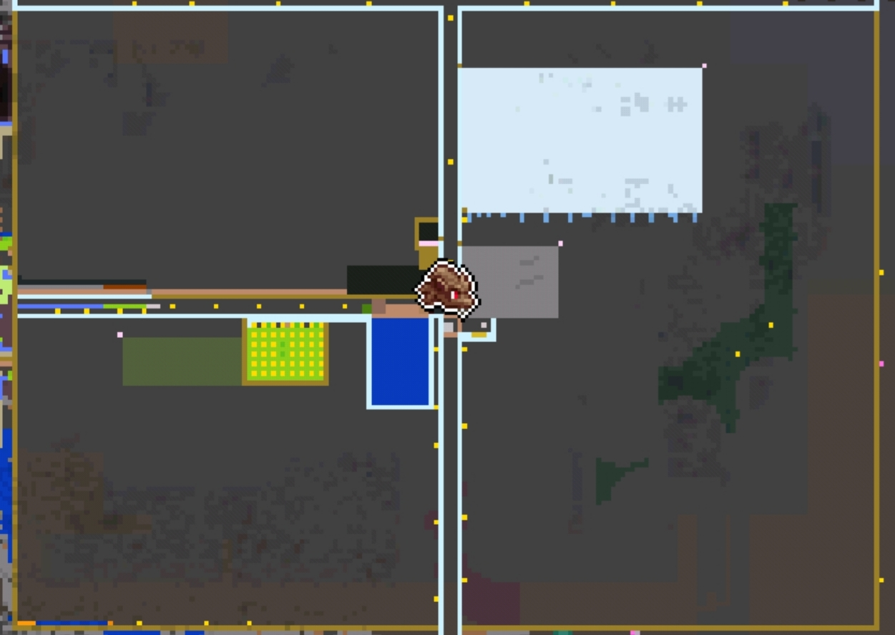
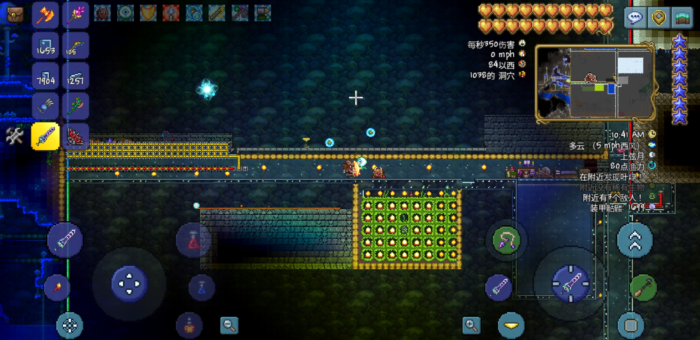
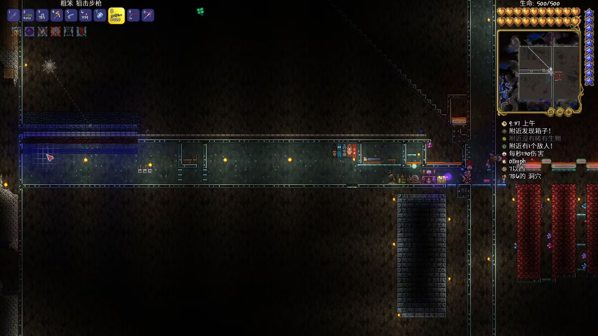

#+title: 泰拉瑞亚战士全流程笔记
#+date: <2024-11-10 Sun 09:14>
#+description: 看404岛主等up的教程学的知识点笔记

#+SETUPFILE: ../../../../setup.setup

* 肉前流程
** 创建世界
战士，只建议玩猩红世界，以获取站神必备物品。（腐化，前期地形比较难探，且没有站神小玩具）
** 开局
下挖一小坑标记出生点，左右撸树平整下场地，搭建如图示卡怪单向墙，因为僵尸头顶有平台时不会跳,史莱姆不会下平台，人可先上平台（5格）再上至墙顶翻入，左右各一部。未成城镇前围小点（两堵墙搭得近点）防怪刷里面，有3个NPC后（会形成城镇）后再扩大墙之间的距离（与NPC屋同宽可围成成基地，后期屋子内可以铺上墙防刷怪)

#+begin_quote
僵尸（战士）AI特性:其第二第三格有平台时会尝试跳起来跳到平台上（如果玩家高于平台就会上去，反之就会下来），但第四格（即其头顶的一格）有平台时就不会跳了
#+end_quote
** 基地/NPC监狱
以基本的卡怪墙为前提，在出生点上方搭三层间隔4格高（即正常放置极限高）的平台（放置怪物跳上来），在最上方的那一阶平台开始左右扩展。预留以出生点那格为中心的3格宽作过道，于两侧各搭建NPC房屋5-6间（自用布局:左边4间，右边6-8间），款式如图，内部分上层4宽4高（用实体方块围外面），下层4宽3高（用平台围），中间隔以3实体方块和1火把（联通上下层），上层内部再摆上工作台和椅子，并在火把处向上铺3~4格墙即可成屋
#+begin_quote

原理:具有60格总面积，有光源（火把），家具（桌椅），门（平台，放房间内部也算），背景墙（小于4*4的破洞会被作为窗户处理），足够的站立点（中间的三格实体方块），处于非邪恶环境内（向日葵可以抵消邪恶计分）
缺点:NPC基于检测房间墙壁生成，墙铺得少NPC来得慢
#+end_quote
建议先建几间房引奸商进来，屯钱买镰刀割干草作垫脚和建筑方块（前期)。钱可以通过刷史莱姆或者僵尸屯(50银足以勾引奸商)，怕死可以直接把钱放在地上不会丢
** 探险/探图
把家周围的地表探下，遇怪优先以躲避为主（跳过史莱姆，平地教方块或者平地小跳勾引僵尸从头上是跳过，小心摔落伤害。路过沙漠尽多地挖仙人掌做仙人掌剑仙人掌套。秃鹫和史莱姆一样不会下平台，用此法可躲攻击。前期遇丛林对技术没自信的建议撤，雪地可以尝试越过或者探索，猩红等邪恶环境是见了就要跑的（跑不掉可以用方块把自己围起来）。
#+begin_quote
探索小技巧:往返床\\
利用系统对房屋判定，自动开关门和沙子自动下落的特性，将房屋造成门打开时房间失效（判定与NPC房类似，不过不需要判断是否有椅子和邪恶环境罢了），人使用魔镜（或回忆药水）会传送回初始出生点，然后门自动关闭，房间生效，人再传送会回到设定出生点。（用于前期探索时快速往返）

便捷的模板房间如下:

使用方式:人站在门前，门自动打开，在非床侧门上方放置一个沙子使房间失效，用魔镜传送即可
#+end_quote
** 挖矿
(此过程相对漫长且时刻穿插)
没有存钱罐下矿记得清钱，有则随身带一个，矿工帽对下矿也挺有帮助的。选址建议在普通地形探矿，相对安全。如果家附近有地表矿道建议顺其而下（不过要小心摔落伤害），多避战，多挡怪，前期战士弱鸡打不过。采矿的同时宝石也别放过，挖去做钩爪提升机动力（越早越好，搭配干草块，探险救果较好）（有钩爪就可以在一格宽的通道里上下移动）。遇到发光蘑菇地可以看看有多少生命水晶，把血量上限拉上去。
- 矿物:
  - 肉前自然矿[fn:1]:铜锡;铁铅;银钨;金/铂金
  - 肉前邪恶矿:魔矿/猩红矿（钧需要金一级稿或者炸弹）
  - 肉前特殊矿:陨石;黑曜石;狱岩矿（需要邪恶镐）
  - 肉后灵矿:钴矿/钯金矿;山铜矿/秘银矿;精金矿/钛金矿
  - 肉后其他矿:（神圣锭由新三王掉落）;叶绿矿（可合成蘑菇锭，幽灵锭）;夜明矿
- 稿力:决定敲击方块次数，矿级越高镐力越高，能挖的方块也越多。（不等于挖掘速度，肉前银镐最快，肉后蘑菇挖矿爪最快）
** 拼索更多地形
*** 雪地
雪地物产不算丰富，但是相对比较安全，可算是第二挖矿选择，可取其中冰雪刃，冰回旋镖，和溜冰靴
*** 空岛
空岛生成时有概率水池溢出落到地面，所以见到地上的疑似非正常生成水池时可以搭绳子绳子上去找空岛。如果绳子足够多且有伞则可以尝试用绳子搭根"擎天柱"上天用伞滑翔寻找，亦或者是在高空用铁轨水平方向查找（建议和床搭配）。如果有重力药水那就省事了。

探索空岛主要目的:获取星怒，马掌和气球。
*** 沙漠
有星怒后探索地下沙漠就方便了，破仙人掌球掏生命水晶，寻找高尔夫球手。

目的:获得海螺（传送海边），凿子(有猫雕更好)
*** 丛林
主要目的:搜集丛林孢子，蘑菇，毒刺以做草剑（真有了那就莽了）;\\
次要目的:取再生流杖
*** 微光
在丛林侧海边与正常地形交界处向下挖或用雷管炸出下滑通道，找到微光，堵下两头防怪，然后迅速建NPC屋把NPC般进来，用10金买晶塔（微光重铸赛高）

微光重铸设计:旁边挖个沟下去，摆上单向墙。
** 特殊事件
在探索到一定程度，拉到一定血量上限后就会发生的事，如160和10防御有克眼，200血炸邪恶心出哥布林事件，还有随机的血月（需要血量上限）和史莱姆雨（打多了召唤史莱姆王）
** 过克眼
在家顶准备2层钩爪能够到的战斗平台，铺长点，换上防御最高的套装，有条件可备些廉读价饰品上防御（如绳子+染料反复微光重铸），拿手榴弹，悠悠球，回旋镖等（远程）武器干就完了。
** 过血月/哥布林袭击
向上延伸卡怪墙，和上层NPC房屋结合（如图），在事件期间堵住出口，然后在地上用手雷慢慢向左右清怪即可。
目标:取钱币槽

** 过克脑
猩红中央空洞里铺上几层平台，掏袭击拿到的尖球约100个洒地上，后期草剂强健。目标:得到样本组织做猩红镐，猩红套。
** 打史莱姆王
召唤方式:杀够足够的史莱姆或者用材料去祭坛合成召唤物\\
平地拉或者用高空短平台通过下平台勾引下去用手手榴弹或者其他武器削。目标:取史莱姆ang。
** 骷髅王
先探下地狱，用黑皮药水挖狱岩矿，再挖点黑曜石做狱岩套及火山大剑（要用到地狱熔炉，需要探索遗迹获得）。

在地牢门口搭2-3层一屏幕长的平台（间隔高点），用火山（换血）打手，然后以窄左右高上下同向绕圈走位打头（可全程带史莱姆ang）（可上向日葵和猫雕）
** 地牢与合成装备
刷怪取金题钥匙开箱取村正，回家合成把永夜剑（需要祭坛，火山，草剑，邪恶剑，村正）再回去探索。找到机械体师，找到猩红宝箱位置并用火把围两圈标记，刷够足够的骨头合成虚空袋即可。
** 其他BOSS
*** 蜂王
骷髅王后配置可以直接野战蜂王（丛林找蜂巢）（无需药水），注意下就行了
*** 雪怪
祭坛合成召唤物或者等待自然生成\\
反正不会立刻挂，大不了搭上条命再去站撸，去把那个宠物（骨眼）打出来即可（巨好用）。

* 肉前准备工作与细状概述内
** 初步形成晶塔网络与NPC编排
- 丛林晶塔 油漆工、树妖（boss后）、巫师（蜂王后）、（史莱姆1只（给一史莱姆铜短剑即可））
- 洞穴晶塔 哥布林（袭击后）、机械师（骷髅王后）、（史莱姆）、炸弹商
- 沙漠晶塔 高尔夫球手（地下沙漠）、染料商（骷髅王后）、（随便了这里）
- 雪原晶塔 （不重要）
- 海洋晶塔 渔夫（海边）、派对女孩（具有一定NPC后）、理发师（蜘蛛洞）
- 森林晶塔 向导、奸商、（其他垃圾）
#+begin_quote
换取晶塔的方法:只有军火商（有枪即来）和护士（有生命水晶即来）的城镇满幸福度，军火商会出售晶塔
#+end_quote
** 初悉建成各群系的鱼池
鱼池只需300格即可没有渔力debuff

需求:丛林地表，沙漠地表，天空池，雪地地表，森林地表
** 城填样式与基地安排
- 一般共性 NPC屋悬空于地表，可平整下地面，一般距地15格即可
- 家 以单向墙/卡怪墙为准，内建空间一侧储物（放箱子），另一侧放床、工作站等家具，出生点上下为贯通上下的直通车（通上通下）
- 丛林 丛林的NPC屋需改造为下底封上的样式，防止肉后从林刷"新三王"(丛林龟等)，高度适当抬高，但别脱离环境
** 其它肉后基础设施建筑设
- 家具 搞到利器站（没有肉后找奸商买）、施法桌、做草药的
- 丛林 挖条直通车下到丛林神庙，横向通道用平台防刷怪。建生命果农场（世纪之花苞农场确信），叫叶绿矿农场（?），加防刷怪平台(小心感染了)
- 草药农场 用利用树妖买的盆栽和丛林开出的再生法杖种植，建议种四行:一行太阳花，一层火焰花，余下两层种雏菊（建议建在海洋城镇外侧，刷怪少空间大）
** 三套刷怪场
分别布局在家中直通车的洞穴层，家顶（地表，城镇环境用影烛消除），海边（刷哥布林或海盗等）
*** 刷怪机制
预先声明:坐标系使用的坐标原点均在玩家左上角

- 区域
  - 安全区域:W63，N36，E65，S38
  - 刷怪区域:W84，N46，E83，S45
  - 环境判定:W83，N61，E85，S64，至少需清定此范围防环境污染
  - NPC检测:W120，N68，E121，S72，确保此范围内没有NPC，有则用影烛
  - 删怪区:W250，N120，E220，S140
- 刷怪尝试 刷怪区择非实非人工墙，下寻一块（普通方块或者平台皆可)检测位置(三格高，左侧没有方块）（即在左上右下向阶梯不刷怪)，后出
- 类型 方块（大多）、环境（丛林冰雪龟）、墙怪（蜘蜘），环境+墙+方块（地牢）、其它（混沌精要影烛）
*** 环境构建
沙漠（需要有墙）1.5k物块，雪地1.5k;丛林250;神圣125;猩红300;地牢250（还要刷怪处有背景墙和方块，玩家在危险墙后）（墙分砖、板、瓷砖，战士只用瓷砖墙）
*** 物特殊生物处理
法师会传送至记家6~20格范围内，空间宽3高4，要有危险墙，用下面放泡泡上面倒岩浆处理

*** 刷怪场搭建
清空环境区域，并向N多清3格，往S多清3~6格，往W多清理10~20格，如图所示建立框架，外建议用方块围下外框架。刷怪区用下半砖铺以激活（肉后）小宝箱怪，下方速移平台为向右倒斜坡实体方块替换为防岩浆平台，怪下平台会被速移。

还有，这里还有一份改进后的设计供参考（最好还是自己去看看岛主的视频）

*** 地表刷怪
丢掉环境部分，如法炮制即可
* 肉后
** 过肉山
在地狱搭建三分之一到二分之一世界宽（中世界）铁轨，把握好距离，可用永夜剑轻松过（47防）
** 过渡时期
- 缺蛛洞搞黑隐士刷蜘蛛牙搞召唤物（武器），去搞祭坛取灵矿！尽可能多敲但留点（合成）。
- 去神圣地刷精灵取精灵尘与快走时钟。太空用克盾逆向来回绕龙（类似于8字）去飞翔之魂制翼。
- 刷猩红怪取灵夜和魂，利用装置（上面改进版的刷怪场有，即那个宽三高4的底部开孔泡泡还有倒斜坡的那个） 无伤猩红宝箱怪取臭狐爪和血指虎
- 用草药做挖矿药去挖矿做出精金套和精金/钛金熔炉
- 搞齐常驻buff家具
- 满月去地表刷怪场刷狼人搞月光护符
- 做出十字盾（刷怪场刷怪搞材料）
- 搭建腐化环境打吞噬者拿到围巾
- 从奸商那儿买铁钻丢微光换铁，用椎骨等合成铁长直召唤物。
** 铁长直——新三王之一
摆上猫雕，做铁皮药，用十字盾、克盾（或夜光护符）、克脑、围巾、狂战士手套和星星面纱，磕点灵液。躲开头部攻击后，人就身它身体里面骗伤拿臭狐爪输出，取神圣锭做能神圣套和光辉飞盘
** 海盗事件
海边刷怪场在刷藏宝图，打海盗事件，打出三个饰品合成出赚钱利器，掏出刃杖，掏出蜘蛛套，掏出宏伟蓝图和岛主牌刷钱机， =591铂金，60金15银3铜= ，我来啦！
** 建筑方块改变
丢弃所有的干草块，把钱都丢到酒馆老板买麦芽酒去微光分解成破璃，爽爆了（好看啊)
** 花前
挖叶绿矿做海龟套（须刷怪），十字盾，克盾，克脑，围巾，手套，冰龟壳，星星面纱，带上臭狐爪往蜂蜜里一站，站撸世花（没有嗑药需要磕满500生命值）
** 石前
- 合出泰拉刃
- 做出蘑菇挖爪挖进地牢取战士玩具"吸血鬼刀"
- 地下刷怪场刷地牢怪（圣骑士）
- 用吸血鬼刃站撸猪鲨（需要有冰盾和忍者大师套装）（用"5-3-反"规律精准瞄准，否则也会炸）
- 夜间光女站撸同理（别想着白天了）
** 石后
合成甲虫套，搞到太阳石和闪亮石，合成天界护符
** 干月总
地牢门口打教徒，除了打四柱时伤害确实高站撸不动（建议先打日曜柱取武器，打星晨柱做唤物），四柱后1min内做几个200血的大血瓶。带上铁皮和生命回复、减伤药，备上天界壳、闪亮石、冰盾(红盾)、围巾、面纱、克脑、忍者大师，跑到预制的房间内（如图），即抗伤站撸（吸血鬼刀用不了）。建议夜间打，去打上面和右边，最后打左，那个破晓之光输出，半血了就停下等闪亮石回血。
** 天顶剑
月后无敌，日耀套、天界飞盘，自备材料自己做

* Footnotes

[fn:1] 同等级间只能够二选一，这里用分号区分同等级的矿物，同等级矿物之间也有性能差异。这里自左向右等级逐渐升高（依照微光降级排序）
