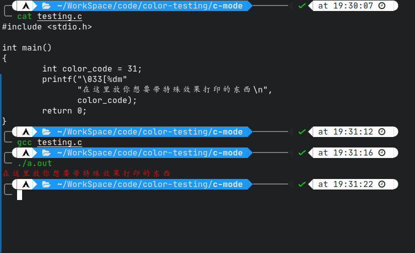
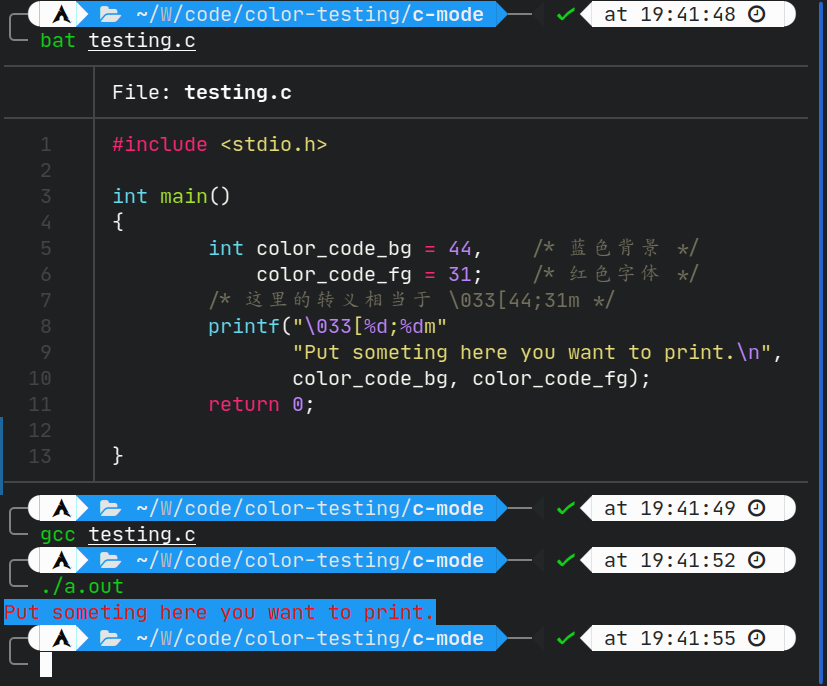
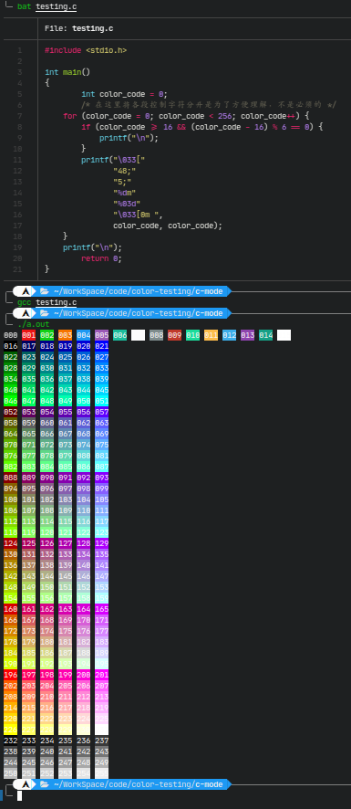

#+title: 打印字符使用特殊效果
#+author: 既然博客都是我的那我就皮一下
#+date: 2023-01-18 18:22
#+description: 使用ANSI转义字符实现终端输出字符带有特殊效果

#+setupfile: ../../../setup.setup

* 打印字符使用特殊效果
** 简单介绍
特殊效果的支持源自ANSI标准，由于我不是很懂所以不多赘述。这里重点关注我们应该如何使用它。

先说结论：

要使用特殊效果，通常需要使用任意输出函数输出以 =\033[数字选项+字符选项= 为格式的字符串。

其中，字符选项相当于指定了其大概的类型，只可以单独使用，并作为一串控制字符串的结束。而数字选项则是细分了其具体功能，且可以复用，只需要使用分号将其隔开。

例子请续看下文。

** m型效果 
#+BEGIN_QUOTE
做出一些提醒，以上内容都需要一个关键的字符 =m= ，所有的文字效果都是基于 =\033[XXm= 的格式，只是为了方便理解，在大部分内容都不作为重点讲述。
#+END_QUOTE
*** 颜色
**** 使用普通颜色（非256色）
要打印出普通的颜色，只需要使用下面的程序：

#+BEGIN_SRC C
#include <stdio.h>

int main()
{
        int color_code = 31;    /* 这里使用变量不是必须的，只是为了更容易看懂，实际上需要打印出对应的数字即可 */
        printf("\033[%dm"
               "在这里放你想要带特殊效果打印的东西\n",
               color_code);
        return 0;
}
#+END_SRC

#+BEGIN_QUOTE
它运行后的输出结果是这样的：
#+CAPTION: 输出结果

#+END_QUOTE

下面是所有关于颜色控制的数字表格，左侧是字体颜色，右侧是背景颜色。

| 数字 | 字体颜色  | 数字 | 背景颜色  |
|------+-----------+------+-----------|
|   30 | 黑色      |   40 | 默认/无色 |
|   31 | 红色      |   41 | 红色      |
|   32 | 绿色      |   42 | 绿色      |
|   33 | 黄色/橙色 |   43 | 黄色/橙色 |
|   34 | 蓝色      |   44 | 蓝色      |
|   35 | 紫色      |   45 | 紫色      |
|   36 | 青色      |   46 | 青色      |
|   37 | 白色      |   47 | 白色      |

#+BEGIN_QUOTE
顺带一提，这些控制代码是“可堆叠的”，意思就是不通的颜色代码可以使用分号 =;= 隔断开来，这样就不必打上好几个 =\033[...= 让代码变得难以阅读。这里再举一个例子做示范。

#+BEGIN_SRC C
#include <stdio.h>

int main()
{
        int color_code_bg = 44,    /* 蓝色背景 */
            color_code_fg = 31;    /* 红色字体 */
        /* 这里的转义相当于 \033[44;31m */
        printf("\033[%d;%dm"
               "Put someting here you want to print.\n",
               color_code_bg, color_code_fg);
        return 0;
}
#+END_SRC
运行效果如下：
#+CAPTION: 运行结果

#+END_QUOTE

**** 使用真彩色（256色）
在这种情况下，我们可以打印出256种颜色，比普通颜色高级多了。不过我也还是不知道Vim和Emacs这些编辑器使用主题时是怎样打印任意颜色的。毕竟我取过色，发现我使用的主题有很多都不在256色的范围内，所以说挺令我困惑的。

废话少说，先上代码示范。

#+BEGIN_SRC C
#include <stdio.h>

int main()
{
        int color_code = 0;
        /* 在这里将各段控制字符分开是为了方便理解，不是必须的 */
        for (color_code = 0; color_code < 256; color_code++) {
                if (color_code >= 16 && (color_code - 16) % 6 == 0) {
                        printf("\n");
                }
                printf("\033["
                       "48;"
                       "5;"
                       "%dm"
                       "%03d"
                       "\033[0m ",
                       color_code, color_code);
        }
        printf("\n");
        return 0;
}
#+END_SRC
#+BEGIN_QUOTE
运行效果如下：
#+CAPTION: 运行结果

注：如果觉得图片不够清晰可以[[./打印字符使用特殊效果/out3.html][访问这个地址查看终端输出]]
#+END_QUOTE

下面开始讲解。

要想使用256色的输出，你需要的是 =48;5;%dm= 这样一串控制符。
其中的 =48;5;= 就是关键。

在这里 =48= 的意思实际上应该是告诉颜色的类型是背景颜色，如果想要设置字体的颜色，只需要将其替换成 =38= 即可。

接下来的 =5= 我就不清楚具体的作用了。我只提上一点：如果单独使用它，那么它所对应的效果实际上是 *字体闪烁* 。

*** 文字效果
如果你观察仔细，就应该会发现刚刚的代码里面有一些新的控制符，例如刚刚提到的 =\033[5m;= 也有 =\033[0m= 。现在，是时候列出一个效果列表了。
| 控制符 | 效果                                 |
|--------+--------------------------------------|
|      0 | 清除所有文字效果                     |
|      1 | 加粗文字                             |
|      2 | 细化文字                             |
|      3 | 斜体                                 |
|      4 | 下划线                               |
|      5 | 闪烁                                 |
|      6 | 未知                                 |
|      7 | 颜色反转（字体和背景颜色互换）       |
|      8 | 隐藏字体（或许可以尝试做一些彩蛋？） |

** 其他类型
*** 光标移动
| 空字符 | 效果 |
|--------+------|
| D      | 左   |
| C      | 右   |
| A      | 上   |
| B      | 下   |
这种情况下，数字参数用于指定步数
*** 光标显示
隐藏光标： =\033[?25l=

显示光标： =\033[?25h=
*** 光标位置
保存： =\033[u=

还原： =\033[l=

