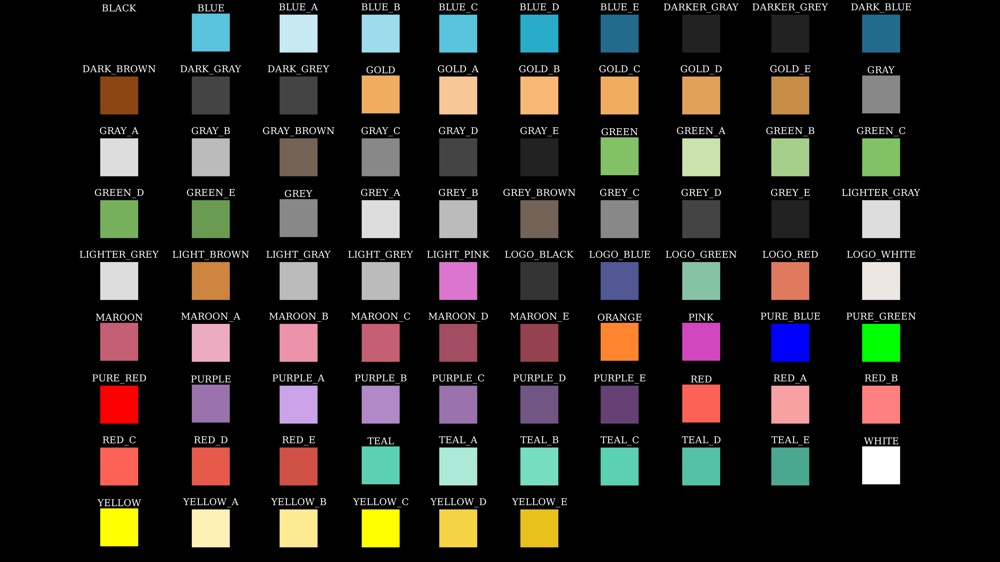

#+TITLE: Manim学习笔记
#+DATE: <2023-08-23 三 00:47>
#+description: 啃manim教程

#+SETUPFILE: ../../../../setup.setup

#+begin_quote
警告！这只是一篇笔记！一篇笔记！非入门教程！\\
系统环境：Arch Linux\\
时间：2023-08-23\\
顺带一提：使用manimCE的建议看最后 =Reference= 里面最后一个链接里的官方教程
#+end_quote

* Manim的安装
** Latex
在Arch Linux下安装 =texlive= 包组：
#+begin_src shell
  sudo pacman -S texlive
#+end_src
** ffmpeg
同理，直接
#+begin_src shell
  sudo pacman -S ffmpeg
#+end_src
** manim
manim有两个版本，社区版本和3Blue1Brown个人维护版本，源码均在gitbub上\\
两个版本没有太大的不同，我选择的是社区版本
- 社区版安装：
  #+begin_src shell
    sudo pip install manim
  #+end_src
- 3B1B版本安装：
  #+begin_src shell
    sudo pip install manimgl
  #+end_src
#+begin_quote
备注：使用镜像源的方法：\\
在 =$HOME/= 下创建 =.pip= 目录并添加 =pip.conf= 文件并写入：
#+begin_src conf
  [global]
  index-url = https://pypi.tuna.tsinghua.edu.cn/simple
  [install]
  trusted-host = https://pypi.tuna.tsinghua.edu.cn
  # trusted-host 此参数是为了避免麻烦，否则使用的时候可能会提示不受信任
#+end_src
建议在root用户下操作

补充:若pip执行报错外部环境问题，参见[[https://www.yaolong.net/article/pip-externally-managed-environment/][这里]]。
#+end_quote

* Manim的使用
** 框架
引入manim包，随便定义一个继承自 =Scene= 的类，定义 =construct= 方法。在其中编写
动画。

示例：
#+begin_src python
  from manim import *

  class example_class(Scene):
      def construct(self):
          square = Square()
          self.play(Create(square))
          self.wait(1)
#+end_src

然后在命令行执行以下格式的命令渲染：
#+begin_src shell
  manim -ql path/to/file.py example_class
#+end_src
即
#+begin_src shell
  manim -ql 文件.py 你定义的类名
#+end_src
其中， =-ql= 指定了渲染的质量（480p 15fps），将 =l= 替换为 =h= 指定为高渲染质量
（1080p 60fps），参数表格关系如下:
| 参数 | 输出规格        | 含义         |
|------+-----------------+--------------|
| -ql  | 854x480 15fps   | low(480p)    |
| -qm  | 1280x730 30fps  | medium(720p) |
| -qh  | 1920x1080 60fps | high(1080p)  |
| -qp  | 2560x1440 60fps | 2k           |
| -qk  | 3840x2160 60fps | 4k           |

类名可以省略，文件只有一个类时默认渲染那一个，如果有多个，程序会询问，如果加上
=-p= 参数，则会在渲染完成后调用程序打开文件

** 创建对象
*** 列表
将创建对应对象的方法用表格列出：
| 方法        | 对象类型                                                                          |
|-------------+-----------------------------------------------------------------------------------|
|             | 几何图形                                                                          |
| Line        | 线 =(ARG:start_xy, end_xy)=                                                       |
| Square      | 正方形                                                                            |
| Rectangle   | 矩形                                                                              |
| Triangle    | 三角形                                                                            |
| Polygon     | 沿着指定的坐标点创建多边形 =(ARG: xy1, ..., xyn)=                                 |
| Circle      | 圆形                                                                              |
| Ellipse     | 椭圆                                                                              |
| Annulus     | 圆环                                                                              |
| Arrow       | 箭头（指向） =(ARG:start_xy, end_xy)=                                             |
| CurvedArrow | 曲箭头                                                                            |
| Dot         | 点                                                                                |
|-------------+-----------------------------------------------------------------------------------|
|             | 数轴相关                                                                          |
| Axes        | 数轴 =(ARG:(x1,x2),(y1,y2), [x_length=2*6], [y_length=2*3])=                      |
| ax.plot     | Draw curve =(ARG:lambda, x_range, y_range)=                                       |
| ax.get_area | get Shape in area =(ARG:curve, range)=                                            |
| NumberPlane | 网格                                                                              |
|-------------+-----------------------------------------------------------------------------------|
|             | 文字                                                                              |
| Tex         | 文字（使用Latex生成）[fn:1]                                                       |
| MathTex     | 数学公式（使用Latex格式）                                                         |
| Text        | 一样是渲染文字（没有中文问题）                                                    |
|-------------+-----------------------------------------------------------------------------------|
|             | 逻辑操作                                                                          |
| VGroup      | 虚拟组，可以使用 =.add()= 方法将对象添加进去[fn:3]，可以使用 =[index]= 的形式访问 |
| Group       | 组，具体性质未知                                                                  |
*** 通用或常见属性
| 变量名       | 可用的值 | 作用                 |
|--------------+----------+----------------------|
| color        | <COLOR>  | 设置边框颜色         |
| fill_color   | <COLOR>  | 设置填充的颜色       |
| fill_opacity | 0.0~1.0  | 设置填充颜色的透明度 |
|--------------+----------+----------------------|
| height       |          | 高                   |
| width        |          | 宽                   |
|--------------+----------+----------------------|
| inner_radius |          | 内半径               |
| outer_radius |          | 外半径               |
|--------------+----------+----------------------|
| font_size    |          | 字体大小             |
**** 附表
| 标号    | 值     |
|---------+--------|
| <COLOR> | RED    |
|         | ORANGE |
|         | YELLOW |
|         | GREEN  |
|         | BLUE   |
|         | ...    |

其他颜色见下图

#+caption: manim中各种颜色图

#+begin_export html

生成上图的代码

#+end_export
#+begin_src python
  #!/usr/bin/env manim -pqh -s

  from manim import *

  class Color(Scene):
      def construct(self):
          # plane = NumberPlane()
          # self.add(plane)
          colors = dir(color.manim_colors)[:-10]
          colors.remove("List")
          colors.remove("ManimColor")
          boxs = VGroup()
          for i in colors:
              group = VGroup()
              col = color.manim_colors.__dict__[i]
              box = Rectangle(width=0.5, height=0.5, color=col, fill_opacity=1)
              text = Text(i).scale(0.2).next_to(box, UP*0.2)
              group.add(box, text)
              boxs.add(group)
          boxs.arrange_in_grid(buff=0.2)
          self.add(boxs)

#+end_src
#+begin_export html

#+end_export

** 改变对象属性方法（对象内部方法）
TIPS: 有相当多的方法可以使用 =object.animate.XXX= 的形式使用动画显示（需要传到
=self.play()= 里）
- =scale()=
  缩放
- =set_fill(color, [opacity=0.x])=
  设置填充
- =set_color(color, ...)=
  设置对象颜色（边框和填充）
- =set_stroke(color, ...)=
  设置对象边框颜色
- =rotate(angle, [about_point=None])=
  旋转对象，角度制请使用 =n*DEGREES= ，弧度制请使用 =n*PI= 的形式(还有个 =TAU=
  目前不知道怎么用)（注意:正角逆时针，负角才是顺时针），使用 =about_point= 可以实现绕点旋转（注:该方法在 =animate=
  中只能实现转换，而不能实现旋转效果）
*** 对象定位
- =move_to()=
  绝对位置（以坐标轴中心定位）\\
  - 参数：
    - =UP= 上
    - =DOWN= 下
    - =LEFT= 左
    - =RIGHT= 右
    - =ORIGIN= 中心
    - =[x,y,z]= 坐标轴
  - 组合方式： 使用 =+= 号相加
- =shift()=
  相对位置（以对象当前位置定位），参数同上
- =next_to()=
  以已有对象位置定位 +（上面的好像也可以）+
- =align_to()=
  对齐某个已知对象
- =surround()=
  +据说圆形特有+ 环绕已有元素（约等于定位点重叠）
- =to_corner()=
  未知，待补充（Tex）
- =to_edge()=
  贴着屏幕边缘
- =arrange()=
  VGroup()对象特有方法（好像是），可以将组内对象呈一条线型排列
- =arrange_in_grid()=
  VGroup()对象特有方法（好像是），可以将组内对象呈网格型排列
** 显示对象
- =self.add()=
  直接安装定位显示对象
- =self.play()=
  按照指定的动画显示对象， =run_time= 指定动画时间
- =self.wait()=
  画面静止保持等待
*** 动画函数（外部）
- =FadeIn()=
  淡入， =shift= 指定淡入运动方向
- =FadeOut()=
  淡出
- =Rotating()=
  旋转一周
- =Rotate()=
  旋转， =angle= 指定角度， =PI= 为180度
- =GrowArrow()=
  箭头生长
- =GrowFromCenter()=
  从中心扩张
- =Create()=
  类绘制的效果，参数 =lag_ratio= 效果未知
- =Write()=
  类写字的效果
- =Transform()=
  将一个对象转换为另一个对象（操作仍然通过原来的对象操作）
- =ReplacementTransform()=
  将第一个对象替换为第二个对象而非转换
- =LaggedStart()=
  效果未知
- =ApplyMethod()=
  可以定义图形在场景空间中的运动补帧\\
  参数格式： =对象方法指针, 位置=
** 示例
#+begin_export html

我的抄的实例

#+end_export
#+begin_src python
  #!/bin/python
  from manim import *

  class SquareToCircle(Scene):
      def construct(self):
          circle = Circle()
          circle.set_fill(PINK, opacity=0.5)

          square = Square()
          square.set_fill(BLUE, opacity=0.5)
          square.flip(RIGHT)
          square.rotate(-3 * TAU / 8)

          self.play(Create(square))
          self.play(Transform(square, circle))
          self.play(FadeOut(square))

  class mkCircle(Scene):
      def construct(self):
          circle = Circle()
          circle.set_fill(PINK, opacity=0.5)

          square = Square()
          square.set_fill(BLUE, opacity=0.5)

          square.next_to(circle, RIGHT, buff=0.5)
          self.play(Create(square), Create(circle))

  class AnimatedSquareToCircle(Scene):
      def construct(self):
          circle = Circle()  # create a circle
          square = Square()  # create a square

          self.play(Create(square))  # show the square on screen
          self.play(square.animate.rotate(PI / 4))  # rotate the square
          self.play(
              ReplacementTransform(square, circle)
          )  # transform the square into a circle
          self.play(
              circle.animate.set_fill(PINK, opacity=0.5)
          )  # color the circle on screen

  class OpeningManim(Scene):
      def construct(self):
          title = Tex(r"This is some \LaTeX")
          basel = MathTex(r"\sum_{n=1}^\infty \frac{1}{n^2} = \frac{\pi^2}{6}")
          VGroup(title, basel).arrange(DOWN)
          self.play(
              Write(title),
              FadeIn(basel, shift=DOWN),
          )
          self.wait()

          transform_title = Tex("That was a transform")
          transform_title.to_corner(UP + LEFT)
          self.play(
              Transform(title, transform_title),
              LaggedStart(*(FadeOut(obj, shift=DOWN) for obj in basel)),
          )
          self.wait()

          grid = NumberPlane()
          grid_title = Tex("This is a grid", font_size=72)
          grid_title.move_to(transform_title)

          self.add(grid, grid_title)  # Make sure title is on top of grid
          self.play(
              FadeOut(title),
              FadeIn(grid_title, shift=UP),
              Create(grid, run_time=3, lag_ratio=0.1),
          )
          self.wait()

          grid_transform_title = Tex(
              r"That was a non-linear function \\ applied to the grid",
          )
          grid_transform_title.move_to(grid_title, UL)
          grid.prepare_for_nonlinear_transform()
          self.play(
              grid.animate.apply_function(
                  lambda p: p
                  + np.array(
                      [
                          np.sin(p[1]),
                          np.sin(p[0]),
                          0,
                      ],
                  ),
              ),
              run_time=3,
          )
          self.wait()

  class test(Scene):
      def construct(self):
          text = Tex(r"TEXT")
          self.play(Create(text))
          self.wait()

  class test2(Scene):
      def construct(self):
          text = Tex(r"中文渲染测试", tex_template=TexTemplateLibrary.ctex)
          text2 = Tex(r"这是第二段测试文字", tex_template=TexTemplateLibrary.ctex)
          text2.move_to(DOWN)
          self.play(Create(text))
          self.play(FadeIn(text2, shift=UP))
          self.wait()

  class DifferentRotations(Scene):
      def construct(self):
          left_square = Square(color=BLUE, fill_opacity=0.7).shift(2 * LEFT)
          right_square = Square(color=GREEN, fill_opacity=0.7).shift(2 * RIGHT)
          self.play(
              left_square.animate.rotate(PI), Rotate(right_square, angle=PI), run_time=2
          )
          self.wait()

  class Shapes(Scene):
      def construct(self):
          circle = Circle()
          square = Square()
          triangle = Triangle()

          circle.shift(LEFT)
          square.shift(UP)
          triangle.shift(RIGHT)

          self.add(circle, square, triangle)
          self.wait(1)

  class MoreShapes(Scene):
      # A few more simple shapes
      # 2.7 version runs in 3.7 without any changes
      # Note: I fixed my 'play command not found' issue by installing sox
      def construct(self):
          circle = Circle(color=PURPLE_A)
          square = Square(fill_color=GOLD_B, fill_opacity=1, color=GOLD_A)
          square.move_to(UP+LEFT)
          circle.surround(square)
          rectangle = Rectangle(height=2, width=3)
          ellipse = Ellipse(width=3, height=1, color=RED)
          ellipse.shift(2*DOWN+2*RIGHT)
          pointer = CurvedArrow(2*RIGHT,5*RIGHT,color=MAROON_C)
          arrow = Arrow(LEFT,UP)
          arrow.next_to(circle,DOWN+LEFT)
          rectangle.next_to(arrow,DOWN+LEFT)
          ring = Annulus(inner_radius=.5, outer_radius=1, color=BLUE)
          ring.next_to(ellipse, RIGHT)

          self.add(pointer)
          self.play(FadeIn(square))
          self.play(Rotating(square),FadeIn(circle))
          self.play(GrowArrow(arrow))
          self.play(GrowFromCenter(rectangle), GrowFromCenter(ellipse), GrowFromCenter(ring))

#+end_src
#+begin_export html

#+end_export

* Reference
- ManimGL版本的教程与文档（有部分与ManimCE不兼容）
  - [[https://zhuanlan.zhihu.com/p/108240714][3Blue1Brown 动画制作教程(2)--尝试更多的图形 - 知乎]]
  - [[https://docs.manim.org.cn/cairo-backend/constants.html][常量部分constants - manim 文档]][fn:2]
  - [[https://elteoremadebeethoven.github.io/manim_3feb_docs.github.io/html/tree/animations/creation.html][Creation — Manim Feb/03/2019 documentation]]
- ManimCE的教程文档
  - [[https://docs.manim.community/en/stable/][Manim Community v0.17.3]]

* Footnotes

[fn:3] 也可以通过 =vgroup_object+=other_object= 的形式添加对象到组内
[fn:2] 该中文文档由英文翻译过来，谨慎查看 

[fn:1] 文字使用Latex渲染，渲染中文时可能会报错，所以要在后面加上参数
=tex_template=TexTemplateLibrary.ctex= 便可成功执行（注意！这是是社区版的解决方
法！）
